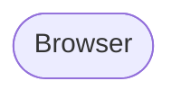

# add-service

Service Architecture Lab に新しいサービスディレクトリを追加するときに使う。policy（`docs/service-architecture-lab-policy.md`）と root `CLAUDE.md` の方針を満たす最小スケルトンを生成し、ユーザーが ADR / 実装に集中できる状態にする。

## 起動時にユーザーに聞くこと

以下が指定されていなければ **必ず確認**してから着手する。auto モードでも勝手に決めない。

1. **サービスディレクトリ名**（`<service>` — 小文字英数字、例: `shopify`, `notion`, `airbnb`）
2. **モチーフ**（参考にする実 SaaS。README 冒頭に書く）
3. **Backend 言語・フレームワーク**（Rails 8 / Django / FastAPI / Go / Node 等）
4. **学習テーマを 1 行で**（例: "Engine 分割によるモジュラーモノリス"、"per-guild Hub による WebSocket シャーディング"）
5. **frontend を作るか**（policy 上「必要なプロジェクトのみ」のため Yes/No）
6. **ai-worker を作るか**（モック可。Yes/No）

## 生成するもの

```txt
<service>/
  README.md                       # 雛形（後述）
  docker-compose.yml              # 雛形（backend 言語に応じた最小構成）
  backend/                        # フレームワークの公式 init は別途ユーザーが実行
    .gitkeep
  frontend/                       # frontend = Yes のときのみ
    .gitkeep
  ai-worker/                      # ai-worker = Yes のときのみ
    .gitkeep
  docs/
    architecture.md               # 後で書く前提のスケルトン（見出しのみ）
    adr/
      .gitkeep
  infra/
    terraform/
      .gitkeep                    # policy 上 apply はしない設計図用
```

ディレクトリだけ作って、フレームワーク本体（`rails new` / `django-admin startproject` / `go mod init` / `npx create-next-app` 等）は実行しない。**「どの初期化コマンドを叩くか」だけ README に書き、ユーザーに任せる**。理由: 設計選択（DB、テスト、認証ライブラリ等）に学習価値があるため。

## README.md 雛形

`shopify/README.md` 冒頭の構造に倣う:

```markdown
# <モチーフ> 風 <一言要約> (<Backend スタック>)

<モチーフ> を参考に、**「<学習テーマ>」** をローカル環境で再現するプロジェクト。

外部 SaaS / LLM は使用せず、ai-worker 側で deterministic な mock を実装することでローカル完結を保つ（リポ全体方針: [`../CLAUDE.md`](../CLAUDE.md)）。

---

## 見どころハイライト

> 🔴 **設計フェーズ**: ADR 起こし中

<!-- 実装が進んだら箇条書きで主要設計を列挙 -->

---

## アーキテクチャ概要



---

## 計画している ADR (最低 3 本)

- ADR 0001: <学習テーマの中心>
- ADR 0002: <ストリーミング / 同時実行 / 境界 等の主要決定>
- ADR 0003: <データモデル / 権限 / テスト戦略 等>

---

## ローカル起動

```sh
# TODO: docker compose up -d などの起動手順を実装後に更新
```

---

## 初期化コマンド（プロジェクト初期化時に実行）

<!-- このセクションは初期化が終わったら削除する -->

- `<rails new ... / django-admin startproject ... / npx create-next-app ... / go mod init ... 等>`
```

## docker-compose.yml 雛形

backend に応じて最小限を生成する。例（Rails の場合）:

```yaml
services:
  db:
    image: postgres:16-alpine
    environment:
      POSTGRES_PASSWORD: postgres
    ports: ["5432:5432"]
  backend:
    build: ./backend
    depends_on: [db]
    ports: ["3000:3000"]
```

ai-worker / frontend は対応する場合のみ追加。**生成後、ユーザーに「実装フェーズで `Dockerfile` を書く必要がある」と明示する**。

## docs/architecture.md スケルトン

見出しだけ:

```markdown
# <service> アーキテクチャ

## ドメイン境界
## データモデル
## 主要フロー
## 失敗時の挙動
## ローカル運用
```

## root README.md 更新

`README.md` の `## 候補プロジェクト（検討中）` 表を読み、新サービスの行を `~~<service>~~ → 着手` に書き換える（既存表は CLAUDE.md と同期される運用）。`プロジェクト一覧` 表にも 1 行追加（ステータスは 🔴 Phase 1 設計フェーズ）。

## root CLAUDE.md の表も同様

`CLAUDE.md` の「候補プロジェクト（検討中）」表で同じサービス行を着手済みに書き換える。CLAUDE.md と README は同期する方針 (CLAUDE.md ルール参照)。

## 完了後にユーザーに伝えること

- 生成した内容のサマリ（ディレクトリツリー、生成ファイル数）
- **次に手を動かすべき 3 つのアクション**:
  1. backend フレームワークの初期化コマンド
  2. ADR 0001 の執筆（`docs/adr-template.md` をコピー）
  3. `docker-compose.yml` の Dockerfile 整備
- ADR 候補 3 本のたたき台（学習テーマからの提案）

## Phase 進行の運用 (CLAUDE.md ルール 6 と整合)

スキャフォールド完了後の進行は概ね以下の Phase に分かれる。**Phase 番号と粒度は zoom で確立済**。ユーザに順序確認を取らず推奨順で進めて良い (CLAUDE.md ルール 6)。

- **Phase 1**: スキャフォールド + ADR 0001-0003 執筆 + `docs/architecture.md` の見出し
- **Phase 2**: backend 初期化 (rails new / django-admin / npx create-next-app / go mod init) + 主要 migration + DB セットアップ
- **Phase 3**: Models / 状態機械 / Permission Resolver / Jobs (実装の核 + spec)
- **Phase 4**:
  - Phase 4-3: 認証 (rodauth / DRF auth / FastAPI auth など)
  - Phase 4-1: Controllers / Routes / Request spec
  - Phase 4-2: ai-worker (FastAPI) mock + 内部 ingress
- **Phase 5**: CI 設定 (`.github/workflows/ci.yml` に backend / ai-worker / frontend / terraform ジョブ追加) → Frontend (Next.js) → E2E (Playwright + gif) → Terraform (本番想定設計図) の順を推奨

順序は手戻り最小と「人が触れる API が早く立つ」体感のバランスで決める。設計の選択肢提示 (CLAUDE.md ルール 1) は守り、順序判断 (本ルール) はユーザに振らない。

## 注意

- 既存サービスディレクトリと衝突する場合は **上書きしない**。エラーで止めてユーザーに確認。
- 学習テーマと backend 選定の妥当性に違和感があれば（例: "WS fan-out" を Rails でやると言っているのに既に slack で同じテーマを扱っている）、**着手前に指摘**する。重複学習は本リポの目的に反する。
- `infra/terraform/` は policy 上「apply しない設計図」。雛形の `.tf` は生成せず、空ディレクトリのみ。
