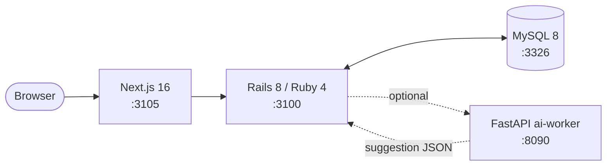

# Calendly 風日程調整プラットフォーム (Rails 8 + Ruby 4 + Next.js 16 + FastAPI)

[Calendly](https://calendly.com/) / [Cal.com](https://cal.com/) を参考に、**「期間 overlap + 同時予約レース防止 + RRULE 展開 / timezone 永続化」** をローカル環境で再現するプロジェクト。

WebRTC や決済はスコープ外。**「時刻ドメイン + 制約充足」** に学習を集中させる。外部 SaaS / LLM は使用せず、ai-worker 側で deterministic な mock を実装することでローカル完結を保つ（リポ全体方針: [`../CLAUDE.md`](../CLAUDE.md)）。

**本リポで初の Ruby 4 系プロジェクト** (policy [`Ruby バージョン方針`](../docs/service-architecture-lab-policy.md#ruby-バージョン方針))。Namespace / YJIT 強化 / 主要 gem (rodauth-rails / solid_queue / pundit) の Ruby 4 互換性をここで実地検証する。

---

## 見どころハイライト

> 🔴 **設計フェーズ**: ADR 起こし中

<!-- 実装が進んだら箇条書きで主要設計を列挙 -->

---

## アーキテクチャ概要



> ai-worker の役割は「**スロット推薦の deterministic mock**」(候補時間帯のスコアリング) を想定。コアの予約ロジックは Rails 側に閉じる。

---

## 計画している ADR (最低 3 本)

policy の「ADR 最低3本」要件に対し、以下 3 本を予定。詳細は `docs/adr/` 配下に追加予定。

- **ADR 0001: availability merge アルゴリズム**
  - host の既存予定 (busy intervals) + 既存予約 + 営業時間ルール (working_hours) を merge して空きスロットを返す方式の選定
  - 候補: (a) eager merge をリクエスト毎に毎回計算 / (b) busy intervals を前計算キャッシュ / (c) free intervals を materialized view で持つ
  - `tstzrange` の集合演算が PostgreSQL の自然形だが、本リポ MySQL 統一なので **MySQL での代替実装** を ADR で決め切る (start_at / end_at の closed-open ペア + 区間和演算 SQL)
- **ADR 0002: 同時予約レース防止 — MySQL における `EXCLUDE` 排他制約代替**
  - PostgreSQL なら `EXCLUDE USING gist (room WITH =, during WITH &&)` で 1 行で書ける排他制約が、MySQL に存在しない
  - 候補: (a) アプリ層 `with_lock` + 重複検査 (zoom と同形) / (b) 条件付き UPDATE で `affected_rows == 0` を弾く (shopify 在庫減算と同形) / (c) `INSERT ... SELECT WHERE NOT EXISTS` を SERIALIZABLE で囲む
  - 100 並行スレッドの spec で fixate (shopify 流) して、最終的に「**唯一の予約だけが成立する**」不変条件を保証する
- **ADR 0003: RRULE 展開と timezone 永続化**
  - recurring availability (毎週月-金 9:00-17:00 等) を `RRULE:FREQ=WEEKLY;BYDAY=MO,TU,WE,TH,FR;...` で保存
  - 展開戦略: eager (window 期間分すべて行に展開) / lazy (取得時に都度展開) のどちらか + キャッシュ層
  - timezone: **すべて UTC で保存 + 元 TZ id を別カラム保持** が定石。DST 跨ぎ (例: 2026 年米国春の DST 開始) の挙動を spec で fixate
  - 採用 gem: `ice_cube` or 自前 (Ruby 4 標準ライブラリの拡張で済むかも)

---

## ローカル起動

```sh
# TODO: 実装フェーズで以下を整備する
# docker compose up -d mysql        # mysql:3326 起動
# make calendly-backend             # Rails API :3100
# make calendly-frontend            # Next.js :3105 (別タブ)
# make calendly-ai                  # FastAPI :8090 (別タブ)
```

ポート割り当て:

| 役割 | host port | container port |
| --- | --- | --- |
| MySQL 8 | 3326 | 3306 |
| Rails backend | 3100 | 3000 |
| Next.js frontend | 3105 | 3000 |
| FastAPI ai-worker | 8090 | 8000 |

---

## 初期化コマンド（プロジェクト初期化時に実行）

<!-- 各コンポーネント初期化が完了したらこの節を削除する -->

- backend (Rails 8 / Ruby 4): `cd backend && rails new . --api --database=mysql --skip-test`（`.ruby-version` に `4.0.x` を pin、Gemfile に `ruby "~> 4.0"` を書く）
- frontend (Next.js 16): `cd frontend && npx create-next-app@latest . --typescript --tailwind --app --src-dir`
- ai-worker (FastAPI): `cd ai-worker && python -m venv .venv && .venv/bin/pip install fastapi uvicorn[standard] httpx pytest pydantic-settings`

> いずれも policy 上「外部 SaaS は使わない」。ai-worker の slot 推薦は deterministic mock (入力ハッシュ → スコア固定) を返す実装にする。

---

## 既存サービスとの関係

| 観点 | 比較対象 | calendly が学ぶこと |
| --- | --- | --- |
| 期間制約 | shopify (在庫の compare-and-decrement) | shopify は「数量の減算」、calendly は「**期間の重複禁止**」。条件付き UPDATE の対称形 |
| 状態機械 | zoom (会議ライフサイクル) | zoom は「会議そのものの寿命」、calendly は「**会議の前段 = 予約**」。時間軸で隣接、技術論点は別 |
| 監査 | zoom (HostTransfer append-only) | 予約変更 / キャンセル履歴を append-only で残す可能性 (ADR 派生候補) |
| 認可 | github (PermissionResolver + Pundit 2 層) | host / invitee / 第三者観覧の権限。同形の 2 層を踏襲 |
| 言語/Ruby | (本リポ初の Ruby 4 採用) | Namespace の使いどころ + 既存 gem 互換性検証。policy 「Ruby バージョン方針」の発火条件評価材料を作る |
