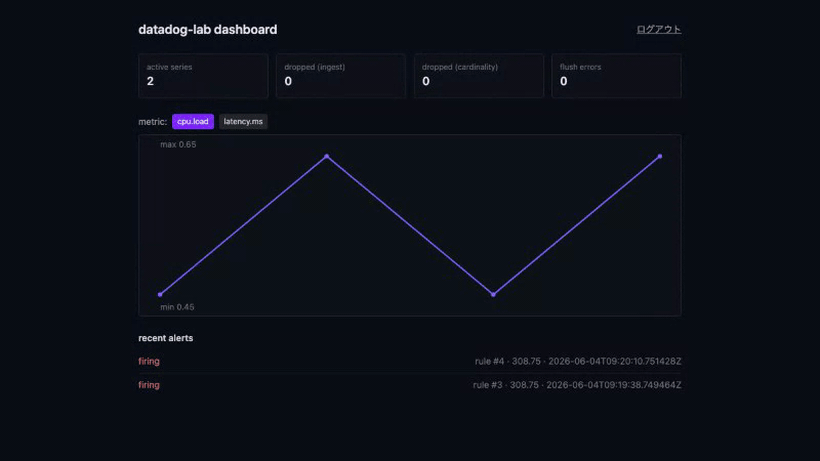

# Datadog 風メトリクス観測基盤 (Go)

Datadog / Prometheus を参考に、**「高基数メトリクスの ingestion パイプライン + 固定窓 rollup + cardinality/backpressure 制御 + alert rule engine」** をローカル環境で再現するプロジェクト。

slack / youtube / github / perplexity / instagram / discord / reddit / shopify / zoom / calendly / uber / figma に続く **13 番目のプロジェクト**、**Go バックエンド 3 本目**（[リポジトリ方針「言語別バックエンド方針」](../README.md#言語別バックエンド方針)）。discord (`1→N fan-out`) / uber (`2 者マッチング`) に続く **Go の第3の並行パターン = `多→1 fan-in パイプライン + backpressure`** を学習テーマに置く。

外部 SaaS / 実 ML は使用せず、メトリクスは合成ジェネレータ、ai-worker 側で deterministic な mock を実装することでローカル完結を保つ（リポ全体方針: [`../CLAUDE.md`](../CLAUDE.md)）。

---

## 見どころハイライト

> 🟢 **MVP 完成 (Phase 5 完了)**: backend（ingestion パイプライン + alert engine）に加え、**frontend ダッシュボード（時系列チャート + stats + アラート一覧、polling）/ Playwright E2E（実機フルスタックで観測ループ検証 + gif）/ Terraform 設計図 / CI 5 ジョブ** まで実装。**backend `go test -race` 全 green + ai-worker pytest 9 + Playwright 2 件**（実機 MySQL + Go backend + Next で pass）。`ingest(API key) → 固定窓 rollup flush → /query → dashboard チャート` の観測ループと `alert rule(gt) → breach → firing` を E2E で確認。

- **fan-in ingestion パイプライン** — `HTTP /ingest → buffered chan → worker pool (parse/route) → single-owner aggregator goroutine`。discord (Hub が `clients` を専有) / uber (matcher が `cell` を専有) と同じ *single-goroutine ownership (CSP)* の流儀で、aggregator が `series → 時間窓 ring buffer` を専有する ([ADR 0001](docs/adr/0001-ingestion-pipeline-windowed-rollup.md))
- **backpressure + cardinality 制御** — bounded channel 満杯時は **non-blocking drop (load shedding)**、series 数が上限到達で新規 series を drop。drop はすべて自己メトリクスで計測（dogfooding） ([ADR 0002](docs/adr/0002-backpressure-cardinality-control.md))
- **固定窓 rollup を MySQL 永続** — per-series ring buffer で 10s 窓に集約 → 完了バケットを `rollups` テーブルに idempotent upsert（`UNIQUE(series_key, bucket_ts, resolution)`）+ retention ([ADR 0003](docs/adr/0003-rollup-data-model-retention.md))
- **周期評価 alert rule engine** — eval loop goroutine が rule を窓ごと評価し `ok → pending → firing → ok` の state machine を駆動 + append-only `alert_events` + ai-worker 異常検知境界（graceful degradation）+ 認証（dashboard=JWT / ingest=API key） ([ADR 0004](docs/adr/0004-alert-engine-ai-boundary-auth.md))

---

## アーキテクチャ概要

```mermaid
flowchart LR
  agent([metrics agent / 合成ジェネレータ])
  user([Browser])
  agent -->|POST /ingest (X-API-Key)| api
  user -->|HTTPS / fetch (Bearer JWT)| front[Next.js 16<br/>:3135<br/>dashboard]
  front -->|GET /query /alerts| api[Go backend<br/>:3130]
  api <-->|REST /detect-anomaly /forecast<br/>X-Internal-Token| ai[FastAPI ai-worker<br/>:8120]
  api --- mysql[(MySQL 8 :3329<br/>rollups / series / alerts)]

  subgraph "Go process (single)"
    api
    ic([ingest chan<br/>bounded])
    wp[worker pool<br/>parse/route]
    agg[aggregator goroutine<br/>map series→ring buffer 専有]
    ev[alert eval loop]
    api --> ic --> wp --> agg
    agg -.->|flush 完了バケット| mysql
    ev -.->|窓ごと評価| mysql
  end
```

詳細な ER / pipeline / state machine / backpressure フローは **[docs/architecture.md](docs/architecture.md)** を参照。

---

## 採用したスコープ

| 含める | 除外 |
| --- | --- |
| HTTP push ingestion（line/JSON、counter/gauge/histogram） | UDP StatsD / gRPC / OTLP（→ 派生 ADR） |
| fan-in パイプライン + single-owner aggregator + 固定窓 rollup | 分散シャーディング / クラスタリング → Terraform 設計図のみ |
| backpressure（bounded chan non-blocking drop）+ load shedding 計測 | 永続キュー / WAL / 厳密 exactly-once |
| cardinality 制御（series 上限で drop + 計測） | tag value の自動圧縮 / 適応カーディナリティ |
| 固定窓 rollup の MySQL 永続（count/sum/min/max/last + histogram buckets JSON） | 本格 TSDB（列指向圧縮 / ダウンサンプリング多段）→ ADR で設計言及のみ |
| query（metric + tag matcher + 期間 + 集計） | PromQL 級のクエリ言語 |
| alert rule engine（threshold + for_duration + state machine） | 異常検知の実 ML / 複合条件 DSL（ai-worker mock で代替） |
| ai-worker `/detect-anomaly`（z-score/MAD mock）`/forecast`（線形外挿 mock） | 実時系列 ML |
| 認証 1 経路（dashboard=JWT）+ ingest=API key（machine 経路） | OAuth / SSO / RBAC |
| span/trace 親子関係 | （除外。metrics に集中。trace は別候補） |

---

## 主要な設計判断 (ADR ハイライト)

| # | 判断 | 何を選んで何を捨てたか |
| --- | --- | --- |
| [0001](docs/adr/0001-ingestion-pipeline-windowed-rollup.md) | **fan-in パイプライン + single-owner aggregator + 固定窓 rollup** | raw event 保存 + query 時集計 / per-series goroutine / 完全 in-memory を却下 |
| [0002](docs/adr/0002-backpressure-cardinality-control.md) | **bounded chan の non-blocking drop (load shedding) + series 上限 drop + 自己計測** | block(client へ backpressure) / 429 reject / LRU evict / 無制限 queue を却下 |
| [0003](docs/adr/0003-rollup-data-model-retention.md) | **rollup テーブル（`UNIQUE(series_key,bucket_ts,resolution)` idempotent upsert）+ series registry + retention** | raw events / 専用 TSDB / 完全 in-memory を却下 |
| [0004](docs/adr/0004-alert-engine-ai-boundary-auth.md) | **周期評価 state machine（ok→pending→firing→ok）+ append-only alert_events + ai-worker 境界 + JWT/API-key 二経路認証** | 即時評価 / push 評価 / 単一認証経路を却下 |

---

## ポート割り当て

| サービス | ポート | 備考 |
| --- | --- | --- |
| frontend (Next.js)  | 3135 | figma の 3125 から +10 |
| backend (Go)        | 3130 | figma の 3120 から +10 |
| ai-worker (FastAPI) | 8120 | figma の 8110 から +10 |
| MySQL               | 3329 | figma の 3328 から +1 |

Redis は **不使用**。集計は in-memory ring buffer + 固定窓で完結（ADR 0001）。

---

## 既存サービスとの関係

| 観点 | 比較対象 | datadog が学ぶこと |
| --- | --- | --- |
| Go 並行性 | `discord`（fan-out）/ `uber`（matching） | **第3の型 = fan-in パイプライン + backpressure**。同じ single-owner CSP で解く問題の形が違う |
| 集計の規模 | `reddit`（Hot ランキング 60s 再計算） | reddit を数桁スケールアップした **「OLAP 風 streaming 集計 + 固定窓 rollup」** |
| 状態機械 | `zoom`（長寿命 meeting）/ `pagerduty`(候補) | alert rule の `ok→pending→firing` は短寿命・周期評価の state machine |
| ai-worker 境界 | `uber`（ETA 同期 + degrade） | 異常検知を同期 REST + graceful degradation で呼ぶ同方針 |
| ローカル完結方針 | `perplexity` / `figma` | 実 ML / 外部 SaaS をモック化する手法を踏襲 |

---

## ローカル起動

> 🟡 Phase 2 完了。backend が起動・DB 接続・認証できる状態。ingestion パイプライン / dashboard は Phase 3-5。

Go は **host 不在のため docker `golang:1.25` コンテナで回す**（uber と同方針 / [memory: uber は Go 不在](../CLAUDE.md)）。host port 3329 の MySQL へはコンテナから `host.docker.internal` で接続する。

```sh
# 1. 依存 (MySQL :3329 + ai-worker :8120) を起動。alert engine の dynamic rule は
#    ai-worker を同期 call (不通でも静的閾値で継続 = graceful degradation)。
docker compose up -d mysql ai-worker

# 2. migration 適用 (schema_migrations で冪等)
DSN='datadog:datadog@tcp(host.docker.internal:3329)/datadog_development?parseTime=true&multiStatements=true'
docker run --rm -v "$PWD/backend":/app -w /app -e DATABASE_URL="$DSN" \
  golang:1.25 go run ./cmd/server/migrate

# 3. backend 起動 (:3130 / REST + 認証、ingestion は Phase 3)
docker run --rm -v "$PWD/backend":/app -w /app -p 3130:3130 \
  -e DATABASE_URL="$DSN" -e HTTP_ADDR=":3130" golang:1.25 go run ./cmd/server

# 3b. メトリクス投入 (ingest = API key) と参照 (query は要 JWT)
#   curl -XPOST localhost:3130/ingest -H 'X-API-Key: dev-ingest-key' \
#     -d '{"samples":[{"name":"cpu.load","tags":{"host":"a"},"type":"gauge","value":0.7}]}'
#   curl 'localhost:3130/query?metric=cpu.load' -H "Authorization: Bearer <JWT>"

# 4. テスト (auth + ingest pipeline + store/api 統合 / go test -race)
#   DB を共有する統合テストはパッケージ並列を避けるため -p 1 で直列化する
docker run --rm -v "$PWD/backend":/app -w /app -e DATADOG_TEST_DB="$DSN" \
  golang:1.25 go test -race -p 1 ./...

# 5. frontend (別タブ)。dashboard: 時系列チャート + stats + アラート一覧 (polling)
cd ../frontend && npm install && npm run dev   # http://localhost:3135

# 6. E2E (別タブ / webServer が backend(docker go) + Next を起動)
cd ../playwright && npm ci && npx playwright install chromium && npm test
npm run capture                                # captures/01-dashboard.gif (ffmpeg 必須)
```

---

## Phase ロードマップ

| Phase | 範囲 | 状態 |
| --- | --- | --- |
| 1 | scaffold + ADR 0001-0004 + architecture.md + docker-compose | 🟢 完了 |
| 2 | `go mod init` + migration（series / rollups / alert_rules / alert_events / users / api_keys）+ store 層 + config + 認証（JWT + bcrypt + API key）+ 最小サーバ（/healthz + auth）+ `go test -race`（auth + store 統合） | 🟢 完了 |
| 3 | **ingestion パイプライン**（/ingest → bounded chan → worker pool → single-owner aggregator → 固定窓 ring buffer → flush）+ backpressure/cardinality（load shedding + 自己計測）+ /query /metrics /stats + `go test -race`（load-shed / cardinality cap / rollup 正当性 / 並行 no-race / live async） | 🟢 完了 |
| 4 | alert rule engine（eval loop + ok→pending→firing state machine + for_duration + append-only events）+ ai-worker（detect-anomaly / forecast mock）+ `internal/ai` graceful degradation + /alerts/rules /alerts/events | 🟢 完了 (go test -race + pytest 9) |
| 5 | CI 5 ジョブ（backend race / ai-worker pytest / frontend / playwright / terraform）+ frontend（dashboard: 時系列チャート + stats + アラート一覧）+ Playwright E2E（観測ループ + alert firing + gif）+ Terraform 設計図 | 🟢 完了 |

---

## E2E デモ (Playwright で録画)

実機フルスタック（MySQL + Go backend + Next.js）で観測ループを録画。`ingest → 固定窓 rollup flush → dashboard` が時系列チャートに反映され、alert が firing する様子を gif 化。

| シナリオ | gif |
| --- | --- |
| メトリクス投入 → rollup → dashboard の時系列チャート表示 + active series / dropped 計測 + firing アラート一覧 |  |

再録画は `cd playwright && npm run capture`（全サービス起動 + ffmpeg 必須）。詳細は [playwright/README.md](playwright/README.md)。

---

## CI (5 ジョブ)

| ジョブ | 内容 |
| --- | --- |
| `datadog-backend` | Go 1.25 + MySQL service + migrate + `go vet` + `go test -race -p 1`（pipeline / alert / store / api 統合）+ `/healthz` smoke |
| `datadog-ai-worker` | pytest（detect-anomaly / forecast / X-Internal-Token） |
| `datadog-frontend` | Next.js typecheck + build |
| `datadog-playwright` | 実機フルスタック（Go backend + Next start）で ingest→dashboard + alert firing E2E |
| `datadog-terraform` | `fmt -check` + `init -backend=false` + `validate` |

---

## ドキュメント

- [docs/architecture.md](docs/architecture.md) — システム図・ER・pipeline・state machine・失敗時挙動
- [docs/adr/0001-ingestion-pipeline-windowed-rollup.md](docs/adr/0001-ingestion-pipeline-windowed-rollup.md)
- [docs/adr/0002-backpressure-cardinality-control.md](docs/adr/0002-backpressure-cardinality-control.md)
- [docs/adr/0003-rollup-data-model-retention.md](docs/adr/0003-rollup-data-model-retention.md)
- [docs/adr/0004-alert-engine-ai-boundary-auth.md](docs/adr/0004-alert-engine-ai-boundary-auth.md)
