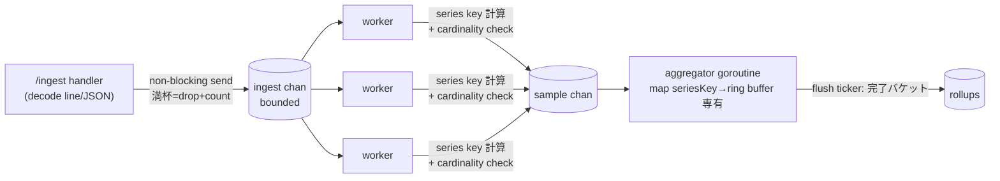
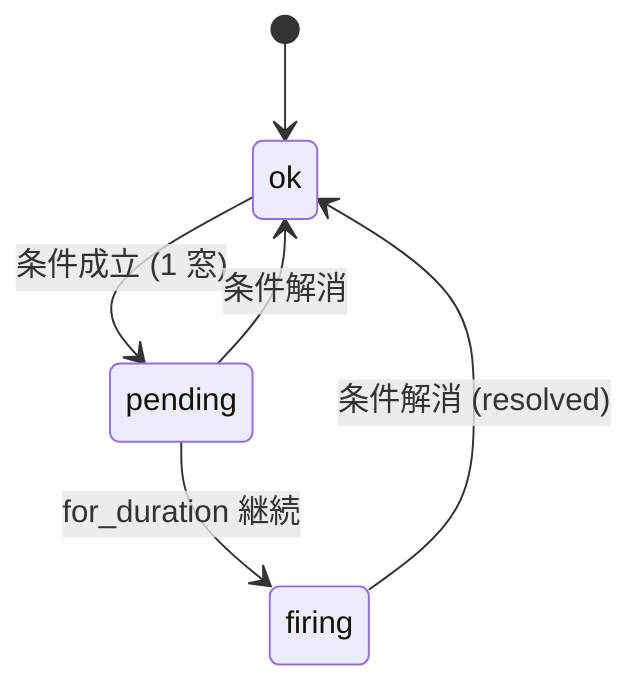
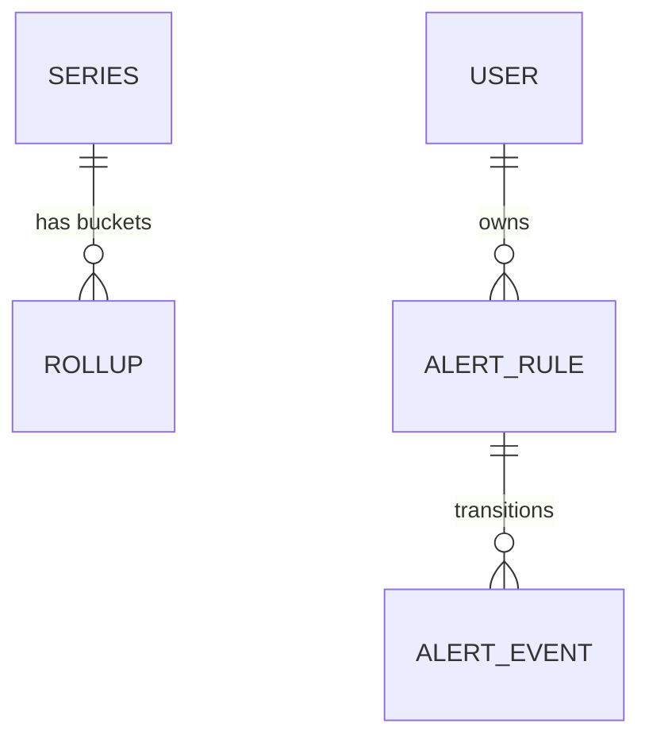

# datadog アーキテクチャ

Datadog / Prometheus を参考に、**「高基数メトリクスの ingestion パイプライン + 固定窓 rollup + cardinality/backpressure 制御 + alert rule engine」** をローカル環境で再現する学習プロジェクト。中核の技術課題は 4 つ:

1. **fan-in ingestion パイプライン + 固定窓 rollup** — `ingest → bounded chan → worker pool → single-owner aggregator goroutine` ([ADR 0001](adr/0001-ingestion-pipeline-windowed-rollup.md))
2. **backpressure + cardinality 制御** — bounded chan の non-blocking drop（load shedding）+ series 上限 drop + 自己計測 ([ADR 0002](adr/0002-backpressure-cardinality-control.md))
3. **rollup データモデル + retention** — `rollups` の idempotent upsert + series registry ([ADR 0003](adr/0003-rollup-data-model-retention.md))
4. **alert rule engine + ai-worker 境界 + 認証** — 周期評価 state machine + 異常検知 mock + JWT/API-key 二経路 ([ADR 0004](adr/0004-alert-engine-ai-boundary-auth.md))

> 本プロジェクトは Go バックエンド 3 本目。discord（`1→N fan-out`）/ uber（`2 者マッチング`）に続く **Go の第3の並行パターン = `多→1 fan-in パイプライン + backpressure`**。いずれも *single-goroutine ownership (CSP)* の流儀は共通で、専有する状態が `clients`（discord）/ `cell`（uber）/ `series→ring buffer`（datadog）と異なるのが対比の妙。

---

## ドメイン境界

```mermaid
flowchart LR
  agent([metrics agent / 合成ジェネレータ])
  user([Browser])
  agent -->|POST /ingest<br/>X-API-Key| api
  user -->|fetch (Bearer JWT)| front[Next.js 16 :3135<br/>dashboard]
  front -->|GET /query /alerts| api[Go backend :3130]
  api <-->|REST /detect-anomaly /forecast<br/>X-Internal-Token| ai[FastAPI ai-worker :8120]
  api --- mysql[(MySQL 8 :3329)]
  ai -.->|read-only| mysql
```

- 永続化は **MySQL のみ**（Redis 不採用、集計は in-memory、ADR 0001）
- ingest（machine 経路）は **API key**、dashboard/query/alert 管理（user 経路）は **JWT**（ADR 0004）
- backend ↔ ai-worker は REST 同期 + `X-Internal-Token`、失敗は graceful degradation（uber 同方針）
- ai-worker ↔ MySQL は読み専のみ。書き込み（rollups / series / alert_events）は **すべて Go 経由**

---

## 主要フロー: ingestion パイプライン (ADR 0001/0002)



1. **handler**: line/JSON を decode → `Sample{name, tags, type, value, ts}` を `ingestChan` へ **non-blocking send**。満杯なら **drop（load shedding）** し `dropped_ingest` を加算。
2. **worker pool (N goroutine)**: `Sample` を取り出し series key（`name` + ソート済み tags）を計算。新規 series が cardinality 上限超なら **drop** し `dropped_cardinality` を加算。OK なら aggregator へ。
3. **aggregator (single goroutine)**: `map[seriesKey]*series` と各 series の **時間窓 ring buffer** を専有（mutex なし、discord Hub と同じ CSP）。`select { case s := <-samples: bucketize(s); case <-flushTicker.C: flushCompleted(); case <-ctx.Done() }`。
4. **flush**: 完了した（現在窓より過去の）バケットを `rollups` に idempotent upsert、retention 超のバケットを ring から落とす。

> backpressure 方針は **「block せず drop して計測」**（ADR 0002）。観測基盤は「落ちないこと」より「壊れずに劣化すること」を優先し、drop 自体を自己メトリクスにして可視化する（dogfooding）。

---

## 主要フロー: alert rule engine (ADR 0004)



- `eval loop goroutine`（ticker, 例 10s）が各 `alert_rule` を直近 rollup に対し評価。
- 条件成立が `for_duration` 継続したら `firing`。状態遷移ごとに **append-only `alert_events`** を記録。
- オプションで ai-worker `/detect-anomaly`（z-score/MAD mock）を呼び「動的閾値アラート」を出す。ai-worker 不通時は静的 threshold のみで継続（degrade）。

---

## データモデル (ADR 0003)



| テーブル | 役割 |
| --- | --- |
| `series` | `series_key`(UNIQUE) + `metric_name` + `tags`(JSON) + `type` + `first_seen`/`last_seen`。cardinality 管理・query 列挙用 |
| `rollups` | 固定窓集約。`series_key`, `bucket_ts`(窓開始), `resolution_s`, `count`, `sum`, `min`, `max`, `last`, `hist`(JSON, histogram のみ)。**`UNIQUE(series_key, bucket_ts, resolution_s)`** で idempotent upsert（flush 再実行・at-least-once を冪等吸収） |
| `alert_rules` | `name`, `metric_name`, `tag_matchers`(JSON), `comparator`(gt/lt), `threshold`, `window_s`, `for_s`, `enabled`, `owner_id` |
| `alert_events` | append-only。`rule_id`, `state`(pending/firing/resolved), `value`, `created_at`。状態遷移履歴（readonly 強制） |
| `users` | dashboard ユーザー。`email`(UNIQUE) + `password_hash`(bcrypt)（discord/uber と同形の Go 自前 JWT 認証） |
| `api_keys` | ingest 用 machine key（`key_hash`, `name`, `created_at`）。`/ingest` は `X-API-Key` で認証 |

> retention: ring buffer は直近 N 窓のみ保持。`rollups` は resolution ごとに保持期間を持ち、超過分は定期 DELETE（多段ダウンサンプリングは設計言及のみ、MVP は単一 resolution）。

---

## REST API 概観

| メソッド | パス | 認証 | 用途 |
| --- | --- | --- | --- |
| `POST` | `/ingest` | API key | メトリクス投入（line/JSON batch）。即 202、集計は非同期 |
| `POST` | `/auth/register` `/auth/login` | — | dashboard ユーザー登録/login → JWT |
| `GET`  | `/query` | JWT | `?metric=&tags=&from=&to=&agg=` で rollup 時系列を返す |
| `GET`  | `/metrics` | JWT | 既知 series 一覧（metric + tags、cardinality 表示） |
| `GET`  | `/alerts/rules` `POST /alerts/rules` | JWT | alert rule の CRUD |
| `GET`  | `/alerts/events` | JWT | alert 発火履歴 |
| `GET`  | `/stats` | JWT | 自己メトリクス（dropped_ingest / dropped_cardinality / active_series）|
| `GET`  | `/healthz` | — | DB / ai-worker 疎通 |

---

## ai-worker の責務 (Python / FastAPI / deterministic mock)

| エンドポイント | 用途 | 入出力 |
| --- | --- | --- |
| `POST /detect-anomaly` | 時系列点列の異常検知（z-score / MAD、実 ML 不使用） | `{points: [{ts, value}]}` → `{anomalies: [{ts, score}], threshold}` |
| `POST /forecast` | 線形外挿による短期予測 mock | `{points: [...], horizon}` → `{forecast: [{ts, value}]}` |
| `GET /health` | 疎通 | `{ok: true}` |

> `X-Internal-Token` 付き同期 REST。backend は ai-worker 不通/遅延/エラーを **graceful degradation**（静的 threshold のみで継続、uber 同方針）。

---

## 失敗時の挙動

- **ingest 過負荷**: ingestChan / sampleChan 満杯 → **non-blocking drop**（202 は返す）+ `dropped_*` 計測。クライアントには成功扱い（fire-and-forget 思想）。
- **cardinality 超過**: 新規 series が上限超 → drop + 計測。既存 series は継続。
- **flush 失敗（DB 一時障害）**: 完了バケットは ring に残し次 tick で再 upsert（`UNIQUE` で冪等）。retention 超で初めて諦める。
- **alert eval 中の ai-worker 不通**: 静的 threshold のみで評価継続（degrade）。
- **認証失敗**: `/ingest` は 401（API key 不正）、JWT 経路は 401。
- **プロセス再起動**: in-memory ring の未 flush バケットは失う（at-most-once の最新窓）。確定済み rollup は MySQL に永続。

---

## ローカル運用

- 起動順: MySQL（:3329）→ ai-worker（:8120）→ backend（:3130, docker golang）→ frontend（:3135）。
- Go は host 不在のため **docker `golang:1.24` コンテナ**で `go run`（uber と同方針 / [memory]）。`go test -race` は CI + docker で実行。
- テスト: `go test -race`（pipeline の concurrency 不変条件 = burst で load-shed / cardinality cap / rollup 集約の正当性）+ pytest（ai-worker）+ Playwright（dashboard E2E）。

---

## Phase ロードマップ

| Phase | 範囲 | 状態 |
| --- | --- | --- |
| 1 | scaffold + ADR 0001-0004 + architecture.md + docker-compose | 🔴 設計フェーズ完了 |
| 2 | `go mod init` + migration（series/rollups/alert_rules/alert_events/users/api_keys）+ store + config + 認証（JWT + bcrypt + API key） | ⬜ |
| 3 | ingestion パイプライン（handler → bounded chan → worker pool → aggregator goroutine + 固定窓 ring buffer + flush）+ backpressure/cardinality + query + `go test -race` | ⬜ |
| 4 | alert rule engine（eval loop + state machine + alert_events）+ ai-worker（anomaly/forecast mock）+ 内部 ingress | ⬜ |
| 5 | CI 5 ジョブ + frontend（dashboard）+ Playwright E2E + Terraform 設計図 | ⬜ |
