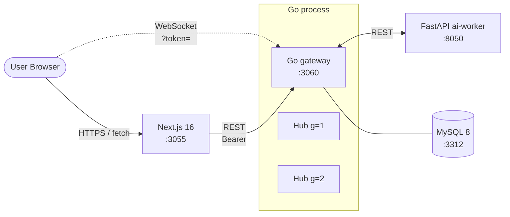

# Discord 風リアルタイムチャット (Go)

Discord のアーキテクチャを参考に、**「ギルド (server) / チャンネル / メッセージ + WebSocket gateway + プレゼンス」** をローカル環境で再現するプロジェクト。

slack (Rails / WebSocket fan-out) / youtube (Rails / Solid Queue) / github (Rails / GraphQL) / perplexity (Rails / SSE) / instagram (Django / Celery fan-out) に続く 6 つ目のプロジェクトとして、**バックエンドを意図的に Go で実装** ([リポジトリ方針「学習方針」](../docs/service-architecture-lab-policy.md#learning-roadmap-rails-replace)) し、**Go の goroutine + channel × WebSocket fan-out × ギルド単位シャーディング × プレゼンスハートビート** の 4 つを正面から扱う。

外部 SaaS / LLM は使用せず、ai-worker 側で deterministic な mock を実装することでローカル完結を保つ。

---

## 見どころハイライト (設計フェーズ)

> Phase 4: ai-worker (FastAPI / `/summarize` `/moderate`) と frontend (Next.js 16 / WebSocket subscribe + heartbeat) まで結線済み。Phase 5 で E2E + Terraform。

- **per-guild Hub goroutine + 単一プロセス** — slack の Rails ActionCable + Redis pub/sub と対比し、**Go の goroutine/channel で同じ問題をどう解くか**を残す ([ADR 0001](docs/adr/0001-guild-sharding-single-process-hub.md))
- **Hub は CSP 流 single goroutine + select pattern** — `clients` map は Hub goroutine が専有、mutex なし。slow consumer は non-blocking send + drop で吸収 ([ADR 0002](docs/adr/0002-hub-goroutine-channel-pattern.md))
- **app 層 HEARTBEAT (op 1) + Hub 内 ticker 監視** — Discord 公式 protocol と整合、ブラウザの WebSocket API 制約 (ping/pong frame を JS から送れない) を踏まえた設計選定 ([ADR 0003](docs/adr/0003-presence-heartbeat.md))
- **HS256 JWT bearer + WebSocket は `?token=` query** — REST + WS で同じ token、IDENTIFY での二重検証で reflection 攻撃を防ぐ ([ADR 0004](docs/adr/0004-auth-jwt-bearer.md))

---

## アーキテクチャ概要



詳細な ER / WebSocket シーケンス / op codes / API 概観は **[docs/architecture.md](docs/architecture.md)** を参照。

---

## 採用したスコープ

| 含める | 除外 |
| --- | --- |
| ギルド / チャンネル / メッセージ / メンバ (有向参加関係) | プライベート DM / グループ DM / カテゴリ化 |
| WebSocket gateway (op 0/1/2/10/11) + 単一プロセス per-guild Hub | shard 化 (multi-process + Redis pub/sub) → 派生 ADR |
| プレゼンス (online / offline 2 状態 + heartbeat 監視) | idle / dnd / invisible / カスタムステータス |
| Guild membership ベースの認可 | per-channel role overwrite → 派生 ADR |
| HS256 JWT bearer (1 経路) | OAuth / SSO / 2FA / メール検証 / token rotation |
| ai-worker `/summarize` `/moderate` (mock) | 実 LLM / NSFW model |
| メッセージ cursor pagination | 検索 / インデックス / FULLTEXT |
| **派生 ADR で扱う候補**: shard 化 / outbox / op `RESUME` / inactive Hub の lazy 停止 / per-channel overwrite / idle/dnd / token rotation / WebRTC voice | (上記いずれも本 ADR 0001-0004 のスコープ外として明示的に切り出し済み) |

---

## 主要な設計判断 (ADR ハイライト)

| # | 判断 | 何を選んで何を捨てたか |
| --- | --- | --- |
| [0001](docs/adr/0001-guild-sharding-single-process-hub.md) | **単一プロセス + per-guild Hub goroutine** + HubRegistry | global Hub / per-channel Hub / multi-process + Redis pub/sub / NATS-Kafka を却下。shard 化は派生 ADR |
| [0002](docs/adr/0002-hub-goroutine-channel-pattern.md) | **single goroutine + `select { case ... }`** で `clients` map を専有、mutex なし | RWMutex+map / actor model / sync.Map / atomic immutable を却下 |
| [0003](docs/adr/0003-presence-heartbeat.md) | **app 層 HEARTBEAT (op 1) + Hub 内 ticker 監視 + offline broadcast** | WS ping/pong (browser から送れない) / TCP keepalive (proxy で殺される) / Redis presence (single process なので不要) を却下 |
| [0004](docs/adr/0004-auth-jwt-bearer.md) | **HS256 JWT + WS は `?token=` query + IDENTIFY 二重検証** | session cookie / API token table / OAuth / Sec-WebSocket-Protocol を却下 |

---

## ポート割り当て

| サービス | ポート | 備考 |
| --- | --- | --- |
| frontend (Next.js)  | 3055 | instagram の 3045 から +10 |
| backend (Go)        | 3060 | instagram の 3050 から +10 |
| ai-worker (FastAPI) | 8050 | instagram の 8040 から +10 |
| MySQL               | 3312 | instagram の 3311 から +1 |

Redis は **不使用**。単一プロセス Hub なので channel で十分 (ADR 0001)。

---

## ローカル起動 (Phase 2 以降で動作)

### 前提

- Docker / Docker Compose / Node.js 20+ / Go 1.24+ / Python 3.12+

### 起動

```bash
# 1. インフラ
docker compose up -d mysql                  # 3312

# 2. backend (Go)
cd backend
go mod download
go run ./cmd/server/migrate                 # マイグレーション (Phase 2 で実装)
go run ./cmd/server                         # http://localhost:3060

# 3. ai-worker (別タブ)
cd ../ai-worker && python -m venv .venv && source .venv/bin/activate
pip install -r requirements.txt
uvicorn main:app --port 8050

# 4. frontend (別タブ)
cd ../frontend && npm install
npm run dev                                  # http://localhost:3055

# 5. E2E (Phase 5 で追加)
cd ../playwright && npm test
```

---

## ステータス

| コンポーネント | ステータス |
| --- | --- |
| ADR (0001-0004)             | 🟢 全 Accepted |
| architecture.md             | 🟢 ER / WebSocket シーケンス / op codes / API 概観 / 起動順序まで記述 |
| Backend (Go gateway)        | 🟢 Phase 2（REST + JWT + migrations + chi） |
| WebSocket gateway           | 🟢 Phase 3（gorilla/websocket + per-guild Hub + heartbeat + presence） |
| ai-worker (FastAPI)         | 🟢 Phase 4（`/summarize` `/moderate` deterministic mock + X-Internal-Token） |
| Frontend (Next.js 16)       | 🟢 Phase 4（login / guild list / channel + WS subscribe + presence pane） |
| 認証 (JWT bearer)           | 🟢 Phase 2 |
| E2E (Playwright)            | ⚪ Phase 5 で着手 |
| インフラ設計図 (Terraform)  | ⚪ Phase 5 で着手 |
| CI (GitHub Actions)         | 🟢 backend / ai-worker / frontend 3 ジョブ |

---

## ドキュメント

- [アーキテクチャ図](docs/architecture.md) — システム構成 / ER / WebSocket シーケンス / op codes / REST API 概観
- [ADR 一覧](docs/adr/)
  - [0001 ギルド単位シャーディング + 単一プロセス Hub](docs/adr/0001-guild-sharding-single-process-hub.md)
  - [0002 Hub の goroutine + channel 実装パターン](docs/adr/0002-hub-goroutine-channel-pattern.md)
  - [0003 プレゼンスのハートビート設計](docs/adr/0003-presence-heartbeat.md)
  - [0004 認証方式 (JWT bearer / WebSocket query param)](docs/adr/0004-auth-jwt-bearer.md)
- リポジトリ全体方針: [../CLAUDE.md](../CLAUDE.md)
- API スタイル選定: [../docs/api-style.md](../docs/api-style.md)
- 共通ルール: [../docs/](../docs/) (coding-rules / operating-patterns / testing-strategy)
- フレームワーク比較: [../docs/framework-django-vs-rails.md](../docs/framework-django-vs-rails.md) (本プロジェクト完成後に **Go vs Rails** 比較を追加予定)

---

## Phase ロードマップ

| Phase | 範囲 | 状態 |
| --- | --- | --- |
| 1 | scaffolding + ADR 4 本 + architecture.md + docker-compose | 🟢 設計フェーズ完了 |
| 2 | Go scaffold（chi + 生 SQL/`store` + JWT + bcrypt）+ Guild / Channel / Message / Member + REST CRUD + 認証 | 🟢 完了 |
| 3 | WebSocket gateway + per-guild Hub + IDENTIFY/HEARTBEAT/DISPATCH + presence broadcast | 🟢 完了 |
| 4 | ai-worker (FastAPI) `/summarize` `/moderate` + frontend (Next.js / WS subscribe / presence) | 🟢 完了 |
| 5 | Playwright (2 BrowserContext で WebSocket fan-out 検証) + Terraform 設計図 | ⚪ 未着手 |
