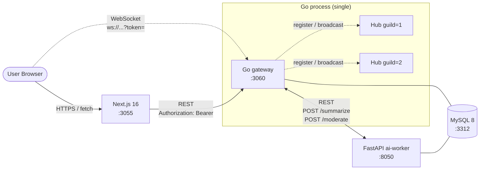
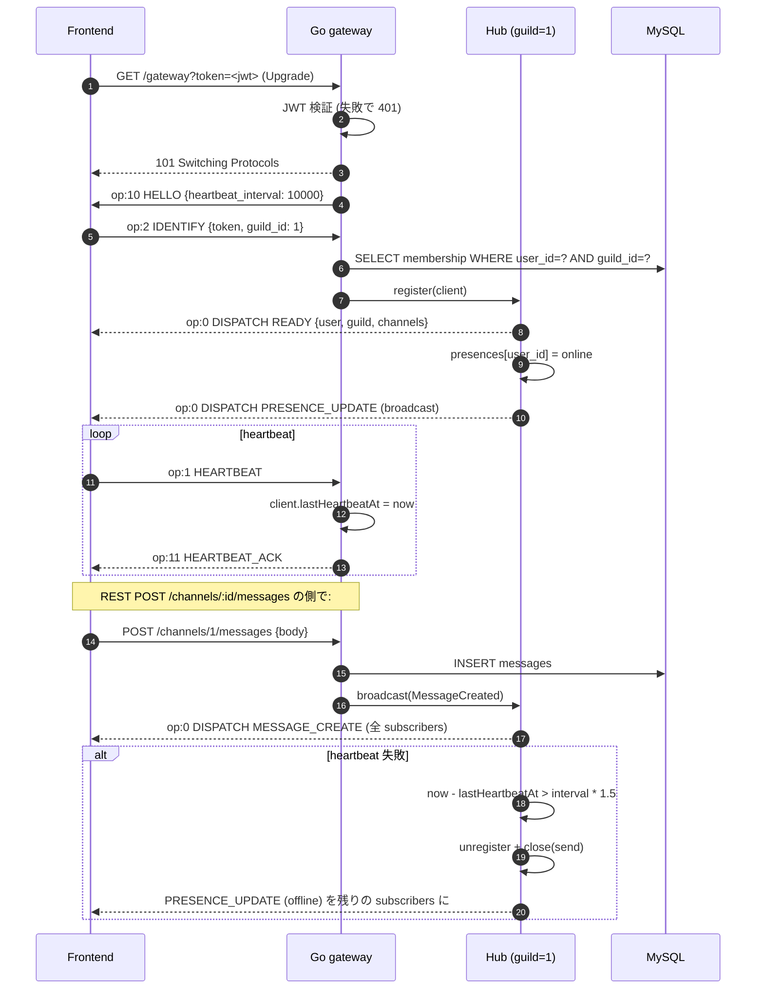
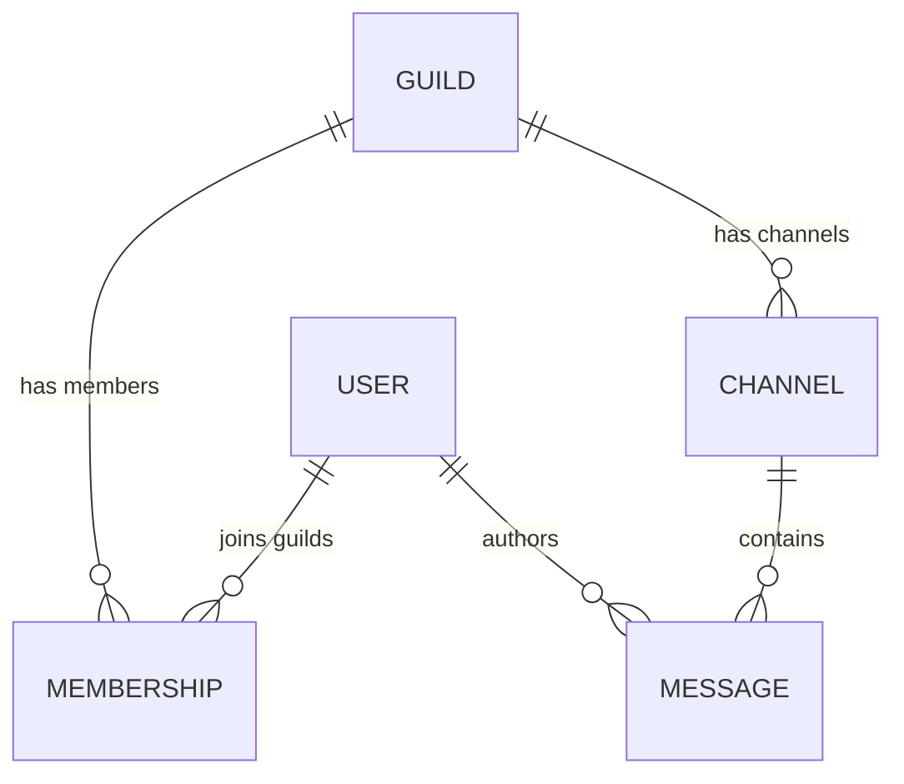

# Discord 風リアルタイムチャット (Go) アーキテクチャ

Discord のアーキテクチャを参考に、**「ギルド (server) / チャンネル / メッセージ + WebSocket gateway + プレゼンス」** をローカル環境で再現する学習プロジェクト。

中核となる技術課題は以下の 4 つ:

1. **ギルド単位シャーディング + 単一プロセス Hub** — per-guild Hub goroutine + HubRegistry。slack の Rails ActionCable + Redis pub/sub との対比 ([ADR 0001](adr/0001-guild-sharding-single-process-hub.md))
2. **Hub の goroutine + channel 実装パターン** — single goroutine + select で `clients` map を専有、mutex なし ([ADR 0002](adr/0002-hub-goroutine-channel-pattern.md))
3. **プレゼンスのハートビート** — app 層 op 1 HEARTBEAT + Hub 内 ticker 監視 + offline broadcast ([ADR 0003](adr/0003-presence-heartbeat.md))
4. **認証 (JWT bearer + WebSocket query)** — REST + WS で同じ JWT、WS は `?token=` で受ける ([ADR 0004](adr/0004-auth-jwt-bearer.md))

> 本プロジェクトは CLAUDE.md「言語別バックエンド方針」の **Go プロジェクト 1 本目**。slack (Rails ActionCable) と用途が近接するため、**「Go × per-guild Hub + goroutine/channel」** に焦点を絞り、**Slack との実装比較が学習素材**。

---

## システム構成



- 永続化は **MySQL のみ** (Redis 不採用、ADR 0001)
- frontend ↔ backend は **REST (固定形) + WebSocket (`/gateway`)**
- backend ↔ ai-worker は REST 同期コール (`/summarize`, `/moderate`)
- ai-worker ↔ MySQL は **読み専接続のみ** (perplexity / instagram と同方針)
- 書き込み (Guild / Channel / Message / Member / User) は **すべて Go 経由**

### WebSocket のデータフロー



詳細:
- per-guild Hub の構造は [ADR 0001](adr/0001-guild-sharding-single-process-hub.md)
- goroutine + channel の select pattern は [ADR 0002](adr/0002-hub-goroutine-channel-pattern.md)
- HELLO / HEARTBEAT / HEARTBEAT_ACK の op codes は [ADR 0003](adr/0003-presence-heartbeat.md)

---

## ドメインモデル



| テーブル | 役割 |
| --- | --- |
| `users` | username (UNIQUE), `password_hash` (bcrypt), `created_at` |
| `guilds` | name, owner_id, created_at |
| `memberships` | `(guild_id, user_id)` UNIQUE PK 相当 + `role` (`owner / admin / member`) + joined_at |
| `channels` | `guild_id` FK, `name`, `created_at`、(guild_id, created_at) index |
| `messages` | `channel_id` FK, `user_id` FK, `body TEXT`, `created_at`、`(channel_id, created_at)` index、`(channel_id, id DESC)` で cursor pagination |

> マイグレーションは Phase 2 (users / guilds / memberships) と Phase 2 後半 (channels / messages) に分けて作成する。

---

## Gateway protocol (op codes)

| op | 方向 | 名前 | データ |
| --- | --- | --- | --- |
| 0  | server → client | DISPATCH       | `{op:0, t: "MESSAGE_CREATE" / "PRESENCE_UPDATE" / "READY", d: {...}}` |
| 1  | client → server | HEARTBEAT      | `{op:1, d: <last_seq>}` |
| 2  | client → server | IDENTIFY       | `{op:2, d: {token, guild_id}}` |
| 10 | server → client | HELLO          | `{op:10, d: {heartbeat_interval: 10000}}` |
| 11 | server → client | HEARTBEAT_ACK  | `{op:11}` |

- 接続後すぐに HELLO を送る
- IDENTIFY 完了で READY を返す (user / guild / channels の初期 payload)
- DISPATCH の `t` で event 種別 (`MESSAGE_CREATE` / `PRESENCE_UPDATE` / 派生で `MESSAGE_DELETE` 等)

詳細形式と server 側のバッファリング規約は [ADR 0003](adr/0003-presence-heartbeat.md)。

---

## REST API 概観 (Go gateway ↔ Frontend)

| メソッド | パス | 用途 |
| --- | --- | --- |
| `POST` | `/auth/register` | username / password で登録、JWT 返却 |
| `POST` | `/auth/login` | username / password で login、JWT 返却 |
| `GET`  | `/me` | JWT から user 情報 |
| `GET`  | `/guilds` | 自分が所属するギルド一覧 |
| `POST` | `/guilds` | ギルド作成 (作成者は owner role で auto-join) |
| `POST` | `/guilds/:id/members` | 自分を guild に join (オープン参加 MVP、本物は招待制) |
| `GET`  | `/guilds/:id/channels` | guild のチャンネル一覧 |
| `POST` | `/guilds/:id/channels` | チャンネル作成 |
| `GET`  | `/channels/:id/messages` | メッセージ一覧 (cursor pagination) |
| `POST` | `/channels/:id/messages` | メッセージ投稿 + Hub.broadcast |
| `POST` | `/channels/:id/summarize` | ai-worker `/summarize` 経由口 |
| `GET`  | `/gateway?token=<jwt>` | WebSocket upgrade |
| `GET`  | `/health` | DB / ai-worker 疎通サマリ |

> **cursor pagination**: `?before=<message_id>` で `id < before` を `(channel_id, id DESC)` index で取得。perplexity / instagram と同方針。

---

## ai-worker の責務 (Python / FastAPI)

| エンドポイント | 用途 | 入出力 |
| --- | --- | --- |
| `POST /summarize` | チャンネルの直近メッセージ要約 (mock) | `{messages: [{user, body}, ...]}` → `{summary}` |
| `POST /moderate` | メッセージのスパム / NSFW スコア (mock) | `{body}` → `{flagged, score, reasons: []}` |
| `GET /health` | 疎通確認 | `{ok: true}` |

> mock 実装の規律: hash ベース determinist。LLM / 外部 API 不使用。Django/instagram と同パターン。

---

## レスポンス境界

- 認可は **`auth middleware` で JWT 検証 + `context` に user_id 注入**
- guild / channel access は handler 内で **membership SELECT** をかける (per-channel 権限 overwrite は派生 ADR、MVP は guild membership のみ)
- **WebSocket 失敗時の挙動**:
  - **(A) upgrade 前**: token 検証失敗 → **HTTP 401** (upgrade させない)
  - **(B) IDENTIFY 失敗**: invalid token / not member → `op:0 DISPATCH t:"INVALID_SESSION"` 後 close
  - **(C) heartbeat 失敗**: `unregister + close(send)` → 残り subscribers に `PRESENCE_UPDATE (offline)` broadcast
- **REST 失敗時**: 通常の HTTP status (4xx / 5xx)
- **ai-worker 不通時**: `/summarize` `/moderate` は **空レスポンス + `degraded: true` で 200** (graceful degradation、[operating-patterns.md §2](../../docs/operating-patterns.md))

---

## 起動順序

```bash
# 1. インフラ
docker compose up -d mysql        # 3312

# 2. backend (Go)
cd backend
go mod download
go run ./cmd/server/migrate
go run ./cmd/server                # http://localhost:3060

# 3. ai-worker (別タブ)
cd ../ai-worker && python -m venv .venv && source .venv/bin/activate
pip install -r requirements.txt
uvicorn main:app --port 8050

# 4. frontend (別タブ)
cd ../frontend && npm install
npm run dev                        # http://localhost:3055

# 5. E2E (Phase 5 で追加)
cd ../playwright && npm test
```

## ポート割り当て

| サービス | ポート | 備考 |
| --- | --- | --- |
| frontend (Next.js)  | 3055 | instagram の 3045 から +10 |
| backend (Go)        | 3060 | instagram の 3050 から +10 |
| ai-worker (FastAPI) | 8050 | instagram の 8040 から +10 |
| MySQL               | 3312 | instagram の 3311 から +1 |
| Redis               | (不使用) | 単一プロセス Hub なので broker 不要 (ADR 0001) |

## Phase ロードマップ

| Phase | 範囲 | 状態 |
| --- | --- | --- |
| 1 | scaffolding + ADR 4 本 + architecture.md + docker-compose | 🟢 設計フェーズ完了 |
| 2 | Go gateway（chi + `store`/SQL + JWT + bcrypt）+ Guild / Channel / Message / Member + REST CRUD + 認証 1 経路 | 🟢 完了 |
| 3 | WebSocket gateway (gorilla/websocket) + per-guild Hub + IDENTIFY/HEARTBEAT/DISPATCH op codes + presence broadcast | 🟢 完了 |
| 4 | ai-worker (FastAPI) `/summarize` `/moderate` + frontend (Next.js channels list / message feed / native WebSocket subscribe) | 🟢 完了 |
| 5 | Playwright (2 BrowserContext で fan-out 検証) + Terraform 設計図 + GitHub Actions CI workflows | ⚪ 未着手 |
