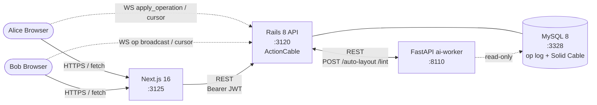

# Figma 風リアルタイム共同編集キャンバス (Rails 8 / Ruby 4)

Figma のアーキテクチャを参考に、**「Server 権威 LWW-CRDT による図形キャンバスのリアルタイム共同編集」** をローカル環境で再現するプロジェクト。

slack / youtube / github / perplexity / instagram / discord / reddit / shopify / zoom / calendly / uber に続く **12 番目のプロジェクト**、**Rails バックエンド 8 本目**（[リポジトリ方針「言語別バックエンド方針」](../README.md#言語別バックエンド方針)）。`slack`（同じ Rails ActionCable）と対比して **「append-only メッセージの fan-out」と「収束する編集 op の fan-out」の違い** を学習テーマに置く。

外部 SaaS / LLM は使用せず、座標・図形はローカル生成、ai-worker 側で deterministic な mock を実装することでローカル完結を保つ（リポ全体方針: [`../CLAUDE.md`](../CLAUDE.md)）。

---

## 見どころハイライト

> 🟡 **Phase 3 完了**: backend 初期化 (Phase 2) に加え、**LWW 収束エンジン `OperationApplier` を実装** (1 txn で `next_seq!` 原子採番 → `operations` append → per-prop `(lamport, actor_id)` LWW で `canvas_objects` を materialize)。**収束不変条件 spec が green** — 同一 op 集合を逆順 + 12 シャッフル順で適用しても全 permutation が同一状態に収束 (RSpec 9 例 / shopify 100-thread・discord race の figma 版)。次は Phase 4 (認証フロー + controllers + `DocumentChannel` + ai-worker)。

- **Server 権威 LWW-CRDT** — 権威は Go 的な in-memory ではなく **MySQL を「server が総順序 `seq` を付与する append-only op log = source of truth」** に置く。各プロパティは Lamport clock `(lamport, actor_id)` 付きの **LWW-Register**、`deleted` も 1 プロパティとして同一機構で解決 ([ADR 0001](docs/adr/0001-consistency-server-authoritative-lww-crdt.md))
- **op log + materialized state の二層** — `operations`（append-only / `(document_id, seq)` で総順序 / late-joiner catch-up）と `canvas_objects`（LWW 解決済みの現在状態 / snapshot 用）を 1 トランザクションで原子更新。`documents.version` を `with_lock` で原子採番 ([ADR 0002](docs/adr/0002-data-model-op-log-materialized-lww.md))
- **ActionCable + Solid Cable で op fan-out** — Rails 8 標準の DB-backed pub/sub（Redis 不使用）。`slack` の Redis adapter との対比。**multiplayer cursor は ephemeral**（op log にも DB にも載せない別メッセージ型） ([ADR 0003](docs/adr/0003-realtime-actioncable-solid-cable-ephemeral-cursor.md))
- **認証 1 経路** — rodauth-rails JWT を REST + ActionCable 両方で（slack 同方針） ([ADR 0004](docs/adr/0004-auth-rodauth-jwt-rest-and-actioncable.md))

---

## アーキテクチャ概要



詳細な ER / op 適用シーケンス / LWW 収束 / catch-up flow は **[docs/architecture.md](docs/architecture.md)** を参照。

---

## 採用したスコープ

| 含める | 除外 |
| --- | --- |
| 図形キャンバス（rect / ellipse / text-label を x/y/w/h/fill/z 等で編集） | ベクターパス編集 / ペンツール / ブーリアン演算 |
| Server 権威 LWW-CRDT による同時編集の収束 | pure peer CRDT (Yjs/Automerge) / OT（→ ADR で対比のみ） |
| append-only op log + materialized state + per-prop Lamport clock | event-sourced 完全リプレイ専用設計（snapshot を持たない形） |
| ActionCable + Solid Cable で op fan-out、cursor は ephemeral | WebRTC P2P mesh / 音声・動画 |
| 楽観適用 → server echo で reconcile / `?since=seq` catch-up | オフライン長時間編集のマージ UI / 競合解決 UI |
| document 単位の権限（owner / editor / viewer、1 経路認証） | チーム / プロジェクト / 組織階層の権限グラフ |
| ai-worker `/auto-layout`（整列・分配の実ジオメトリ）`/lint`（重なり検出 mock） | 実 ML / コンポーネント自動生成 / デザイン提案 LLM |
| local-history による undo/redo（自分の直近 op の逆 op） | 完全な協調 undo（他者 op を跨いだ undo の意味論）→ 派生 ADR |

---

## 主要な設計判断 (ADR ハイライト)

| # | 判断 | 何を選んで何を捨てたか |
| --- | --- | --- |
| [0001](docs/adr/0001-consistency-server-authoritative-lww-crdt.md) | **Server 権威 + LWW-CRDT** — server が `seq` 総順序を付与、各プロパティは Lamport clock 付き LWW-Register で収束 | pure peer CRDT (Yjs) / state-based CvRDT / OT を却下。実 Figma も pure CRDT を使わない理由を記載 |
| [0002](docs/adr/0002-data-model-op-log-materialized-lww.md) | **append-only `operations` log（server 採番 seq）+ materialized `canvas_objects`（per-prop Lamport clock）** を 1 txn 更新 | event-sourced 完全リプレイ / columns-only（clock を持たない LWW）を却下 |
| [0003](docs/adr/0003-realtime-actioncable-solid-cable-ephemeral-cursor.md) | **ActionCable + Solid Cable** で op fan-out、**cursor は非永続**の別メッセージ型 | Redis adapter（slack 既採用）/ cursor を op log に載せる案を却下 |
| [0004](docs/adr/0004-auth-rodauth-jwt-rest-and-actioncable.md) | **rodauth-rails JWT** を REST + ActionCable 両方で（1 経路） | OAuth / Devise / セッション cookie + WS 別経路を却下 |

---

## ポート割り当て

| サービス | ポート | 備考 |
| --- | --- | --- |
| frontend (Next.js)  | 3125 | uber の 3115 から +10 |
| backend (Rails)     | 3120 | uber の 3110 から +10 |
| ai-worker (FastAPI) | 8110 | uber の 8100 から +10 |
| MySQL               | 3328 | uber の 3327 から +1 |

Redis は **不使用**。ActionCable は Rails 8 標準の **Solid Cable**（MySQL backed）を採用（ADR 0003）。

---

## 既存サービスとの関係

| 観点 | 比較対象 | figma が学ぶこと |
| --- | --- | --- |
| Rails ActionCable | `slack`（Redis adapter / append-only message fan-out） | **収束する op** の fan-out + **Solid Cable**（DB backed）の対比 |
| リアルタイム協調の流派 | `dropbox`（候補 / OT or sync log） | figma = **CRDT (LWW)** 流派。3 つ揃うと「CRDT / OT / sync log」比較表が成立（policy） |
| 整合性パターン | `shopify`（条件付き UPDATE）/ `uber`（compare-and-set） | それらの「状態収束版」= per-prop LWW で順序非依存に収束 |
| Ruby 4 系 | `calendly`（本リポ初の Ruby 4） | 2 本目の Ruby 4 / Rails 8 プロジェクト |
| ローカル完結方針 | `perplexity`（RAG） | LLM API のような外部依存を deterministic mock 化する手法を踏襲 |

---

## ローカル起動

> 🟡 Phase 2 完了。backend が起動・DB 接続できる状態。controllers / channel / 認証フロー / frontend は Phase 3-5。

backend は **Ruby 4.0.5 (rbenv) + Rails 8.1**。host に Ruby 4 が無い場合は `rbenv install 4.0.5`（`figma/.ruby-version` で固定済み）。mysql2 のネイティブビルドは keg-only の `mysql@8.0` を使うため、初回 bundle 前に以下を設定する（`.bundle/config` は gitignore のため clone 後に再設定が必要）:

```sh
# 0. (clone 直後のみ) mysql2 ビルドを brew の mysql@8.0 に向ける
cd backend
bundle config set --local build.mysql2 \
  "--with-mysql-config=$(brew --prefix mysql@8.0)/bin/mysql_config --with-opt-dir=$(brew --prefix openssl@3)"
bundle install

# 1. 依存 (MySQL :3328) を起動
cd .. && docker compose up -d mysql

# 2. backend (Rails 8.1 / Ruby 4.0.5)。multi-DB (primary / cache / queue / cable) を作成 + schema 適用
cd backend
bin/rails db:prepare
bin/rails s -p 3120                 # http://localhost:3120 (ActionCable 同梱 / dev も Solid Cable)

# 3. ai-worker (別タブ) — Phase 4 で追加
#   cd ai-worker && python -m venv .venv && source .venv/bin/activate
#   pip install -r requirements.txt && uvicorn main:app --port 8110

# 4. frontend (別タブ) — Phase 5 で追加
#   cd frontend && npm install && npm run dev   # http://localhost:3125
```

> 注: dev の ActionCable は `solid_cable`（MySQL backed）。`figma_development_cable` DB が必要なので `db:prepare` で一括作成される。

---

## Phase ロードマップ

| Phase | 範囲 | 状態 |
| --- | --- | --- |
| 1 | scaffold + ADR 0001-0004 + architecture.md + docker-compose | 🟢 完了 |
| 2 | `rails new`（API / Ruby 4.0.5）+ rodauth JWT scaffold + migration（users / documents / document_members / canvas_objects / operations）+ multi-DB（dev も Solid Cable）+ thin models + boot smoke | 🟢 完了 |
| 3 | `OperationApplier`（seq 原子採番 + per-prop Lamport LWW）+ **収束不変条件 spec**（op を任意順で適用しても全 actor が同一状態に収束 — shopify 100-thread / discord race の figma 版）+ RSpec/FactoryBot scaffold | 🟢 完了 (RSpec 9 例) |
| 4 | 認証（rodauth JWT）→ controllers + `DocumentChannel`（ActionCable）+ request/channel spec → ai-worker（auto-layout / lint mock）+ 内部 ingress | ⬜ 次 |
| 5 | CI（backend / ai-worker / frontend / terraform）→ frontend（SVG canvas + cursor + 楽観/reconcile）→ Playwright（2 BrowserContext で同時編集の収束を hstack）→ Terraform 設計図 | ⬜ |

---

## ドキュメント

- [docs/architecture.md](docs/architecture.md) — システム図・ER・op 適用シーケンス・LWW 収束・catch-up・失敗時挙動
- [docs/adr/0001-consistency-server-authoritative-lww-crdt.md](docs/adr/0001-consistency-server-authoritative-lww-crdt.md)
- [docs/adr/0002-data-model-op-log-materialized-lww.md](docs/adr/0002-data-model-op-log-materialized-lww.md)
- [docs/adr/0003-realtime-actioncable-solid-cable-ephemeral-cursor.md](docs/adr/0003-realtime-actioncable-solid-cable-ephemeral-cursor.md)
- [docs/adr/0004-auth-rodauth-jwt-rest-and-actioncable.md](docs/adr/0004-auth-rodauth-jwt-rest-and-actioncable.md)
