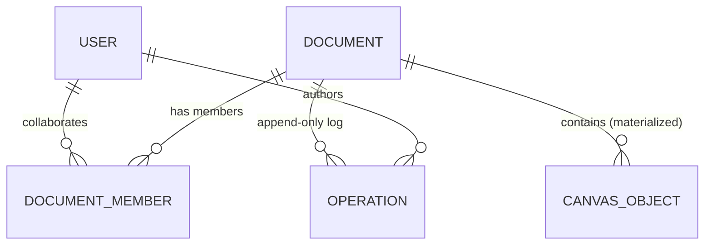
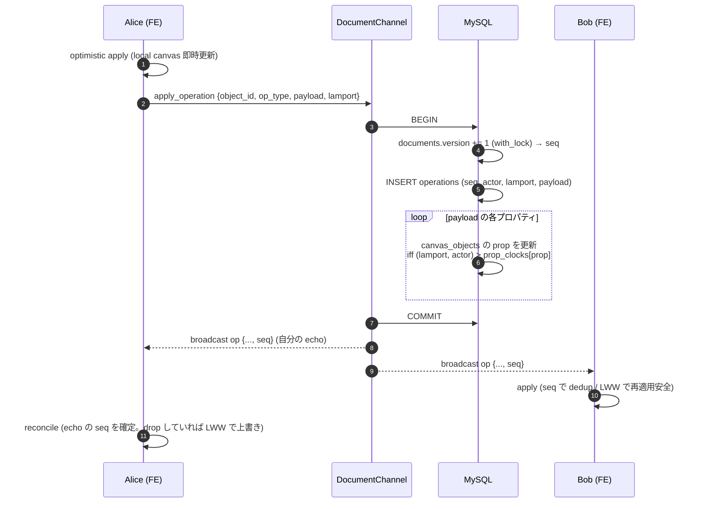
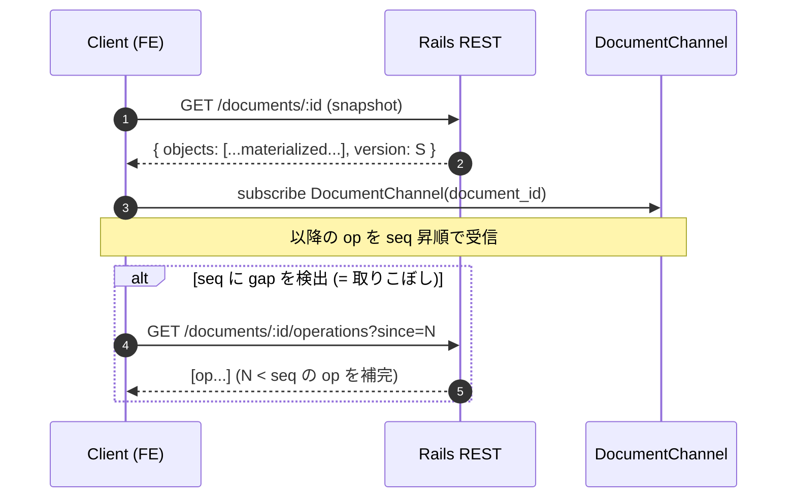

# figma アーキテクチャ

Figma を参考に、**「Server 権威 LWW-CRDT による図形キャンバスのリアルタイム共同編集」** をローカル環境で再現する学習プロジェクト。中核の技術課題は 4 つ:

1. **整合性モデル** — server を権威にしつつ、各プロパティを Lamport clock 付き LWW-Register として収束させる ([ADR 0001](adr/0001-consistency-server-authoritative-lww-crdt.md))
2. **データモデル** — append-only `operations` log（server 採番 `seq`）+ materialized `canvas_objects` を 1 トランザクションで原子更新 ([ADR 0002](adr/0002-data-model-op-log-materialized-lww.md))
3. **リアルタイム配信** — ActionCable + Solid Cable で op を fan-out、cursor は ephemeral ([ADR 0003](adr/0003-realtime-actioncable-solid-cable-ephemeral-cursor.md))
4. **認証** — rodauth-rails JWT を REST + ActionCable 両方で（1 経路） ([ADR 0004](adr/0004-auth-rodauth-jwt-rest-and-actioncable.md))

> 本プロジェクトは Rails バックエンド 8 本目。`slack`（Rails ActionCable / Redis adapter / append-only message）と用途が近接するため、**「append-only fan-out と収束する op fan-out の違い」** + **「Solid Cable（DB backed）」** に焦点を絞り、Slack との実装比較を学習素材にする。

---

## ドメイン境界

```mermaid
flowchart LR
  alice([Alice Browser])
  bob([Bob Browser])
  alice -->|REST fetch (Bearer JWT)| api
  bob   -->|REST fetch (Bearer JWT)| api
  alice -.->|WS apply_operation / cursor| cable
  bob   -.->|WS op broadcast / cursor| cable
  api[Rails 8 API<br/>:3120]
  cable[ActionCable<br/>DocumentChannel]
  api --- cable
  api <-->|REST POST /auto-layout /lint<br/>X-Internal-Token| ai[FastAPI ai-worker<br/>:8110]
  api --- mysql[(MySQL 8 :3328<br/>operations / canvas_objects<br/>+ Solid Cable / Queue / Cache)]
  ai -.->|read-only| mysql
```

- 永続化は **MySQL のみ**。Solid Cable（ActionCable）/ Solid Queue / Solid Cache を同一 DB に同居（Redis 不採用、ADR 0003）
- frontend ↔ backend は **REST（固定形のロード・作成・catch-up）+ ActionCable（op 投入と受信、cursor）**
- backend ↔ ai-worker は REST 同期コール（`/auto-layout`, `/lint`）+ `X-Internal-Token`（trusted ingress）
- ai-worker ↔ MySQL は **読み専接続のみ**（perplexity / instagram / discord と同方針）
- 書き込み（document / member / canvas_object / operation）は **すべて Rails 経由**

---

## データモデル



| テーブル | 役割 |
| --- | --- |
| `users` | rodauth account + profile（slack / calendly と同形） |
| `documents` | canvas file。`name`, `owner_id`, **`version` BIGINT**（per-doc 単調増加カウンタ = op の総順序 `seq` 採番源）, `created_at` |
| `document_members` | 権限。`(document_id, user_id)` UNIQUE + `role` ENUM(`owner` / `editor` / `viewer`) |
| `operations` | **append-only ordered log**。`document_id`, **`seq` BIGINT**（= commit 時の `documents.version`）, `actor_id`, `object_id`（client UUID）, `op_type` ENUM(`create`/`update`/`delete`）, `payload` JSON（変更プロパティ）, **`lamport` BIGINT**, `created_at`。`(document_id, seq)` UNIQUE + INDEX（catch-up 用） |
| `canvas_objects` | LWW 解決済みの **現在状態**（materialized / snapshot 用）。`document_id`, `object_id`（client UUID）, `kind` ENUM(`rect`/`ellipse`/`text`）, `props` JSON, **`prop_clocks` JSON**（`{"x": {"l": 12, "a": 3}, ...}`）, `z_index` INT, `last_seq` BIGINT, `created_at`, `updated_at`。`(document_id, object_id)` UNIQUE |

### 2 つの「時計」を分ける（中核概念）

- **`seq`（server 権威の総順序）** — 配信順序の安定化・catch-up（`?since=seq`）・dedup に使う。server が `documents.version` を `with_lock` で原子採番。
- **`lamport`（client 論理時計）** — **LWW の勝敗判定**に使う。client が編集時に `local = max(local, 受信 lamport) + 1` で進める標準 Lamport clock。

`seq` と `lamport` を分けるのが要点（[ADR 0001](adr/0001-consistency-server-authoritative-lww-crdt.md) / [ADR 0002](adr/0002-data-model-op-log-materialized-lww.md)）。LWW の収束は **到着順・seq に依存しない**（`lamport` のみで決まる）ので、どの actor がどの順で op を適用しても materialized state は同一に収束する（CRDT 性）。`seq` は「server が durable に並べた歴史」を提供するだけ。

---

## 主要フロー

### 1. op 適用（OperationApplier / 1 トランザクション）



- **LWW 比較**: payload の各プロパティについて、`(incoming_lamport, actor_id) > prop_clocks[prop]` のときだけ `props[prop]` と `prop_clocks[prop]` を更新。同値 tie は `actor_id` で決定的に決める。
- **`deleted` も 1 プロパティ**: 削除は `deleted=true` への LWW op。create / update / delete の競合がすべて同一機構（LWW-Register）で収束する。
- **権威の所在**: server は (a) `seq` 総順序の採番、(b) materialized state の durable 保持、(c) 権限検証（viewer は op 拒否）を担う。収束の正しさ自体は LWW の決定性が保証する（[ADR 0001](adr/0001-consistency-server-authoritative-lww-crdt.md)）。

### 2. ドキュメント読み込み + 遅延 join の catch-up



- 初期ロードは **materialized snapshot**（全 op リプレイ不要）。`version` を起点に subscribe。
- WS で seq の gap を検出したら REST で `?since=N` 補完（at-least-once を client 側で吸収）。

### 3. multiplayer cursor（ephemeral）

- `DocumentChannel#cursor({x, y})` → server は **DB に書かず** そのまま fan-out（actor 情報を付けて rebroadcast）。
- cursor は op log にも `canvas_objects` にも載らない。discord presence より軽量（永続ゼロ、ADR 0003）。
- frontend は pointermove を throttle（例 ~30–50ms）して送信、他者の cursor を名前ラベル + per-actor 色で描画。

---

## REST API 概観

| メソッド | パス | 用途 |
| --- | --- | --- |
| `POST` | `/auth/...`（rodauth） | register / login → JWT 発行（ADR 0004） |
| `GET`  | `/me` | JWT から user 情報 |
| `GET`  | `/documents` | 自分が member のドキュメント一覧 |
| `POST` | `/documents` | ドキュメント作成（作成者は owner で auto-member） |
| `GET`  | `/documents/:id` | **snapshot**（materialized objects + version）|
| `GET`  | `/documents/:id/operations?since=N` | op catch-up（seq > N）|
| `POST` | `/documents/:id/members` | collaborator 追加（role 指定）|
| `POST` | `/documents/:id/auto-layout` | ai-worker `/auto-layout` proxy（選択 object の整列・分配）|
| `POST` | `/documents/:id/lint` | ai-worker `/lint` proxy（重なり・グリッド外検出）|

ActionCable: `DocumentChannel`（`stream_for document`）。client→server action = `apply_operation` / `cursor`。server→client broadcast = `operation`（seq 付き）/ `cursor`（ephemeral）。

---

## ai-worker の責務 (Python / FastAPI / deterministic mock)

| エンドポイント | 用途 | 入出力 |
| --- | --- | --- |
| `POST /auto-layout` | 選択 object の整列・等間隔分配（**実ジオメトリ計算**、LLM 不使用） | `{objects: [{id, x, y, w, h}, ...], mode: "align-left"\|"distribute-h"\|...}` → `{updates: [{id, x, y}, ...]}` |
| `POST /lint` | 重なり / グリッド外 / 不揃い間隔の検出 + 提案（deterministic） | `{objects: [...], grid: 8}` → `{issues: [{object_id, kind, suggestion}, ...]}` |
| `GET /health` | 疎通確認 | `{ok: true}` |

> mock 規律: 幾何計算は決定的。LLM / 外部 API 不使用。backend からは `X-Internal-Token` 付き同期 REST、結果は op として canvas に適用（auto-layout は updates を LWW op 化）。ai-worker 不通時は **`degraded: true` で 200**（graceful degradation、[operating-patterns.md](../../docs/operating-patterns.md)）。

---

## 失敗時の挙動

- **認証失敗（REST）**: 401。**ActionCable**: connection identification 失敗で reject（slack 同方針、ADR 0004）。
- **権限不足**: viewer が `apply_operation` → server で拒否（op を materialize せず broadcast もしない）。
- **op の取りこぼし（WS drop）**: client が seq gap を検出 → `GET /operations?since=N` で補完。LWW なので再適用は冪等。
- **同時編集の競合**: 同一プロパティへの並行 op は **LWW（lamport, actor）で決定的に勝者を選ぶ**。負けた op も `operations` には残る（監査・catch-up 用）が `canvas_objects` には反映されない。
- **ai-worker 不通**: `/auto-layout` `/lint` は `degraded: true` で 200、canvas 編集自体は止めない。
- **server 再起動 / 新規 join**: materialized snapshot から復元（全リプレイ不要）。

---

## ローカル運用

- 起動順: MySQL（:3328）→ Rails（:3120, ActionCable 同梱）→ ai-worker（:8110）→ frontend（:3125）。
- Solid Cable / Solid Queue / Solid Cache は同一 MySQL に同居（single-DB、youtube / shopify / zoom と同方針）。
- テスト: RSpec（収束不変条件 spec / channel spec / request spec）+ pytest（ai-worker）+ Playwright（2 BrowserContext で同時編集の収束を hstack）。

---

## Phase ロードマップ

| Phase | 範囲 | 状態 |
| --- | --- | --- |
| 1 | scaffold + ADR 0001-0004 + architecture.md + docker-compose | 🟢 完了 |
| 2 | `rails new`（API / Ruby 4.0.5）+ rodauth JWT scaffold + migration（users / documents / document_members / canvas_objects / operations）+ multi-DB（dev も Solid Cable）+ thin models + boot smoke | 🟢 完了 |
| 3 | `OperationApplier`（seq 原子採番 + per-prop Lamport LWW）+ **収束不変条件 spec**（RSpec 9 例 / 逆順 + 12 シャッフルで収束を固定）+ RSpec/FactoryBot scaffold | 🟢 完了 |
| 4 | 認証（rodauth JWT）→ controllers + `DocumentChannel` + spec → ai-worker（auto-layout / lint）+ 内部 ingress | ⬜ |
| 5 | CI → frontend（SVG canvas + cursor + 楽観/reconcile）→ Playwright（同時編集収束 hstack）→ Terraform | ⬜ |
