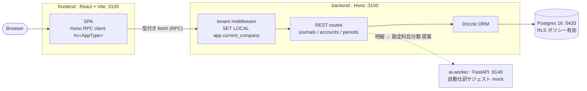

# freee 風 複式簿記 SaaS (TypeScript フルスタック: Hono + React/Vite + Postgres)

freee / マネーフォワード を参考に、**「Postgres Row-Level Security (RLS) による DB 強制マルチテナント + 複式簿記の不変条件 (借方 = 貸方) を持つ append-only 仕訳 ledger」** をローカル環境で再現するプロジェクト。

本リポ初の **Postgres** 採用プロジェクトであり、backend は **Hono** (linear の NestJS に対する edge-first / 軽量ミドルウェアの対極)、frontend は **React + Vite (SPA)** (本リポ初の非 Next.js)。FE/BE の型は **Hono RPC (`hc<AppType>`)** で codegen 不要に共有する (linear の共有 zod / github の graphql-codegen に次ぐ第3の流派)。

外部 SaaS / LLM は使用せず、ai-worker 側で deterministic な mock を実装することでローカル完結を保つ（リポ全体方針: [`../CLAUDE.md`](../CLAUDE.md)）。

---

## 見どころハイライト

> 🟡 **Phase 2 完了**: ADR 0001-0004 + monorepo 初期化 (Hono/Drizzle/React-Vite/zod) + RLS/EXCLUDE/trigger を含む生 SQL migration + seed。**4 つの DB 不変条件 (RLS 分離 / append-only / 借方=貸方 / 期間ガード) を非特権ロール freee_app で検証済み** (`backend/scripts/smoke.ts`)、Hono RPC のフルパス (`/accounts` の tenant 別取得 + zod 検証) も疎通。次は Phase 3 (仕訳記帳 / 期末締め / 試算表のドメイン実装 + テスト)。

このプロジェクトが「再現する技術課題」は以下の 4 点。実装が進んだら各項目に実装ポインタを足す。

- **DB 強制マルチテナント (Postgres RLS)** — 全テーブルに `company_id` を持たせ、`shared-schema + RLS ポリシー`で**アプリ層のうっかり漏れを DB 層で塞ぐ**。アプリは非 superuser / 非 BYPASSRLS ロールで接続し、リクエストごとに `SET LOCAL app.current_company` をトランザクションに注入する。**shopify (MySQL のアプリ層 `shop_id` scoping) との「DB 強制 vs アプリ層」対比**が学習軸。
- **複式簿記の不変条件 (借方 = 貸方)** — 1 仕訳 (journal entry) は複数明細 (lines) を持ち、`SUM(debit) = SUM(credit)` を **deferrable constraint / トランザクション内検証**で強制する。
- **append-only 仕訳 ledger + 逆仕訳 (reversal)** — 記帳済み仕訳は UPDATE / DELETE しない。訂正は**逆仕訳を新規記帳**して表現する (shopify StockMovement / zoom HostTransfer と同じ append-only 監査の系譜)。
- **期末締め state machine** — 会計期間を `open → closed` で遷移させ、**締め済み期間への記帳を拒否**する。

---

## アーキテクチャ概要



> RLS の肝: アプリ接続ロールは `NOSUPERUSER` かつ RLS をバイパスしない。`SET LOCAL` をトランザクション境界に閉じ込めることで、コネクションプール越しのテナント混線を防ぐ。

---

## ADR (4 本確定)

- **[ADR 0001](docs/adr/0001-multi-tenancy-postgres-rls.md): shared-schema + Postgres RLS によるマルチテナント分離** — 分離戦略の比較と RLS 運用 (非特権ロール / `SET LOCAL` / プール混線)。shopify アプリ層 scoping との対比。中核。
- **[ADR 0002](docs/adr/0002-double-entry-invariant-append-only-ledger.md): 複式簿記 invariant + append-only 仕訳 ledger + 逆仕訳** — 借方=貸方 を DEFERRABLE constraint trigger で COMMIT 時に DB 強制 / 訂正は逆仕訳。
- **[ADR 0003](docs/adr/0003-period-close-state-machine.md): 期末締め state machine と締め済み期間への記帳ガード** — 期間状態遷移 + `EXCLUDE` 制約での非重複 (calendly の MySQL 代替との対比)。
- **[ADR 0004](docs/adr/0004-hono-drizzle-rpc-stack.md): Hono + Drizzle + Hono RPC** — linear (NestJS/Prisma/zod) が却下した組を意図的に採用し TS フルスタックの別流派を学ぶ。

ADR は [`../docs/adr-template.md`](../docs/adr-template.md) の書式。設計の全体像は [`docs/architecture.md`](docs/architecture.md)。

---

## ローカル起動

ポート割り当て: Postgres `5433` / backend(Hono) `3150` / frontend(Vite) `3155` / ai-worker `8140`。

```sh
cd freee
npm install                      # monorepo (npm workspaces) 一括

# 1. DB を起動 (Postgres 16, healthcheck 付き)
docker compose up -d --wait db

# 2. スキーマ + RLS/EXCLUDE/trigger を適用 (テーブル所有者 freee で) → seed
npm run db:migrate -w @freee/backend
npm run db:seed    -w @freee/backend

# 3. backend (Hono :3150) — 実行時は非特権ロール freee_app で接続 (RLS が効く)
npm run dev -w @freee/backend

# 4. frontend (React+Vite :3155) — /accounts /health は :3150 へ proxy
npm run dev -w @freee/frontend

# 5. ai-worker (仕訳サジェスト mock :8140)
docker compose up -d ai-worker
```

### 不変条件のスモーク確認

```sh
# RLS テナント分離 / append-only / 借方=貸方 / 期間ガード を freee_app ロールで一括検証
npx tsx backend/scripts/smoke.ts
```

DB 停止: `docker compose down`（ボリュームも消すなら `-v`）。
