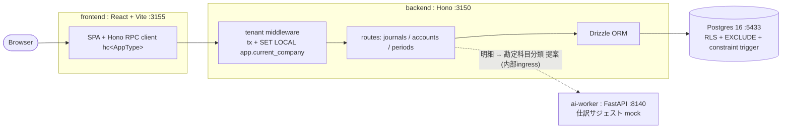

# freee アーキテクチャ

> 🔴 Phase 1 設計フェーズ。ADR 0001-0004 まで確定。実装が進んだら各節に実装ポインタを足す。

関連: [ADR 0001 RLS](adr/0001-multi-tenancy-postgres-rls.md) / [ADR 0002 複式簿記 invariant](adr/0002-double-entry-invariant-append-only-ledger.md) / [ADR 0003 期末締め](adr/0003-period-close-state-machine.md) / [ADR 0004 Hono/Drizzle/RPC](adr/0004-hono-drizzle-rpc-stack.md)

## ドメイン境界

- **Company (tenant)** — すべての業務データが属する分離単位。RLS の `app.current_company` の値（ADR 0001）。
- **Account (勘定科目)** — 借方/貸方が積み上がる先。company スコープ。
- **JournalEntry / JournalLine (仕訳 / 明細)** — 記帳の本体。entry 1 : N line、借方=貸方が不変条件（ADR 0002）。append-only。
- **AccountingPeriod (会計期間)** — `open / closed` の state machine。記帳可否を決める（ADR 0003）。
- **信頼境界**: Hono backend（記帳・締め・台帳の権威）↔ ai-worker（自動仕訳サジェストの mock、**提案のみで記帳しない**。内部 ingress + 共有トークン）。ai-worker は会計の真実を持たない。

## データモデル

全 tenant-scoped table に `company_id BIGINT NOT NULL` + `(company_id, ...)` 複合 index + RLS ポリシー（ADR 0001）。

| テーブル | 主な列 | 不変条件 / 制約 |
| --- | --- | --- |
| `companies` | `id`, `name` | tenant のルート |
| `accounts` | `company_id`, `code`, `name`, `type`(資産/負債/純資産/収益/費用) | `(company_id, code)` UNIQUE |
| `journal_entries` | `company_id`, `entry_date`, `description`, `reversed_entry_id?` | append-only（UPDATE/DELETE 拒否） |
| `journal_lines` | `company_id`, `journal_entry_id`, `account_id`, `side`(debit/credit), `amount NUMERIC(18,2)` | `amount > 0`、entry 単位で **SUM(debit)=SUM(credit)**（DEFERRABLE constraint trigger） |
| `accounting_periods` | `company_id`, `name`, `starts_on`, `ends_on`, `status`(open/closed) | 同一 company 内で期間が**重ならない**（`EXCLUDE USING gist`） |
| `period_closings` | `company_id`, `period_id`, `action`(close/reopen), `at` | append-only 監査 |

金額は `NUMERIC`（浮動小数禁止）。FE/BE 境界では文字列で運ぶ（ADR 0004）。

## 主要フロー

1. **記帳** — tenant middleware が `db.transaction` を開き `SET LOCAL app.current_company` を発行 → `entry_date` が属する期間が `open` か検証（ADR 0003）→ entry + lines を INSERT → アプリ層で借方=貸方プリチェック → COMMIT 時に DEFERRABLE trigger が SUM 検証（ADR 0002）。
2. **訂正（逆仕訳）** — 元 entry を指す `reversed_entry_id` 付きで、借方貸方を入れ替えた新規 entry を記帳。元 entry は不変。
3. **期末締め** — `accounting_periods` を `open → closed`（再オープンは `closed → open`）。遷移は明示マップで検証し `period_closings` に監査記録。
4. **試算表 (trial balance)** — 勘定科目別に `SUM(debit) - SUM(credit)` を集計。仕訳の projection なので集計テーブルは持たない（MVP）。
5. **仕訳サジェスト** — 取引明細の摘要から勘定科目を ai-worker が deterministic に分類提案。あくまで提案で、記帳はユーザー確定後に backend が行う。

## 失敗時の挙動

- 借方 ≠ 貸方 → アプリ層で 422（trigger は最終防衛線）。
- 締め済み期間への記帳 / 逆仕訳 → 409 or 422（アプリ層 + trigger）。
- 期間の重複作成 → `EXCLUDE` 違反で 422。
- **テナント越境アクセス** → アプリ層 scope を外しても RLS で 0 行（fail-closed）。これが本 PJ の核となる不変条件テスト。
- ai-worker 応答なし / 4xx → サジェストなしで degrade。記帳フロー自体は阻害しない。

## ローカル運用

- `docker compose up -d db ai-worker`（Postgres 5433 / ai-worker 8140）。backend(3150) / frontend(3155) は host の Node で `npm run dev`（linear と同方針）。
- 初期化: `CREATE EXTENSION btree_gist`（EXCLUDE 用）、アプリ用 `NOSUPERUSER` ロール作成、RLS ポリシー / trigger は Drizzle migration（生 SQL 併用）で適用。
- マイグレーション用ロール（テーブル所有者 = RLS バイパス）と実行時ロール（非特権 = RLS 適用）を分ける（ADR 0001）。
