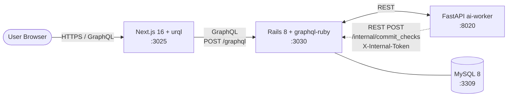
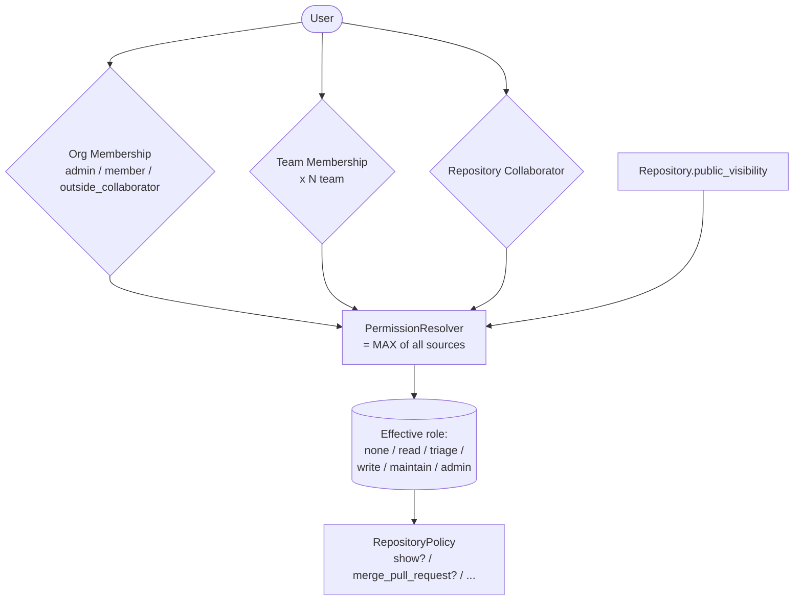

# GitHub風 Issue Tracker

GitHub のアーキテクチャを参考に、**「権限グラフ」「Issue / PR / Review の関係グラフ」「CI ステータス集約」「GraphQL field 単位認可」** の 4 つに集中したプロジェクト。

slack / youtube が **REST + OpenAPI** だったのに対し、**本リポジトリで唯一の GraphQL プロジェクト**。
関係グラフが主役のドメインで GraphQL の N+1 / Dataloader / field 認可がなぜ嬉しいかを実装で示すことが目的。
実 git 操作・diff レンダリング・OAuth 統合は範囲外。

---

## 見どころハイライト

- **権限グラフを 1 箇所に集約した解決層** — `Org base / Team / 個別 Collaborator / 公開 floor` の最大権限を `PermissionResolver` が解く。Mutation はすべて Pundit policy verb 経由 (`authorize!(record, :merge_pull_request?)`) で書かれ、解決ロジックの直接呼び出しは禁止規約 ([ADR 0002](docs/adr/0002-permission-graph.md))
- **graphql-ruby Dataloader で N+1 を実証的に潰す** — `repositories.viewerPermission` のような一覧で N 件を返すフィールドが、permission 解決クエリを **N に対して定数で抑える**ことを `spec/graphql/n_plus_one_spec.rb` で SQL 件数と共に固定 ([ADR 0001](docs/adr/0001-graphql-adoption.md))
- **Issue / PR の番号空間共有** — GitHub の `#1, #2, ...` は Issue と PR で 1 つの番号空間。`repository_issue_numbers` テーブルに `with_lock` で採番させ、Issue=#1 → PR=#2 が連番で発行されることを実環境でも確認 ([ADR 0003](docs/adr/0003-issue-pr-data-model.md))
- **CI チェックの集約値を派生計算** — 個別 check は `commit_checks` に upsert で永続化し、PR の `checkStatus` (SUCCESS / FAILURE / PENDING / NONE) は `head_sha` 配下の最新行から派生。ai-worker → backend `/internal/commit_checks` (REST + 共有トークン) → GraphQL バッジ反映までを Playwright で E2E ([ADR 0004](docs/adr/0004-ci-status-aggregation.md))

---

## アーキテクチャ概要



### 権限グラフ (effective role の解決)



詳細な ER / GraphQL スキーマ概観は **[docs/architecture.md](docs/architecture.md)** を参照。

---

## 採用したスコープ

| 含める | 除外 |
| --- | --- |
| Org / Team / Repository / Collaborator の権限階層 | SSO / SAML / 2FA |
| Issue (open/closed) + Comment + Label + Assignee | Issue templates / projects / milestones の作り込み |
| PR + Review + RequestedReviewer + mergeable_state | 実 git 操作 / diff レンダリング / inline review |
| CI チェック upsert + 集約状態 | Actions ランナー / artifact ストレージ |
| AI レビュー (モック) / Issue 要約 (モック) | Marketplace / 課金 / Webhook 配信保証 |

---

## 主要な設計判断 (ADR ハイライト)

| # | 判断 | 何を選んで何を捨てたか |
| --- | --- | --- |
| [0001](docs/adr/0001-graphql-adoption.md) | **GraphQL (graphql-ruby + urql)** | 関係グラフが主役のドメインで REST だと endpoint 爆発。N+1 は Dataloader で潰す。コスト: HTTP cache / schema 進化の運用 |
| [0002](docs/adr/0002-permission-graph.md) | **Resolver + Pundit policy の 2 層構造** | 解決と verb 適用を分離。outside_collaborator は base 継承を持たない (実 GitHub 仕様) を Scope spec で固定 |
| [0003](docs/adr/0003-issue-pr-data-model.md) | **Issue と PR を別テーブル + 番号空間共有** | STI で NULL 洪水を作らず、`repository_issue_numbers.with_lock` で採番だけ共有 |
| [0004](docs/adr/0004-ci-status-aggregation.md) | **upsert + 派生計算の集約** | 個別 check の履歴は upsert で潰す (`(repo, sha, name)` UNIQUE)、集約値は派生フィールドで動的計算 |

---

## 動作確認 (Try it)

`docker compose up -d mysql` 後、Rails / ai-worker / frontend を起動 + `bundle exec rails db:seed` で `acme/tools` を作る。

### GraphQL クエリ (curl)

```bash
# viewer 切替は X-User-Login ヘッダで行う (Phase 5 で本番 auth に差し替え予定)
curl -sS -H "Content-Type: application/json" -H "X-User-Login: alice" \
  -X POST http://localhost:3030/graphql \
  -d '{"query":"{ viewer { login email } }"}'

# repository 詳細 (viewerPermission は Dataloader で batch 解決)
curl -sS -H "Content-Type: application/json" -H "X-User-Login: alice" \
  -X POST http://localhost:3030/graphql \
  -d '{"query":"{ repository(owner:\"acme\", name:\"tools\") { viewerPermission issues(first:10){ number title state } pullRequests(first:10){ number title checkStatus } } }"}'

# Issue 作成 mutation (action 単位の mutation で createIssue / closeIssue / mergePullRequest など)
curl -sS -H "Content-Type: application/json" -H "X-User-Login: alice" \
  -X POST http://localhost:3030/graphql \
  -d '{"query":"mutation{ createIssue(input:{owner:\"acme\", name:\"tools\", title:\"hi\", body:\"\"}){ issue{ number } errors } }"}'
```

### CI 集約の挙動を見る

```bash
# ai-worker から build と test を success で投げる → checkStatus が SUCCESS に
curl -sS -X POST http://localhost:8020/check/run \
  -H "Content-Type: application/json" \
  -d '{"owner":"acme","name":"tools","head_sha":"seedsha000000000000000000000000000000000","check_name":"build","force_state":"success"}'
curl -sS -X POST http://localhost:8020/check/run \
  -H "Content-Type: application/json" \
  -d '{"owner":"acme","name":"tools","head_sha":"seedsha000000000000000000000000000000000","check_name":"test","force_state":"success"}'

# GraphQL で集約値を確認
curl -sS -H "Content-Type: application/json" -H "X-User-Login: alice" \
  -X POST http://localhost:3030/graphql \
  -d '{"query":"{ pullRequest(owner:\"acme\", name:\"tools\", number:2){ checkStatus commitChecks{ name state } } }"}'
# => {"data":{"pullRequest":{"checkStatus":"SUCCESS","commitChecks":[...]}}}
```

ブラウザで http://localhost:3025/acme/tools/pull/2 を開けば、集約バッジ + commit_checks 表 + reviews が見える。

### 権限の境界を試す

```bash
# alice (org admin) はすべて見える
curl ... -H "X-User-Login: alice" ...   # repository 詳細を返す

# carol (outside_collaborator / 個別付与なし) は private repo を見えない
curl ... -H "X-User-Login: carol" ...   # repository: null (404 ではなく field-level null)
```

---

## テスト

| レイヤ | フレームワーク | 件数 / カバー範囲 |
| --- | --- | --- |
| 単体・サービス | RSpec + FactoryBot | 21 件 (PermissionResolver / IssueNumberAllocator / PullRequest 状態機械 / aggregated_check_state) |
| Policy | RSpec | 6 件 (`RepositoryPolicy::Scope` の outside_collaborator / team-grant 含む) |
| GraphQL request | RSpec | 47 件 (viewer / repository / issue / pull request / 8 mutation / Internal ingress) |
| N+1 | RSpec (`spec/graphql/n_plus_one_spec.rb`) | 1 件 (`viewerPermission` の Dataloader 効果を SQL 本数で固定) |
| E2E | Playwright (chromium) | 4 件 (browse / visibility / issue 作成 / CI 集約) |

合計 RSpec **75 件** + Playwright **4 件** 通過。

---

## ローカル起動

### 前提

- Docker / Docker Compose / Node.js 20+ / Ruby 3.3+ / Python 3.12+

### 起動

```bash
# 1. インフラ
docker compose up -d mysql                  # 3309

# 2. backend
cd backend && bundle install
bundle exec rails db:prepare
bundle exec rails db:seed                   # alice / bob / carol + acme/tools + Issue#1 + PR#2
bundle exec rails server -p 3030

# 3. ai-worker
cd ../ai-worker
python3 -m venv .venv && source .venv/bin/activate
pip install -r requirements.txt
uvicorn main:app --port 8020

# 4. frontend
cd ../frontend && npm install
npm run dev                                 # http://localhost:3025

# 5. E2E (任意)
cd ../playwright && npm test
```

### ポート割り当て

| サービス | ポート | 備考 |
| --- | --- | --- |
| frontend (Next.js)  | 3025 | App Router + urql + graphql-codegen |
| backend (Rails)     | 3030 | API mode + graphql-ruby + Pundit + Solid Queue |
| ai-worker (FastAPI) | 8020 | /review / /code-summary / /check/run |
| MySQL               | 3309 | development / queue / cache を 3 DB に分離 |

---

## ステータス

| コンポーネント | ステータス |
| --- | --- |
| Backend (Rails 8 + GraphQL) | 🟢 RSpec 75 件 (PermissionResolver / IssueNumberAllocator / GraphQL Type / Mutation / N+1 / Internal ingress) |
| Frontend (Next.js + urql)   | 🟢 organization / repository / PR 詳細 + checkStatus バッジ |
| ai-worker (Python)          | 🟢 /review / /code-summary / /check/run + backend ingress 疎通 |
| E2E (Playwright)            | 🟢 chromium 4 件 |
| インフラ設計図 (Terraform)  | 🟢 ECS / Aurora / S3 / SQS / CloudFront で `terraform validate` 通過 |
| CI (GitHub Actions)         | 🟢 github-{backend, frontend, ai-worker, terraform} 4 ジョブ |
| ADR                         | 🟢 0001-0004 全 Accepted |

---

## ドキュメント

- [アーキテクチャ図](docs/architecture.md) — システム構成 / ER / GraphQL スキーマ概観
- [本番想定 Terraform](infra/terraform/) — ECS / Aurora / S3 / SQS / CloudFront（apply はしない）
- [ADR 一覧](docs/adr/) — 設計判断 4 件
  - [0001 GraphQL 採用](docs/adr/0001-graphql-adoption.md)
  - [0002 権限グラフ](docs/adr/0002-permission-graph.md)
  - [0003 Issue / PR データモデル](docs/adr/0003-issue-pr-data-model.md)
  - [0004 CI ステータス集約](docs/adr/0004-ci-status-aggregation.md)
- リポジトリ全体方針: [../CLAUDE.md](../CLAUDE.md)
- API スタイル選定: [../docs/api-style.md](../docs/api-style.md) (REST/GraphQL 比較 + GraphQL 運用ルール)
- 共通ルール: [../docs/](../docs/) (coding-rules / operating-patterns / testing-strategy)

---

## Phase ロードマップ

| Phase | 範囲 | 成果物 |
| --- | --- | --- |
| 1 | 雛形 + ADR 4 本 + architecture.md | 🟢 完了 |
| 2 | Org / Team / User / Repository + PermissionResolver + GraphQL `viewer` / `organization` / `repository` | 🟢 完了 (RSpec 18 件) |
| 3 | Issue / Comment / Label + IssueNumberAllocator + Mutation 4 本 | 🟢 完了 (RSpec 34 件) |
| 4 | PullRequest / Review / RequestedReviewer + Mutation 4 本 + 番号空間共有 | 🟢 完了 (RSpec 51 件) |
| 5a | CI 集約 + ai-worker (/review, /code-summary, /check/run) + Internal ingress | 🟢 完了 (RSpec 63 件 / 全層疎通) |
| 5b | Frontend (Next.js + urql) + viewer 切替 + repository / PR 詳細 + CI バッジ | 🟢 完了 |
| 5c | Playwright E2E + Terraform 設計図 + CI workflows | 🟢 MVP 完成 (RSpec 75 件 / Playwright 4 件) |
