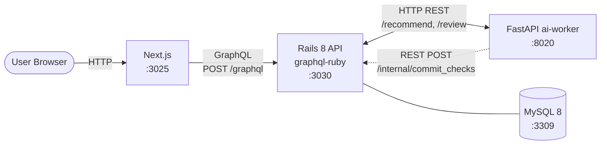
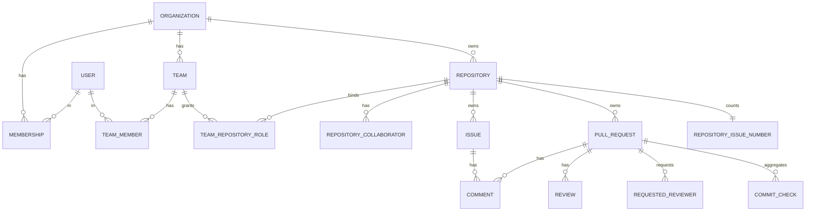

# GitHub 風 Issue Tracker アーキテクチャ

GitHub のアーキテクチャを参考に、**権限グラフ** と **Issue / PR / Review の関係グラフ** と **CI ステータス集約** をローカル環境で再現する学習プロジェクト。

---

## システム構成



- 外部依存は **MySQL のみ**（Solid Queue / Solid Cache を使う、Redis 不使用）
- frontend ↔ backend は **GraphQL** (ADR 0001)
- ai-worker ↔ backend は **内向き REST**（trusted ingress、GraphQL を使わない）
- ai-worker からの check 通知は **REST POST → backend が permanent 化** (ADR 0004)

## ドメインモデル



詳細：

- **権限グラフ** — `Organization` / `Team` / `Repository` の階層と継承解決は ADR 0002 を参照
- **Issue / PR データモデル** — 別テーブル + 番号空間共有は ADR 0003 を参照
- **CI ステータス集約** — `commit_checks` upsert + 動的集約は ADR 0004 を参照

## GraphQL 概観

```graphql
type Query {
  viewer: User!
  organization(login: String!): Organization
  repository(owner: String!, name: String!): Repository
}

type Repository {
  id: ID!
  name: String!
  owner: Organization!
  viewerPermission: RepositoryPermission!  # READ / TRIAGE / WRITE / MAINTAIN / ADMIN
  issues(first: Int, state: IssueState, after: String): IssueConnection!
  pullRequests(first: Int, state: PullRequestState, after: String): PullRequestConnection!
  collaborators: [RepositoryCollaborator!]!
}

type Issue {
  id: ID!
  number: Int!
  title: String!
  body: String!
  state: IssueState!  # OPEN / CLOSED
  author: User!
  assignees: [User!]!
  labels: [Label!]!
  comments(first: Int): CommentConnection!
}

type PullRequest {
  id: ID!
  number: Int!
  title: String!
  body: String!
  state: PullRequestState!  # OPEN / CLOSED / MERGED
  headRef: String!
  baseRef: String!
  mergeableState: MergeableState!
  reviews: [Review!]!
  requestedReviewers: [User!]!
  checkStatus: CheckStatus!  # SUCCESS / FAILURE / PENDING（集約値）
  commitChecks: [CommitCheck!]!
}

type Mutation {
  createIssue(input: CreateIssueInput!): CreateIssuePayload!
  createPullRequest(input: CreatePullRequestInput!): CreatePullRequestPayload!
  requestReview(input: RequestReviewInput!): RequestReviewPayload!
  submitReview(input: SubmitReviewInput!): SubmitReviewPayload!
  mergePullRequest(input: MergePullRequestInput!): MergePullRequestPayload!
  assignIssue(input: AssignIssueInput!): AssignIssuePayload!
}
```

> Mutation は **action 単位**で切る。汎用 `updateIssue` は作らない (ADR 0001)。

## レスポンス境界

- 認可は GraphQL **field 単位**で実行
- 権限不足 → **field を `null` で返す**（GraphQL 規約）。HTTP は 200 のまま
- ai-worker 失敗時は AI 由来 field のみ `null` + `degraded: true` を別 field で expose（[`docs/operating-patterns.md` の graceful degradation](../../docs/operating-patterns.md) と整合）

## ai-worker の責務

| 機能 | 用途 | 入出力 |
| --- | --- | --- |
| `POST /review` | PR の AI 自動レビュー（モック） | PR diff（モック）→ レビューコメント文字列 |
| `POST /code-summary` | Issue / PR 説明の自動要約 | body → 要約文 |
| `POST /check/run` | CI チェックのモック実行 | head_sha + check 名 → backend `/internal/commit_checks` に POST |

> 実 git は扱わない。head_sha は文字列ハッシュとして扱い、ai-worker はそれを受けて check 状態を投げ返すだけ。

## 起動順序

```bash
# 1. インフラ
docker compose up -d mysql        # 3309

# 2. backend
cd backend && bundle exec rails db:prepare
bundle exec rails server -p 3030

# 2b. Solid Queue worker（必要になった Phase で起動）
bundle exec bin/jobs

# 3. ai-worker
cd ../ai-worker && source .venv/bin/activate
uvicorn main:app --port 8020

# 4. frontend
cd ../frontend && npm run dev      # http://localhost:3025
```

## ポート割り当て

| サービス | ポート | 備考 |
| --- | --- | --- |
| frontend (Next.js)  | 3025 | youtube の 3015 から +10 |
| backend (Rails API) | 3030 | youtube の 3020 から +10 |
| ai-worker (FastAPI) | 8020 | youtube の 8010 から +10 |
| MySQL               | 3309 | youtube の 3308 から +1 |

## Phase ロードマップ

| Phase | 範囲 | 状態 |
| --- | --- | --- |
| 1 | scaffolding + ADR + architecture.md + docker-compose | 🟢 完了 |
| 2 | Org / Team / User / Repository モデル + 権限 Resolver + GraphQL `viewer` / `organization` / `repository` | 🟢 完了 (RSpec 18 件 / `viewerPermission` 出力確認) |
| 3 | Issue / Comment / Label + IssueNumberAllocator + GraphQL Mutation (`createIssue` / `closeIssue` / `assignIssue` / `addComment`) | 🟢 完了 (RSpec 34 件) |
| 4 | PullRequest / Review / RequestedReviewer + Mutation (`createPullRequest` / `requestReview` / `submitReview` / `mergePullRequest`) / Issue/PR 番号空間共有 | 🟢 完了 (RSpec 51 件 / Issue=#1, PR=#2 を実環境で確認) |
| 5 | CI チェック集約 + ai-worker 統合（`/review`, `/check/run`）+ Playwright E2E + Terraform + CI | ⚪ 未着手 |
