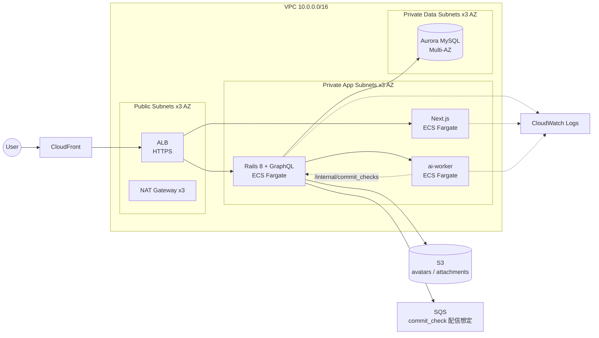

# github / infra / terraform

> **設計図用途**: `terraform apply` する想定ではない（CLAUDE.md 参照）。
> 「本番化するなら AWS 上でどう組むか」を Terraform として読み取れる形で残すことが目的。
> CI で `terraform validate` のみ通る状態を維持する。

## 全体像



## ファイル構成

| ファイル | 内容 |
| --- | --- |
| `versions.tf`        | Terraform / provider バージョン固定、backend 設定（コメントアウト） |
| `variables.tf`       | 入力変数（リージョン・AZ・コンテナイメージ・ドメイン等） |
| `outputs.tf`         | ALB DNS / RDS endpoint 等の出力 |
| `network.tf`         | VPC + 3-AZ public/private subnets + NAT |
| `security_groups.tf` | ALB / ECS / RDS 用 SG (Redis なし / Solid Queue 採用) |
| `alb.tf`             | ALB + Listener + Target Groups（path 振り分け） |
| `ecs.tf`             | ECS Cluster + 3 Service (frontend / backend / ai-worker) |
| `rds.tf`             | Aurora MySQL クラスタ |
| `s3.tf`              | アバター / 添付ファイル用バケット |
| `sqs.tf`             | commit_check 配信想定（ローカルは backend `/internal/commit_checks` を直接叩く） |
| `cloudfront.tf`      | CDN（静的アセット + ALB オリジン） |
| `iam.tf`             | ECS task / execution roles |
| `cloudwatch.tf`      | Log groups + 主要アラーム |
| `secrets.tf`         | DB password, internal ingress token 等の Secrets Manager |

## 設計判断（コードと ADR の対応）

- **GraphQL は ALB → backend ECS にそのまま流す** (ADR 0001)
- **権限解決は backend 内で完結** (ADR 0002)。AWS IAM 等には載せない
- **Issue / PR は同一 RDS クラスタ** (ADR 0003)
- **CI チェック集約**: ローカルは ai-worker → backend に直接 POST。本番想定は ai-worker → SQS → backend consumer (Phase 5c では SQS リソースのみ確保)

## 動作確認

```bash
cd github/infra/terraform
terraform init -backend=false
terraform validate
```
