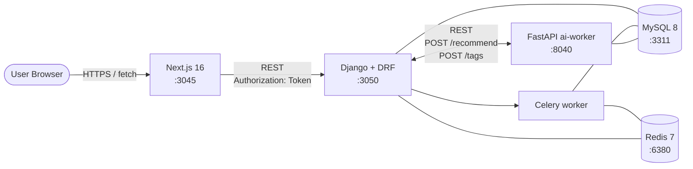

# Instagram 風タイムライン (Django/DRF)

Instagram のアーキテクチャを参考に、**「フォロー中ユーザの投稿を、タイムライン上で時系列順に表示する」** をローカル環境で再現するプロジェクト。

slack (Rails / WebSocket fan-out) / youtube (Rails / Solid Queue 状態機械) / github (Rails / GraphQL + 権限グラフ) / perplexity (Rails / SSE + RAG) に続く 5 つ目のプロジェクトとして、**バックエンドを意図的に Django/DRF + Celery + Python に切り替え** ([CLAUDE.md「言語別プロジェクト」](../CLAUDE.md#学習方針言語別プロジェクトと-rails-リプレイス)) し、**タイムライン生成戦略 / フォローグラフ DB 設計 / Django ORM N+1 / 非同期 fan-out worker** の 4 つを正面から扱う。

外部 SaaS / LLM / 画像認識 API は使用せず、ai-worker 側で deterministic な mock を実装することでローカル完結を保つ。

---

## 見どころハイライト (設計フェーズ)

> Phase 1 完了時点。実装は Phase 2 以降で進める。

- **fan-out on write を Celery で非同期実行** — `Post` 作成時に signal で Celery task を enqueue、フォロワー全員の `timeline_entries` に bulk_create。read は単一 index scan で完結 ([ADR 0001](docs/adr/0001-timeline-fanout-on-write.md))
- **Adjacency List + 双方向 index + denormalized counter** — `follow_edges` 単一テーブルで followers / following を両方向 index で引き、`F('count') ± 1` で counter を更新 ([ADR 0002](docs/adr/0002-follow-graph.md))
- **`select_related` / `prefetch_related` / `annotate` + `assertNumQueries` で N+1 を CI で固定** — Django ORM 標準ツールだけで N+1 を抑制し、テストで件数を期待値に固定 ([ADR 0003](docs/adr/0003-orm-n-plus-one.md))
- **DRF TokenAuthentication で 1 経路** — `Authorization: Token <token>` ヘッダ、CSRF 不要、SPA との相性が良い。perplexity (rodauth-rails JWT bearer) との **「Rails ↔ Django で同じ役割をどう実装するか」** の対比 ([ADR 0004](docs/adr/0004-auth-drf-token.md))

---

## アーキテクチャ概要



詳細な ER / fan-out シーケンス / index 一覧は **[docs/architecture.md](docs/architecture.md)** を参照。

---

## 採用したスコープ

| 含める | 除外 |
| --- | --- |
| ユーザ / フォロー (有向グラフ) | 非公開アカウント / フォロー request / block / mute |
| 投稿 (caption + image_url) / いいね / コメント | 画像本体のアップロード / 画像変換 / ストーリー / リール |
| **fan-out on write** によるタイムライン (timeline_entries 事前展開) | hybrid push/pull (celebrity 対応) — 派生 ADR で扱う |
| プロフィール画面 (followers/following counter / 直近投稿) | 検索 / ハッシュタグ / 探索の本格実装 (mock のみ) |
| ai-worker の `/recommend` (mock) / `/tags` (mock) | LLM 呼び出し / 実画像認識 / レコメンドモデル学習 |
| DRF TokenAuthentication (1 経路) | OAuth / SSO / 2FA / email 検証 / password reset |
| **派生 ADR で扱う候補**: hybrid timeline (celebrity) / Redis ZSET cache / likes_count denormalize / 全文検索 / token rotation (Knox) | (上記いずれも本 ADR 0001-0004 のスコープ外として明示的に切り出し済み) |

---

## 主要な設計判断 (ADR ハイライト)

| # | 判断 | 何を選んで何を捨てたか |
| --- | --- | --- |
| [0001](docs/adr/0001-timeline-fanout-on-write.md) | **fan-out on write + Celery + Redis + `timeline_entries` 事前展開** | pull (read 時 IN scan) / hybrid (celebrity 対応) / 同期 fan-out / Redis ZSET cache を却下。celebrity 対応は派生 ADR |
| [0002](docs/adr/0002-follow-graph.md) | **Adjacency List + 双方向 index + denormalized counter (F 式更新)** | Adjacency Matrix / Closure Table / Neo4j / counter なし / Redis counter を却下 |
| [0003](docs/adr/0003-orm-n-plus-one.md) | **`select_related` / `prefetch_related` / `annotate` + `assertNumQueries` で件数固定** | debug-toolbar 観測のみ / GraphQL Dataloader / raw SQL / iterator() / 強い denormalize を却下 |
| [0004](docs/adr/0004-auth-drf-token.md) | **DRF TokenAuthentication + `Authorization: Token` ヘッダ (1 経路)** | SessionAuth (CSRF 煩雑) / JWT (perplexity と重複) / django-allauth (スコープ過剰) / 自前実装を却下 |

---

## ポート割り当て

| サービス | ポート | 備考 |
| --- | --- | --- |
| frontend (Next.js)  | 3045 | perplexity の 3035 から +10 |
| backend (Django)    | 3050 | perplexity の 3040 から +10 |
| ai-worker (FastAPI) | 8040 | perplexity の 8030 から +10 |
| MySQL               | 3311 | perplexity の 3310 から +1 |
| Redis               | 6380 | slack の 6379 から +1 |

---

## ローカル起動 (Phase 2 以降で動作)

### 前提

- Docker / Docker Compose / Node.js 20+ / Python 3.12+

### 起動

```bash
# 1. インフラ
docker compose up -d mysql redis           # 3311 / 6380

# 2. backend
cd backend && python -m venv .venv && source .venv/bin/activate
pip install -r requirements.txt
python manage.py migrate
python manage.py seed                      # users / posts / follows 投入 (Phase 2 で実装)
python manage.py runserver 0.0.0.0:3050

# 3. Celery worker (別タブ)
cd backend && source .venv/bin/activate
celery -A config worker -Q fanout,default -l info

# 4. ai-worker (別タブ)
cd ../ai-worker && python -m venv .venv && source .venv/bin/activate
pip install -r requirements.txt
uvicorn main:app --port 8040

# 5. frontend (別タブ)
cd ../frontend && npm install
npm run dev                                # http://localhost:3045

# 6. E2E (Phase 5 で追加)
cd ../playwright && npm test
```

---

## ステータス

| コンポーネント | ステータス |
| --- | --- |
| ADR (0001-0004)             | 🟢 全 Accepted |
| architecture.md             | 🟢 ER / fan-out シーケンス / API 概観 / 起動順序まで記述 |
| Backend (Django/DRF)        | 🟢 Phase 3 完了 — accounts / follows / posts / timeline + Celery fan-out + soft delete (pytest 40 件 pass) |
| Celery worker               | 🟢 Phase 3 完了 — fan-out / backfill / unfollow remove / soft delete propagation の 4 task |
| ai-worker (FastAPI)         | ⚪ Phase 4 で着手 |
| Frontend (Next.js 16)       | ⚪ Phase 4 で着手 |
| 認証 (DRF TokenAuthentication) | 🟢 Phase 2 完了 — register / login / logout / IsAuthenticated default |
| E2E (Playwright)            | ⚪ Phase 5 で着手 |
| インフラ設計図 (Terraform)  | ⚪ Phase 5 で着手 |
| CI (GitHub Actions)         | ⚪ Phase 5 で追加 |

---

## ドキュメント

- [アーキテクチャ図](docs/architecture.md) — システム構成 / ER / fan-out シーケンス / API 概観 / index 一覧
- [ADR 一覧](docs/adr/)
  - [0001 タイムライン生成戦略 (fan-out on write)](docs/adr/0001-timeline-fanout-on-write.md)
  - [0002 フォローグラフの DB 設計](docs/adr/0002-follow-graph.md)
  - [0003 Django ORM N+1 と index 設計](docs/adr/0003-orm-n-plus-one.md)
  - [0004 認証方式 (DRF TokenAuthentication)](docs/adr/0004-auth-drf-token.md)
- リポジトリ全体方針: [../CLAUDE.md](../CLAUDE.md)
- API スタイル選定: [../docs/api-style.md](../docs/api-style.md)
- 共通ルール: [../docs/](../docs/) (coding-rules / operating-patterns / testing-strategy)

---

## Phase ロードマップ

| Phase | 範囲 | 状態 |
| --- | --- | --- |
| 1 | scaffolding + ADR 4 本 + architecture.md + docker-compose | 🟢 設計フェーズ完了 |
| 2 | Django scaffold (users / posts / follows / likes / comments) + DRF Token 認証 + 基本 CRUD + N+1 ガード | 🟢 完了 (pytest 23 件 / curl 経由で auth + CRUD smoke) |
| 3 | Celery + Redis 統合 + `timeline_entries` モデル + fan-out / backfill / unfollow / delete 4 task + `/timeline` endpoint + soft delete | 🟢 完了 (pytest 40 件 pass / `CELERY_TASK_ALWAYS_EAGER` で chain を結合検証) |
| 4 | ai-worker (FastAPI) `/recommend` `/tags` + frontend (Next.js timeline + プロフィール + 投稿フォーム) | ⚪ 未着手 |
| 5 | Playwright E2E + Terraform 設計図 + GitHub Actions CI workflows | ⚪ 未着手 |
