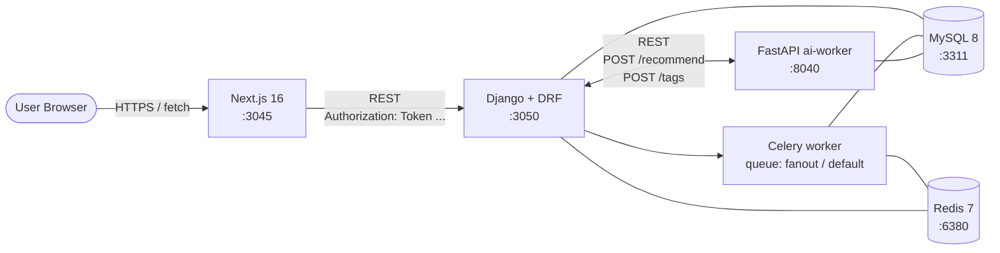
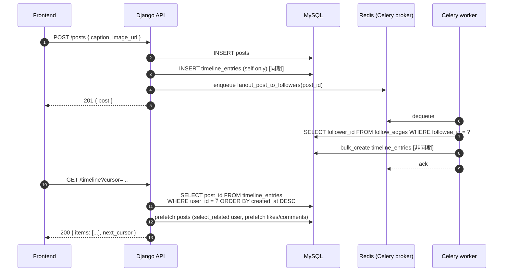
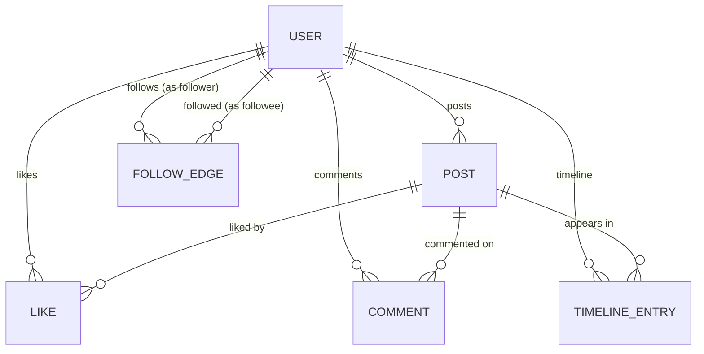

# Instagram 風タイムライン アーキテクチャ

Instagram のアーキテクチャを参考に、**「フォロー中ユーザの投稿を、タイムライン上で時系列順に streaming する (HTTP polling)」** をローカル環境で再現する学習プロジェクト。

中核となる技術課題は以下の 4 つ:

1. **タイムライン生成戦略 (fan-out on write)** — 投稿時に follower の `timeline_entries` に事前展開し、read を index scan に落とす ([ADR 0001](adr/0001-timeline-fanout-on-write.md))
2. **フォローグラフの DB 設計** — Adjacency List + 双方向 index + denormalized counter ([ADR 0002](adr/0002-follow-graph.md))
3. **Django ORM の N+1 回避と index 設計** — `select_related` / `prefetch_related` / `annotate` + `assertNumQueries` で件数を CI 固定 ([ADR 0003](adr/0003-orm-n-plus-one.md))
4. **認証 (DRF TokenAuthentication)** — 1 経路の最小構成、`Authorization: Token` ヘッダ ([ADR 0004](adr/0004-auth-drf-token.md))

> 本プロジェクトは CLAUDE.md の **「Python (Django/DRF) を学ぶ」** 例外プロジェクトに該当する。slack / youtube / github / perplexity (すべて Rails) との対比で、**Django/DRF / Celery / Django ORM** の実務感を獲得することが目的。

---

## システム構成



- 永続化は **MySQL + Redis** (Redis は Celery broker / 結果 backend 兼用)
- frontend ↔ backend は **REST** (固定形)。SSE / WebSocket は使わない (タイムラインは polling + cursor で十分)
- backend ↔ ai-worker は **REST 同期コール** (推薦 / タグ抽出)。perplexity の 3 ステージ orchestrator と異なり、本プロジェクトは ai-worker の出力を Django が DB に書き戻す形は不採用 (推薦は read-only)
- ai-worker ↔ MySQL は **読み専接続のみ** (推薦は posts / follows を SELECT するだけ)
- 書き込み (Post / Follow / Like / Comment / TimelineEntry) は **すべて Django 経由**

### Fan-out on write のデータフロー



詳細:
- ステージごとの責務は [ADR 0001](adr/0001-timeline-fanout-on-write.md)
- `timeline_entries` の index 設計は [ADR 0003](adr/0003-orm-n-plus-one.md)
- フォロワー列挙の index は [ADR 0002](adr/0002-follow-graph.md)

---

## ドメインモデル



| テーブル | 役割 |
| --- | --- |
| `users` | DRF `AuthToken` 紐付け、`username` UNIQUE、`followers_count` / `following_count` denormalize ([ADR 0002](adr/0002-follow-graph.md)) |
| `authtoken_token` | DRF `rest_framework.authtoken` の token 保管。1 user 1 token (MVP) ([ADR 0004](adr/0004-auth-drf-token.md)) |
| `posts` | 1 投稿 1 行。`caption TEXT` / `image_url VARCHAR` (画像本体は scope 外、URL のみ)。`(user_id, created_at)` 複合 index |
| `follow_edges` | フォロー関係。PK `(follower_id, followee_id)` + 逆引き index `(followee_id, follower_id)` ([ADR 0002](adr/0002-follow-graph.md)) |
| `timeline_entries` | fan-out on write の事前展開先。`(user_id, post_id)` UNIQUE + `(user_id, created_at DESC)` index ([ADR 0001](adr/0001-timeline-fanout-on-write.md)) |
| `likes` | `UNIQUE(post_id, user_id)`。いいねの重複防止 + 「自分がいいねしたか」の prefetch source |
| `comments` | `(post_id, created_at)` index、コメント順表示 |

> マイグレーションは Phase 2 (users / posts / follow_edges / likes / comments) と Phase 3 (timeline_entries + Celery 統合) に分けて作成する。

---

## REST API 概観 (Django ↔ Frontend)

| メソッド | パス | 用途 |
| --- | --- | --- |
| `POST` | `/auth/register` | username / password で登録、Token 発行 |
| `POST` | `/auth/login` | Token を返却 |
| `POST` | `/auth/logout` | Token 無効化 |
| `GET`  | `/users/:username` | プロフィール (followers/following counter / 直近投稿) |
| `POST` | `/users/:username/follow` | follow_edges を作成 + counter を `F() + 1` |
| `DELETE` | `/users/:username/follow` | follow_edges を削除 + counter を `F() - 1` |
| `GET`  | `/users/:username/followers` | followers 一覧 (cursor pagination) |
| `GET`  | `/users/:username/following` | following 一覧 (cursor pagination) |
| `POST` | `/posts` | Post 作成 + self timeline 同期 INSERT + Celery enqueue |
| `GET`  | `/posts/:id` | Post 詳細 (likes_count / comments / liked_by_me) |
| `DELETE` | `/posts/:id` | Post 削除 (Celery で fan-out 削除) |
| `POST` | `/posts/:id/like` | Like 作成 |
| `DELETE` | `/posts/:id/like` | Like 削除 |
| `POST` | `/posts/:id/comments` | Comment 作成 |
| `GET`  | `/posts/:id/comments` | Comment 一覧 (cursor) |
| `GET`  | `/timeline` | フォロー中ユーザの投稿 (cursor pagination) |
| `GET`  | `/discover` | ai-worker `/recommend` の結果 + posts hydrate |
| `GET`  | `/health` | DB / Redis / ai-worker 疎通サマリ |

> **cursor pagination の方針**: `created_at + id` の複合 cursor を base64 で encode。`(user_id, created_at DESC, id DESC)` の index と整合させる ([ADR 0003](adr/0003-orm-n-plus-one.md))。

---

## ai-worker の責務 (Python / FastAPI)

| エンドポイント | 用途 | 入出力 |
| --- | --- | --- |
| `POST /recommend` | 探索タブ用の推薦 (mock) | `{ user_id, top_k }` → `{ post_ids: [...] }` |
| `POST /tags` | 画像タグ抽出 (mock) | `{ image_url }` → `{ tags: [...] }` |
| `GET /health` | 疎通確認 | `{ ok: true }` |

> **mock 実装の規律**: 外部 LLM / 画像認識 API は使用しない。`/recommend` は「直近 N 日でフォロー数が多いユーザの投稿を deterministic にシャッフル」程度の実装。`/tags` は image_url のハッシュから疑似的に tag を返す。学習対象は **「Django ↔ FastAPI 間の責務分離 (推薦は read-only / 書き込みは Django 経由)」**。

---

## レスポンス境界

- 認可は **`request.user` で絞り込み**。timeline は `user_id = request.user.id` のみ参照可
- 認証は **DRF TokenAuthentication** で全 endpoint 保護 ([ADR 0004](adr/0004-auth-drf-token.md))。`Authorization: Token <token>` ヘッダ
- **fan-out 失敗時の挙動**:
  - **(A) Post 作成時**: self への `timeline_entries` INSERT は同期 (作成 transaction 内)。これが失敗したら 500 を返し、Post も rollback
  - **(B) Celery fan-out**: at-least-once。`UNIQUE (user_id, post_id)` + `INSERT IGNORE` で冪等。task が n 回 retry しても重複は出ない
  - **(C) Celery dead-letter**: max_retries 超過後は `posts.fanout_status = 'failed'` を立て、夜間 batch (`recover_failed_fanouts`) で再実行
- **削除の伝播**: Post 削除も非同期 fan-out。delete されるまで follower の timeline に残るが、read 時に `JOIN posts WHERE deleted_at IS NULL` で除外
- **counter の整合性**: `F('followers_count') ± 1` で race を回避。signal 例外時のズレは `manage.py recount_follows` で夜間修復 ([ADR 0002](adr/0002-follow-graph.md))

---

## 起動順序

```bash
# 1. インフラ
docker compose up -d mysql redis    # 3311 / 6380

# 2. backend (Django + DRF)
cd backend && python -m venv .venv && source .venv/bin/activate
pip install -r requirements.txt
python manage.py migrate
python manage.py runserver 0.0.0.0:3050

# 3. Celery worker (別タブ)
cd backend && source .venv/bin/activate
celery -A config worker -Q fanout,default -l info

# 4. ai-worker
cd ai-worker && python -m venv .venv && source .venv/bin/activate
pip install -r requirements.txt
uvicorn main:app --port 8040

# 5. frontend
cd frontend && npm install
npm run dev                                    # http://localhost:3045

# 6. seed (Phase 2 で投入)
cd backend && python manage.py seed
```

## ポート割り当て

| サービス | ポート | 備考 |
| --- | --- | --- |
| frontend (Next.js)  | 3045 | perplexity の 3035 から +10 |
| backend (Django)    | 3050 | perplexity の 3040 から +10 |
| ai-worker (FastAPI) | 8040 | perplexity の 8030 から +10 |
| MySQL               | 3311 | perplexity の 3310 から +1 |
| Redis               | 6380 | slack の 6379 から +1 |

## Phase ロードマップ

| Phase | 範囲 | 状態 |
| --- | --- | --- |
| 1 | scaffolding + ADR 4 本 + architecture.md + docker-compose | 🟢 設計フェーズ完了 |
| 2 | Django scaffold (users / posts / follows / likes / comments) + DRF Token 認証 + 基本 CRUD + N+1 ガード (`assertNumQueries`) | 🟢 完了 (pytest 23 件 pass / curl smoke) |
| 3 | Celery + Redis 統合 + `timeline_entries` モデル + fan-out task + `/timeline` endpoint + 削除伝播 | ⚪ 未着手 |
| 4 | ai-worker (FastAPI) `/recommend` `/tags` + frontend (Next.js timeline + プロフィール + 投稿フォーム) | ⚪ 未着手 |
| 5 | Playwright E2E + Terraform 設計図 + GitHub Actions CI workflows | ⚪ 未着手 |
