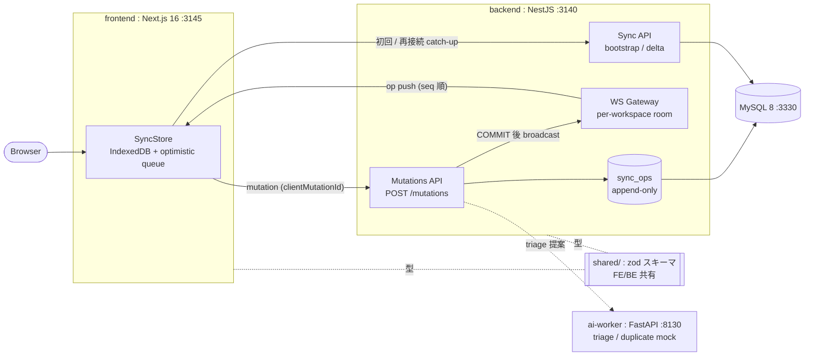

# Linear 風 issue tracker (TypeScript フルスタック: NestJS + Next.js)

Linear を参考に、**「server 権威 sync log による delta sync + optimistic update / offline 耐性 (sync engine)」** をローカル環境で再現するプロジェクト。本リポ初の **TypeScript backend** (NestJS) であり、frontend / backend / 共有スキーマを 1 つの npm workspaces monorepo として構成する。

外部 SaaS / LLM は使用せず、ai-worker 側で deterministic な mock を実装することでローカル完結を保つ（リポ全体方針: [`../CLAUDE.md`](../CLAUDE.md)）。

---

## 見どころハイライト

> 🟡 **Phase 3 完了**: sync engine の server 側が一周 — `POST /mutations` (採番/冪等台帳) + `GET /sync/bootstrap`・`/sync/delta` ($transaction 一括読みで torn snapshot 防止) + **素 WS gateway** (`/sync/ws` / hello + op push / heartbeat)。**並行 30 mutation 下で delta 読者が gap を観測しない不変条件テスト** (ADR 0002 の実証) を含む jest e2e 26 + vitest 14 が green。Phase 4 で client 側 (IndexedDB + optimistic/offline) を作る。

- **server 権威 sync log** — 全 mutation を per-workspace `seq`(= `lastSyncId`) で全順序化した append-only log に記録。採番は workspace 行の `FOR UPDATE` ロックで commit 順 = seq 順を保証し、delta 読み飛ばし (gap) を構造的に排除する（[ADR 0002](docs/adr/0002-sync-log-per-workspace-seq.md)）
- **bootstrap + delta sync** — 初回は materialized snapshot を全量、以降は `?since=seq` の差分 catch-up。WS 切断からの再接続も同じ経路で吸収（[ADR 0002](docs/adr/0002-sync-log-per-workspace-seq.md) / [ADR 0005](docs/adr/0005-realtime-raw-websocket.md)）
- **optimistic update + rollback + offline queue** — client は mutation を即ローカル適用し、server 確定 op で confirm、拒否なら巻き戻す。オフライン編集は IndexedDB の pending queue に永続化して再接続時に replay、`clientMutationId` UNIQUE で at-least-once を冪等に吸収（[ADR 0003](docs/adr/0003-client-sync-optimistic-offline.md)）
- **zod スキーマの FE/BE 共有** — mutation 引数 / op payload / WS メッセージを `shared/` workspace で単一定義し、backend の validation pipe と frontend のフォーム検証が同じスキーマを使う（[ADR 0004](docs/adr/0004-monorepo-shared-zod-types.md)）
- **figma (LWW-CRDT) との対比** — 「リアルタイム協調 3 流派 (CRDT / OT / sync log)」のうち sync log 担当。収束を client 側 merge ではなく **server の全順序**で取る設計差を学ぶ
- **local-first の体感** — 検索・フィルタは IndexedDB キャッシュ上で完結し、サーバ往復なしで即応答する

### ボリューム方針 (初 TS フルスタックのため学習面積を広く取る)

最小 MVP に絞らず、各機能が sync engine を通る形で実装範囲を広げる:

| 機能 | 学習ポイント |
| --- | --- |
| per-team issue number (`ENG-42`) | team 行カウンタの原子採番 (shopify `Order#number` の TS 版) |
| kanban 並び順 (fractional indexing) | `sort_order` 文字列キーの中間挿入 — 本リポ初 |
| activity feed | `sync_ops` log の projection として issue 履歴を表示 (追加テーブルなし) |
| command palette (Cmd+K) + キーボード操作 | Linear らしさ / frontend 設計の練習 |
| ai-worker triage | 優先度・ラベル提案 + duplicate 検出 (deterministic mock) |

---

## アーキテクチャ概要



設計の詳細は [`docs/architecture.md`](docs/architecture.md)、判断の経緯は [`docs/adr/`](docs/adr/)。

---

## ADR

| # | 決定 |
| --- | --- |
| [0001](docs/adr/0001-typescript-backend-nestjs-prisma.md) | TS backend に NestJS (Express platform) + Prisma を採用し module を責務分割 |
| [0002](docs/adr/0002-sync-log-per-workspace-seq.md) | per-workspace `seq` の sync log — counter 行 `FOR UPDATE` 採番で gapless 全順序 |
| [0003](docs/adr/0003-client-sync-optimistic-offline.md) | client 同期 — optimistic queue + rebase + offline replay (`clientMutationId` 冪等) |
| [0004](docs/adr/0004-monorepo-shared-zod-types.md) | npm workspaces monorepo + `shared/` zod スキーマで FE/BE 型共有 |
| [0005](docs/adr/0005-realtime-raw-websocket.md) | realtime 配信は素の WebSocket — COMMIT 後 broadcast + 取りこぼしは catch-up で吸収 |

---

## ローカル起動

```sh
# 1. MySQL :3330 (初回は linear_test / linear_shadow も自動作成)
docker compose up -d

# 2. 依存インストール (monorepo root で。shared/backend に一括で入る)
npm install

# 3. backend 環境変数と migration
cp backend/.env.example backend/.env
cd backend && npx prisma migrate dev && cd ..

# 4. shared を build して backend (NestJS :3140) を起動
npm run build -w @linear/shared
npm run start:dev -w backend

# 動作確認
curl http://localhost:3140/health
# WS は ws://localhost:3140/sync/ws?workspaceId=<id>&token=<JWT> (hello → op push)
```

```sh
# テスト / lint (root の Makefile からは make linear-test / make linear-lint)
npm run test -w @linear/shared     # vitest (fractional fuzz + schema)
npm run test -w backend            # jest unit
npm run test:e2e -w backend        # jest e2e (linear_test DB / --runInBand)
npm run lint                       # eslint + tsc --noEmit
```

> frontend (Next.js :3145) は Phase 5、ai-worker (:8130) は Phase 4 で追加する。

---

## ポート割当

| コンポーネント | ポート |
| --- | --- |
| MySQL 8 | 3330 |
| backend (NestJS) | 3140 |
| frontend (Next.js) | 3145 |
| ai-worker (FastAPI) | 8130 |
