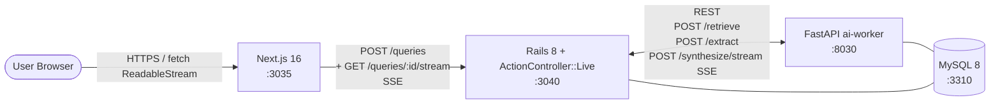

# Perplexity 風 RAG 検索

Perplexity AI のアーキテクチャを参考に、**「ユーザのクエリに対して、ローカルコーパスから根拠を集め、引用付きで回答を streaming する」** をローカル環境で再現するプロジェクト。

slack (WebSocket fan-out) / youtube (アップロード状態機械) / github (権限グラフ + GraphQL) に続く 4 つ目のプロジェクトとして、**マルチステージ RAG パイプライン / hybrid retrieval / SSE streaming / 引用整合性の信頼境界** の 4 つを正面から扱う。

外部 LLM API は使用せず、ai-worker 側で **deterministic な擬似 encoder + mock LLM** を実装することでローカル完結を保つ。

---

## 見どころハイライト (設計フェーズ)

> Phase 1 完了時点。実装は Phase 2 以降で進める。

- **3 ステージを HTTP 境界で分割した RAG パイプライン** — `retrieve / extract / synthesize/stream` を ai-worker の独立 endpoint に置き、Rails が orchestrator として直列に呼ぶ。**ai-worker は MySQL 読み専 / 書き込みは Rails 一意化**。中間結果が Rails から見えるので **引用整合性検証を Rails 側で行える信頼境界**が引ける ([ADR 0001](docs/adr/0001-rag-pipeline-decomposition.md))
- **Hybrid retrieval + embedding データ管理** — MySQL FULLTEXT (ngram) と numpy in-memory cosine の **min-max 正規化 + 重み付き和**。学習対象は scoring の構造 / **embedding BLOB 永続化 / `embedding_version` 再計算 / cold start ロード** (擬似 encoder の精度ではない、これは意図した制約) ([ADR 0002](docs/adr/0002-hybrid-retrieval.md))
- **SSE streaming + 三段階の degradation 規律** — slack の WebSocket / github の polling とは別物の「単方向 long-lived HTTP ストリーム」。SSE 開始前は 5xx / 開始後は `event: error` / done 後は原子的トランザクション、と[共通方針 graceful degradation](../docs/operating-patterns.md#2-graceful-degradation) の SSE 例外規律を ADR で明文化 ([ADR 0003](docs/adr/0003-sse-streaming.md))
- **引用整合性の信頼境界を Rails 側に置く** — ai-worker の出力 (LLM mock) を信頼せず、SSE proxy 中に Rails が regex で引用 marker を抽出し `allowed_source_ids` と照合。違反は本文に残しつつ `event: citation_invalid` で通知、永続化は検証通過分のみ ([ADR 0004](docs/adr/0004-citation-verification-boundary.md))
- **SSE / hybrid scoring / citation 検証のテスト戦略** — `ActionController::Live` を `Net::HTTP` 直叩き + 純関数 unit-test + Playwright で fetch ReadableStream を駆動する 3 層構成 ([ADR 0005](docs/adr/0005-testing-strategy.md))
- **チャンク分割戦略 (固定長 + 改行優先 + overlap なしから始める)** — 学習対象として「境界またぎ問題が起きる初期戦略」を残し、overlap / hierarchical / semantic は派生 ADR で増分追加する増分学習路線 ([ADR 0006](docs/adr/0006-chunk-strategy.md))

---

## アーキテクチャ概要



詳細な ER / RAG パイプラインのシーケンス / イベント形式は **[docs/architecture.md](docs/architecture.md)** を参照。

---

## 採用したスコープ

| 含める | 除外 |
| --- | --- |
| ローカルコーパス (seeds から投入) の取り込み + chunk 分割 (固定長 + 改行優先) | Web 検索 / 外部クロール |
| BM25 + 擬似ベクタ hybrid retrieval (構造とデータ管理を学ぶ目的) | pgvector / Faiss / OpenSearch (Terraform 設計図でのみ言及) |
| `retrieve` / `extract` / `synthesize` の 3 endpoint + Rails orchestrator | LangChain / LlamaIndex 等のフレームワーク採用 |
| mock LLM による synthesize streaming (SSE) | 実 OpenAI / Anthropic API 接続 |
| 引用 ID の Rails 側再検証 + citations 永続化 | LLM-as-a-judge / SelfCheckGPT 系の自検証 |
| クエリ履歴 (Query / Answer / Citation) の永続化 | 会話分岐 (ChatGPT 風 thread fork) / 履歴分岐 |
| rodauth-rails の cookie auth (Phase 4 で導入) / Phase 1-3 はヘッダ切替で代用 | OAuth / SSO / 2FA |
| **派生 ADR で扱う候補**: overlap chunking / hierarchical chunking / semantic chunking / RRF / real encoder / LLM-as-a-judge | (上記いずれも本 ADR 0001-0006 のスコープ外として明示的に切り出し済み) |

---

## 主要な設計判断 (ADR ハイライト)

| # | 判断 | 何を選んで何を捨てたか |
| --- | --- | --- |
| [0001](docs/adr/0001-rag-pipeline-decomposition.md) | **3 endpoint + Rails orchestrator** + ai-worker DB 読み専 / 書き込みは Rails 一意化 | 単一 `/answer` モノリシック / Rails 内で全部 / 非同期キュー / 並列 fan-out / 内部 ingress (github 規律) を却下 |
| [0002](docs/adr/0002-hybrid-retrieval.md) | **MySQL FULLTEXT (ngram) + 擬似ベクタ cosine の hybrid + embedding BLOB データ管理** | BM25 only / ベクタ only / pgvector / sentence-transformers / RRF を却下。学習対象は scoring 構造 + データ運用 (精度ではない) |
| [0003](docs/adr/0003-sse-streaming.md) | **SSE (`ActionController::Live`) + fetch ReadableStream + 三段階の degradation 規律** | WebSocket / GraphQL Subscription / long polling / HTTP/2 push / gRPC を却下、`Last-Event-ID` 再接続も不採用 |
| [0004](docs/adr/0004-citation-verification-boundary.md) | **Rails 側で引用 ID を再検証 (信頼境界)** | ai-worker 内完結 / 検証なし / Frontend 検証 / 構造化出力を却下。永続化と認可と同じ層に検証を集める |
| [0005](docs/adr/0005-testing-strategy.md) | **`Net::HTTP` 直叩き + 純関数 unit + Playwright fetch ReadableStream** の 3 層 | Capybara system spec / SSE 専用 gem / Rails 側 LLM stub / Pact contract test を却下 |
| [0006](docs/adr/0006-chunk-strategy.md) | **固定長 + 改行優先 (再帰的) + overlap なし** を初期採用、戦略差替え可能なインターフェース | overlap / hierarchical / semantic を初手不採用、派生 ADR で増分追加 |

---

## ポート割り当て

| サービス | ポート | 備考 |
| --- | --- | --- |
| frontend (Next.js)  | 3035 | github の 3025 から +10 |
| backend (Rails API) | 3040 | github の 3030 から +10 |
| ai-worker (FastAPI) | 8030 | github の 8020 から +10 |
| MySQL               | 3310 | github の 3309 から +1 |

---

## ローカル起動 (Phase 2 以降で動作)

### 前提

- Docker / Docker Compose / Node.js 20+ / Ruby 3.3+ / Python 3.12+

### 起動

```bash
# 1. インフラ
docker compose up -d mysql                  # 3310

# 2. backend
cd backend && bundle install
bundle exec rails db:prepare
bundle exec rails db:seed                   # sources / chunks / users 投入 (Phase 2 で実装)
bundle exec rails server -p 3040

# 3. ai-worker
cd ../ai-worker
python3 -m venv .venv && source .venv/bin/activate
pip install -r requirements.txt
uvicorn main:app --port 8030

# 4. frontend
cd ../frontend && npm install
npm run dev                                 # http://localhost:3035

# 5. E2E (Phase 5 で追加)
cd ../playwright && npm test
```

---

## ステータス

| コンポーネント | ステータス |
| --- | --- |
| ADR (0001-0006)             | 🟢 全 Accepted (設計確定 / 独立レビュー通過済み) |
| architecture.md             | 🟢 RAG パイプライン / ER / SSE イベント形式 / degradation 規律まで記述 |
| Backend (Rails 8)           | 🟢 Phase 4 完了 — `ActionController::Live` で SSE proxy + CitationValidator + SseProxy + 三段階 degradation (RSpec 101 件) |
| ai-worker (FastAPI + numpy) | 🟢 Phase 3 完了 — /extract + /synthesize/stream (mock LLM SSE) + ADR 0004 self-defense (pytest 70 件) |
| Frontend (Next.js 16)       | 🟢 Phase 4 完了 — QueryConsole (fetch + ReadableStream で SSE 受信 / 引用ハイライト / invalid は薄字) / lint+typecheck+build pass |
| 認証 (rodauth-rails)        | ⏳ Phase 5 に繰り越し (Phase 4 は X-User-Id 維持 / production env ガード済み) |
| E2E (Playwright)            | ⏳ Phase 5 で着手 |
| インフラ設計図 (Terraform)  | ⏳ Phase 5 で追加 (本番想定で OpenSearch を描く想定 / ADR 0002 と整合) |
| CI (GitHub Actions)         | ⏳ Phase 5 で追加 (16 ジョブ目以降 / ADR 0005) |

---

## ドキュメント

- [アーキテクチャ図](docs/architecture.md) — システム構成 / ER / RAG パイプライン / SSE イベント形式
- [ADR 一覧](docs/adr/)
  - [0001 RAG パイプラインの分割方式](docs/adr/0001-rag-pipeline-decomposition.md)
  - [0002 Hybrid retrieval (BM25 + 擬似ベクタ + embedding データ管理)](docs/adr/0002-hybrid-retrieval.md)
  - [0003 SSE streaming + 三段階 degradation](docs/adr/0003-sse-streaming.md)
  - [0004 引用整合性の検証境界](docs/adr/0004-citation-verification-boundary.md)
  - [0005 テスト戦略](docs/adr/0005-testing-strategy.md)
  - [0006 チャンク分割戦略](docs/adr/0006-chunk-strategy.md)
- リポジトリ全体方針: [../CLAUDE.md](../CLAUDE.md)
- API スタイル選定: [../docs/api-style.md](../docs/api-style.md)
- 共通ルール: [../docs/](../docs/) (coding-rules / operating-patterns / testing-strategy)

---

## Phase ロードマップ

| Phase | 範囲 | 状態 |
| --- | --- | --- |
| 1 | scaffolding + ADR 6 本 + architecture.md + docker-compose | 🟢 設計フェーズ完了 (独立レビュー通過) |
| 2 | コーパス取り込み (Source / Chunk + chunker + 擬似 encoder + embedding 永続化) + ai-worker `/retrieve` の hybrid 実装 + cold start ロード | 🟢 完了 (RSpec 19 件 + pytest 24 件 / curl `/retrieve` で hybrid 動作確認) |
| 3 | Query / Answer / Citation モデル + Rails オーケストレーター + ai-worker `/extract` `/synthesize/stream` | 🟢 完了 (RSpec 64 件 + pytest 67 件 / `POST /queries` で 引用付き回答が同期返却) |
| 4 | SSE streaming endpoint (Rails proxy) + 引用整合性検証 (CitationValidator + SseProxy) + Frontend (Next.js 16 + fetch ReadableStream + 引用ハイライト) | 🟢 完了 (RSpec 101 件 + pytest 70 件 / e2e で SSE → typewriter → 引用 valid/invalid 確認) |
| 5 | rodauth-rails で X-User-Id を cookie auth に置換 + Playwright E2E + Terraform 設計図 + CI workflows | ⏳ 未着手 (認証は Phase 4 から繰り越し) |
