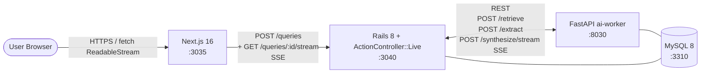
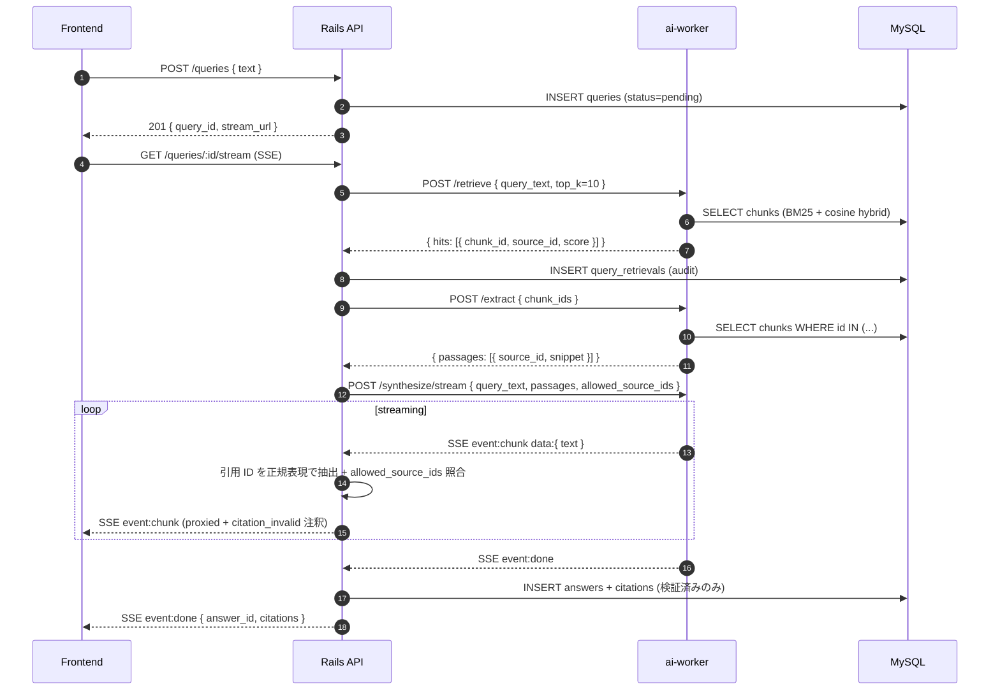
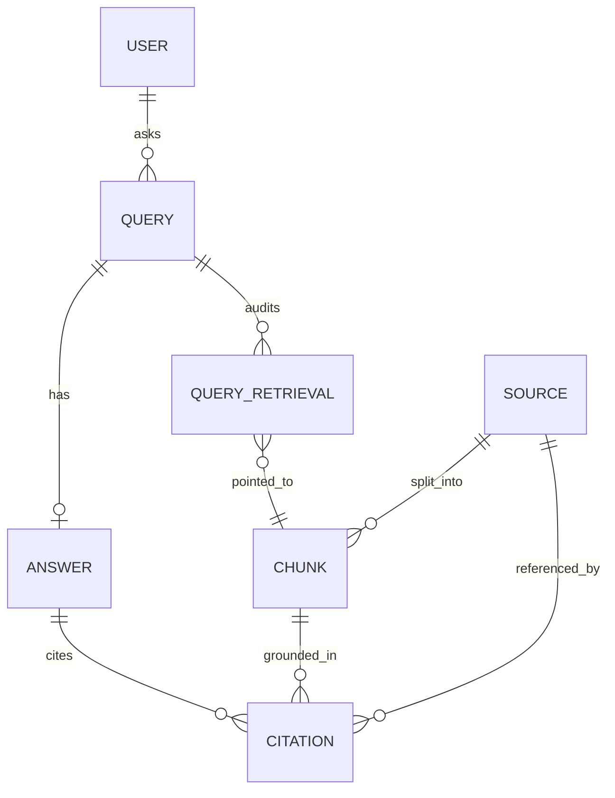

# Perplexity 風 RAG 検索アーキテクチャ

Perplexity AI を参考に、**「ユーザのクエリに対して、ローカルコーパスから根拠を集め、引用付きで回答を streaming する」** をローカル環境で再現する学習プロジェクト。

中核となる技術課題は以下の 6 つ:

1. **マルチステージ RAG パイプライン** — `retrieve → extract → synthesize` の 3 ステージをサービス境界に分けて流す ([ADR 0001](adr/0001-rag-pipeline-decomposition.md))
2. **Hybrid retrieval + embedding データ管理** — BM25 (MySQL FULLTEXT ngram) と擬似ベクタ cosine の **重み統合 / BLOB 永続化 / cold start ロード** ([ADR 0002](adr/0002-hybrid-retrieval.md))
3. **SSE streaming + 三段階の degradation 規律** — slack の WebSocket / github の polling と差別化した単方向 long-lived HTTP ストリーム、及び SSE 開始前 / 開始後 / done 後の失敗ハンドリング ([ADR 0003](adr/0003-sse-streaming.md))
4. **引用整合性の検証境界** — LLM (mock) が吐く引用 ID を Rails 側で再検証して "信頼境界" を引く ([ADR 0004](adr/0004-citation-verification-boundary.md))
5. **テスト戦略 (SSE / hybrid scoring / citation 検証)** — `ActionController::Live` を `Net::HTTP` 直叩きで試験、純関数 unit-test との 3 層構成 ([ADR 0005](adr/0005-testing-strategy.md))
6. **チャンク分割戦略** — 固定長 + 改行優先 (再帰的) を初期採用、overlap / hierarchical / semantic は派生 ADR で増分追加 ([ADR 0006](adr/0006-chunk-strategy.md))

---

## システム構成



- 外部依存は **MySQL のみ** (Redis 不使用、ベクタストアも別プロセス不使用)
- frontend ↔ backend は **REST + OpenAPI** で固定形を返し、**ストリーミング部分のみ SSE** に切り出す
- ai-worker ↔ MySQL は **読み専接続のみ** (ADR 0001): コーパスの読み出しは ai-worker から直接、`INSERT/UPDATE/DELETE` の発行は禁止 (規約として)
- 書き込み (Query / Answer / Citation / Chunk embedding) は **すべて Rails 経由**: `/corpus/embed` の戻り値も Rails が `chunks.embedding` BLOB に詰める (ADR 0001 / 0002)
- ai-worker からの内向き ingress は不要 (Rails が **必ず ai-worker を呼ぶ側**、結果は SSE proxy で返る) — github の内部 ingress 規律を **意識的に却下** (ADR 0001)

### RAG パイプラインのデータフロー



詳細:
- 各ステージの責務分離は [ADR 0001](adr/0001-rag-pipeline-decomposition.md)
- `/retrieve` の hybrid scoring 実装は [ADR 0002](adr/0002-hybrid-retrieval.md)
- SSE proxy の制御フロー (バッファリング / 引用 ID 抽出) は [ADR 0003](adr/0003-sse-streaming.md) と [ADR 0004](adr/0004-citation-verification-boundary.md)

---

## ドメインモデル



| テーブル | 役割 |
| --- | --- |
| `users` | rodauth-rails 想定 (slack を踏襲)。Phase 4 でヘッダ切替 → cookie auth に移行 |
| `sources` | 取り込んだドキュメント (タイトル / URL / 本文)。FULLTEXT は張らない (検索の単位は chunk なので) |
| `chunks` | source を **固定長 + 改行優先 (再帰的) で分割** した最小取得単位 (ADR 0006)。`body TEXT` に **`FULLTEXT(body) WITH PARSER ngram`** インデックス。`embedding` は `BLOB` (float32 × 256 次元 = 1024 byte、little-endian)、`embedding_version` / `chunker_version` の二軸を持つ。UNIQUE: `(source_id, ord, chunker_version)` |
| `queries` | ユーザクエリ。`status: pending / streaming / completed / failed` |
| `query_retrievals` | retrieve 結果を query 単位で記録 (audit。引用検証時に `allowed_source_ids` の出所になる) |
| `answers` | streaming 完了時に確定する 1 query : 1 answer。`status: streaming / completed / failed` |
| `citations` | answer 内の引用紐付け (marker / position / source / chunk)。**実在検証通過分だけ** insert、`Answer.transaction` で answer と原子的に永続化 (ADR 0003 §C) |

> マイグレーションは Phase 2 (sources / chunks) と Phase 3 (queries / answers / citations) に分けて作成する。

---

## REST API 概観 (Rails ↔ Frontend)

| メソッド | パス | 用途 |
| --- | --- | --- |
| `POST` | `/queries` | クエリを永続化し、`stream_url` を返す (即時 201) |
| `GET`  | `/queries/:id/stream` | SSE でストリーミング応答 (本体は Rails が ai-worker から proxy) |
| `GET`  | `/queries/:id` | 完了済みクエリの answer + citations を取得 (SSE 切れた後の再描画用) |
| `GET`  | `/sources/:id` | 引用元 source を取得 (引用クリック時の preview) |
| `GET`  | `/health` | ai-worker / DB の疎通サマリ |

> **2 ステップに分ける理由**: SSE は GET でしか開けない (ブラウザ `EventSource` も `fetch` も同様)。POST→GET の 2 段は遠回りに見えるが、stream URL を再接続できる利点がある。reconnection は SSE の `Last-Event-ID` ヘッダで再開可能。

### SSE イベント形式

```
event: chunk
data: {"text": "東京タワーは ", "ord": 0}

event: chunk
data: {"text": "1958 年に [#src_3] 完成した。", "ord": 1}

event: citation
data: {"marker": "src_3", "source_id": 42, "chunk_id": 117, "valid": true}

event: citation_invalid
data: {"marker": "src_99", "reason": "not_in_allowed_source_ids"}

event: done
data: {"answer_id": 7, "citations": [{"marker":"src_3","source_id":42}]}
```

詳細形式と Rails 側のバッファリング規約は [ADR 0003](adr/0003-sse-streaming.md)。

---

## ai-worker の責務 (Python)

| エンドポイント | 用途 | 入出力 |
| --- | --- | --- |
| `POST /retrieve` | hybrid retrieval | `{ query_text, top_k }` → `{ hits: [{ chunk_id, source_id, bm25_score, cosine_score, fused_score }] }` |
| `POST /extract` | 取得した chunk から passage を整形 | `{ chunk_ids }` → `{ passages: [{ source_id, snippet, ord }] }` |
| `POST /synthesize/stream` | mock LLM を SSE で吐く | `{ query_text, passages, allowed_source_ids }` → SSE (chunk / citation / done) |
| `POST /corpus/embed` | seed 投入時の擬似 encoder (deterministic) | `{ texts }` → `{ embeddings: [[float; 256]] }` |
| `GET /health` | 疎通確認 | `{ ok: true }` |

> **mock LLM の出力規律**: `allowed_source_ids` 内の id だけを引用として吐くこと、を ai-worker 側でも assert する (warn). Rails 側で再検証するので panic ではなく warn。詳細は [ADR 0004](adr/0004-citation-verification-boundary.md)。

---

## レスポンス境界

- 認可は **クエリの owner = current_user** のみ参照可。SSE 接続時にも検証
- 認証導線 (Phase 4 で確定): rodauth-rails の cookie auth を採用予定。Phase 1-3 の API 試験では `X-User-Id` ヘッダ切替で代用 (slack の Phase 進行に倣う)
- **ai-worker 失敗時の SSE 三段階規律 (ADR 0003 §graceful degradation)**:
  - **(A) SSE 開始前**: retrieve / extract 失敗時は **HTTP 5xx** を素直に返す (200 + degraded ではない)。frontend は SSE を開かない
  - **(B) SSE 開始後 / done 前**: synthesize 中断時は `event: error data: { reason }` 後 close。answer.status = failed、**citations は 1 件も永続化しない**
  - **(C) done 受信後**: Rails 側 INSERT 失敗時も `event: error` を frontend に流す。`Answer.transaction do INSERT answer; INSERT citations END` で原子的に処理
- 引用整合性違反 (LLM が allowed 外の id を吐いた) は **エラーではない**: `event: citation_invalid` で frontend に通知、本文の marker は **そのまま残る**が frontend で薄字レンダ (ADR 0004)

---

## 起動順序

```bash
# 1. インフラ
docker compose up -d mysql        # 3310

# 2. backend
cd backend && bundle exec rails db:prepare
bundle exec rails server -p 3040

# 3. ai-worker
cd ../ai-worker && source .venv/bin/activate
uvicorn main:app --port 8030

# 4. frontend
cd ../frontend && npm run dev      # http://localhost:3035

# 5. seed (Phase 2 で投入)
cd ../backend && bundle exec rails db:seed
```

## ポート割り当て

| サービス | ポート | 備考 |
| --- | --- | --- |
| frontend (Next.js)  | 3035 | github の 3025 から +10 |
| backend (Rails API) | 3040 | github の 3030 から +10 |
| ai-worker (FastAPI) | 8030 | github の 8020 から +10 |
| MySQL               | 3310 | github の 3309 から +1 |

## Phase ロードマップ

| Phase | 範囲 | 状態 |
| --- | --- | --- |
| 1 | scaffolding + ADR 6 本 + architecture.md + docker-compose | 🟢 設計フェーズ完了 |
| 2 | コーパス取り込み (Source / Chunk + 擬似 encoder + chunker) + ai-worker `/retrieve` の hybrid 実装 + cold start ロード | 🟢 完了 |
| 3 | Query / Answer / Citation モデル + Rails オーケストレーター + ai-worker `/extract` `/synthesize/stream` | 🟢 完了 (Phase 3 は同期 RAG / Phase 4 で SSE proxy 化) |
| 4 | SSE streaming endpoint + 引用整合性検証 + 認証 (rodauth-rails) + Frontend (fetch ReadableStream + 引用ハイライト UI) | ⏳ 未着手 |
| 5 | Playwright E2E (クエリ→ストリーミング→引用 + degradation §A/§B) + Terraform 設計図 + CI workflows | ⏳ 未着手 |
