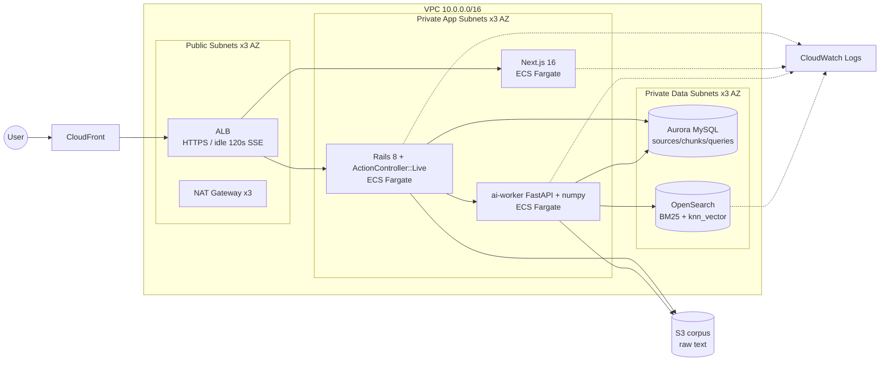

# perplexity / infra / terraform

> **設計図用途**: `terraform apply` する想定ではない（CLAUDE.md 参照）。
> 「本番化するなら AWS 上でどう組むか」を Terraform として読み取れる形で残すことが目的。
> CI で `terraform validate` のみ通る状態を維持する。

## 全体像



## ファイル構成

| ファイル | 内容 |
| --- | --- |
| `versions.tf`        | Terraform / provider バージョン固定、backend 設定（コメントアウト） |
| `variables.tf`       | 入力変数（リージョン・AZ・コンテナイメージ・OpenSearch サイジング等） |
| `outputs.tf`         | ALB DNS / RDS endpoint / OpenSearch endpoint 等の出力 |
| `network.tf`         | VPC + 3-AZ public/private subnets + NAT |
| `security_groups.tf` | ALB / ECS / RDS / OpenSearch 用 SG |
| `alb.tf`             | ALB + Listener + Target Groups（path 振り分け / SSE 用 idle 120s） |
| `ecs.tf`             | ECS Cluster + 3 Service (frontend / backend / ai-worker) |
| `rds.tf`             | Aurora MySQL クラスタ |
| `opensearch.tf`      | OpenSearch ドメイン（ADR 0002 本番想定の hybrid retrieval バックエンド） |
| `s3.tf`              | corpus 用バケット (raw text + version 管理) |
| `cloudfront.tf`      | CDN（静的アセット + ALB オリジン / SSE は素通し） |
| `iam.tf`             | ECS task / execution roles |
| `cloudwatch.tf`      | Log groups + 主要アラーム (ALB 5xx / RDS CPU / OpenSearch red) |
| `secrets.tf`         | DB password / Rails master key / rodauth JWT secret / OpenSearch master |

## 設計判断（コードと ADR の対応）

- **3 ステージ RAG パイプラインを HTTP 境界で分割** (ADR 0001) → ECS で
  backend / ai-worker を別 Service にする。Service Discovery (`ai-worker.perplexity.internal`)
  経由で backend が ai-worker を呼ぶ。
- **ai-worker は MySQL 読み専 / 書き込みは Rails 一意化** (ADR 0001) → IAM ではなく
  DB ユーザの権限で分離 (`perplexity_ro` / `perplexity`)。security_groups.tf でも
  RDS への ai-worker 経路を許可しているが、これは read 用途。
- **Hybrid retrieval を OpenSearch に切替** (ADR 0002 本番想定) → MySQL FULLTEXT +
  numpy in-memory cosine はローカル限定。本番では OpenSearch の BM25 + knn_vector
  を使うため、ai-worker が OPENSEARCH_ENDPOINT を環境変数で受け取る形にしてある。
  ローカル動作は変えない (numpy 経路は維持)。
- **SSE long-lived stream に対応するインフラ調整** (ADR 0003) → ALB idle_timeout 120s,
  CloudFront の `default_cache_behavior` を CachingDisabled, origin_read_timeout 120s.
  backend の deregistration_delay も 30s に短縮。
- **rodauth-rails JWT bearer** (ADR 0007) → JWT secret は Secrets Manager 管理.
  ECS task に SECRET 経由で注入。

## 動作確認

```bash
cd perplexity/infra/terraform
terraform fmt -check -recursive
terraform init -backend=false -input=false
terraform validate
```
