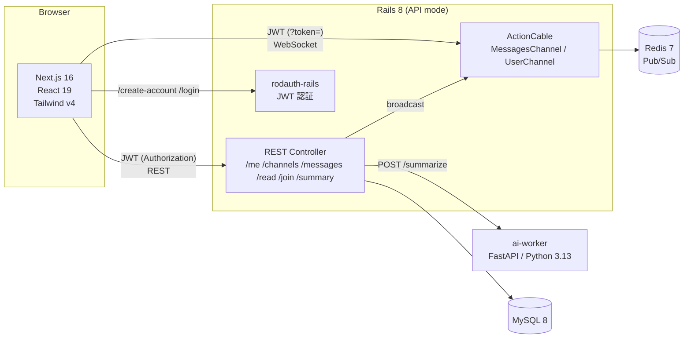
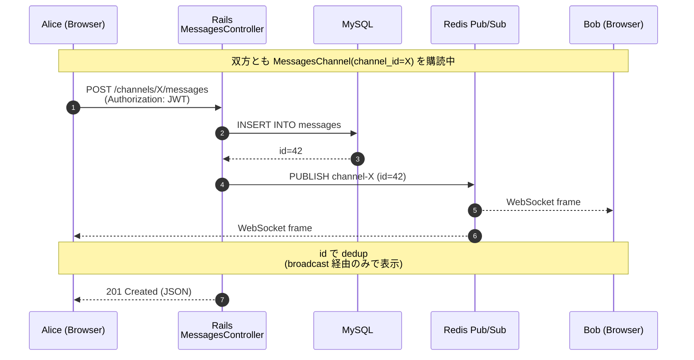
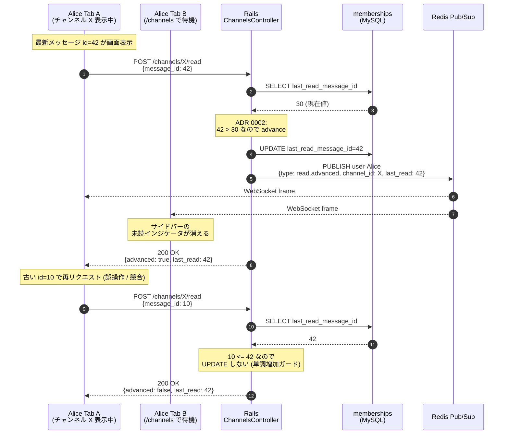
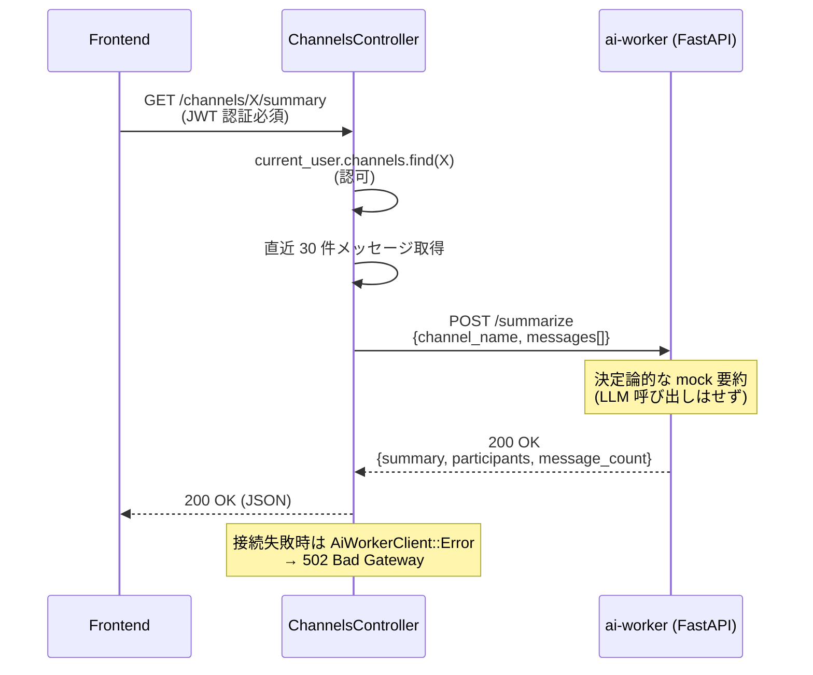

# Slack 風プロジェクト アーキテクチャ

このドキュメントは技術課題と実装の対応を Mermaid 図で示す。設計判断の根拠は ADR を参照（[docs/adr/](adr/)）。

---

## システム全体図



**ADR 対応**:
- WebSocket + Redis Pub/Sub: [ADR 0001](adr/0001-realtime-delivery-method.md)
- メッセージ永続化と既読 cursor: [ADR 0002](adr/0002-message-persistence-and-read-tracking.md)
- DB に MySQL: [ADR 0003](adr/0003-database-choice.md)
- 認証: [ADR 0004](adr/0004-authentication-strategy.md)
- E2E に Playwright: [ADR 0005](adr/0005-browser-e2e-with-playwright.md)

---

## メッセージ配信フロー (ADR 0001)



---

## 既読 cursor の単調増加と多デバイス同期 (ADR 0002)



---

## Rails ↔ ai-worker 境界



---

## テスト戦略

| レイヤー | フレームワーク | カバレッジ |
| --- | --- | --- |
| 単体・統合 | Rails minitest | モデル / Channel / Connection / Broadcast (9 tests) |
| E2E | Playwright (chromium) | auth / fan-out / read-sync / summary (6 tests) |

---

## ポート構成（ローカル開発）

| サービス | ホストポート | 備考 |
| --- | --- | --- |
| frontend (Next.js) | 3005 | `.env.local` の NEXT_PUBLIC_API_URL = backend |
| backend (Rails) | 3010 | docker の 3000 と衝突回避のため移動 |
| ai-worker (FastAPI) | 8000 | uvicorn 直起動 |
| mysql | 3307 → 3306 | 他プロジェクト docker (yamanashi) と衝突回避 |
| redis | 6379 | デフォルト |

---

## 起動順序

```bash
# 1. インフラ
cd projects/slack
docker compose up -d mysql redis

# 2. backend (Rails)
cd backend
bundle exec rails db:create db:migrate
bundle exec rails server -p 3010

# 3. ai-worker (Python)
cd ../ai-worker
python3 -m venv .venv && source .venv/bin/activate
pip install -r requirements.txt
uvicorn main:app --port 8000

# 4. frontend (Next.js)
cd ../frontend
npm install
npm run dev   # http://localhost:3005

# 5. E2E (任意)
cd ../playwright
AI_WORKER_RUNNING=1 npm test
```
