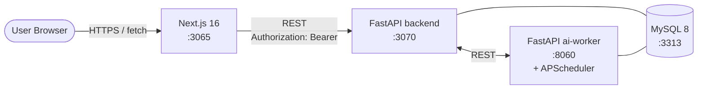

# Reddit 風 forum (FastAPI / async)

Reddit のアーキテクチャを参考に、**「サブレディット / 投稿 / コメントツリー / 投票 + Hot ランキング」** をローカル環境で再現するプロジェクト。

slack (Rails / WebSocket fan-out) / youtube (Rails / Solid Queue) / github (Rails / GraphQL) / perplexity (Rails / SSE) / instagram (Django / Celery fan-out) / discord (Go / per-guild Hub) に続く 7 つ目のプロジェクトとして、**バックエンドを意図的に FastAPI (async) で実装** ([リポジトリ方針「学習方針」](../docs/service-architecture-lab-policy.md#learning-roadmap-rails-replace)) し、**コメントツリー DB 設計 × 投票整合性 × Hot ランキング × 非同期 I/O** の 4 つを正面から扱う。

外部 SaaS / LLM は使用せず、ai-worker 側で deterministic な mock を実装することでローカル完結を保つ。

---

## 見どころハイライト (設計フェーズ)

> 🟢 MVP 完成 (Phase 1-5 完了)：FastAPI backend (32 tests) + ai-worker (19 tests) + Next.js 16 frontend (build pass) + Playwright (3 シナリオ通過) + Terraform validate + GitHub Actions 5 ジョブ。

- **コメントツリーは Adjacency List + Materialized Path のハイブリッド** — `parent_id` で「直接の親」、`path = '00000001/00000004'` で「サブツリー走査と preorder」を分業 ([ADR 0001](docs/adr/0001-comment-tree-storage.md))
- **投票は votes truth + posts.score を相対加算で denormalize** — `INSERT ... ON DUPLICATE KEY UPDATE` + `UPDATE posts SET score = score + delta` を 1 トランザクションで。drift は ai-worker の reconcile job で吸収 ([ADR 0002](docs/adr/0002-vote-integrity.md))
- **Hot ランキングは ai-worker の APScheduler で 60s 再計算** — Reddit 公式の Hot 式 (`log10 + epoch`) を Python で実装、backend は `ORDER BY hot_score DESC LIMIT 25` 一発 ([ADR 0003](docs/adr/0003-hot-ranking-batch.md))
- **FastAPI async + SQLAlchemy 2.0 async + JWT** — instagram (Django/DRF / 同期 ORM + Celery) と意図的に対比し、Python 二大潮流を 1 リポジトリで体感 ([ADR 0004](docs/adr/0004-async-stack-fastapi.md))

---

## E2E デモ (Playwright で録画)

`cd reddit/playwright && npm run capture` で再生成可能。仕組みは [`playwright/README.md`](playwright/README.md#キャプチャ生成の仕組み)。

| # | シナリオ | キャプチャ |
| --- | --- | --- |
| 01 | anonymous 閲覧 (subreddit 一覧) |  |
| 02 | 認証フロー (登録 → subreddit → post → upvote → コメント → reply で depth 2) |  |
| 03 | ai-worker proxy (TL;DR を取得して表示) |  |

---

## アーキテクチャ概要



詳細な ER / Hot シーケンス / API 概観は **[docs/architecture.md](docs/architecture.md)** を参照。

---

## 採用したスコープ

| 含める | 除外 |
| --- | --- |
| サブレディット (= flat namespace) / 投稿 / コメント / 投票 | multireddit / community wiki / flair |
| コメントツリー (Adjacency List + Materialized Path) | re-parent / comment move |
| 投票 (3 値、整合性 + drift reconcile) | award / coin / 課金 |
| Hot / New ランキング | Top (期間別) / Best (Wilson) → 派生 ADR |
| HS256 JWT bearer (1 経路) | OAuth / SSO / 2FA / メール検証 / token rotation |
| anonymous 閲覧 (Hot / 投稿閲覧) | rate limit / shadowban → 派生 ADR |
| ai-worker `/summarize` `/related` `/spam-check` (mock) | 実 LLM / NSFW model |
| **派生 ADR で扱う候補**: Best (Wilson) / Closure Table / Alembic 化 / buffered increment / scheduler advisory lock / rate limit | (上記いずれも本 ADR 0001-0004 のスコープ外として明示的に切り出し済み) |

---

## 主要な設計判断 (ADR ハイライト)

| # | 判断 | 何を選んで何を捨てたか |
| --- | --- | --- |
| [0001](docs/adr/0001-comment-tree-storage.md) | **Adjacency List + Materialized Path のハイブリッド** | Adjacency List 単体 / Nested Set / Closure Table を却下。INSERT は `INSERT → UPDATE` の 2 段で path を採番 |
| [0002](docs/adr/0002-vote-integrity.md) | **votes truth + posts.score を相対加算で denormalize** | 都度 SUM / 絶対値書き込み / votes 不在 / 物理削除 を却下。drift は ai-worker の reconcile job で吸収 |
| [0003](docs/adr/0003-hot-ranking-batch.md) | **ai-worker の APScheduler で 60s ごとに Hot 再計算** | リクエスト時オンザフライ / 投票同期計算 / generated column / 専用テーブル を却下。新規投稿の初期値だけ同期計算 |
| [0004](docs/adr/0004-async-stack-fastapi.md) | **FastAPI async + SQLAlchemy 2.0 async + aiomysql + HS256 JWT bearer** | 同期 mode / tortoise-orm / Litestar / DRF Token / OAuth を却下。internal ingress は `X-Internal-Token` |

---

## ポート割り当て

| サービス | ポート | 備考 |
| --- | --- | --- |
| frontend (Next.js)  | 3065 | discord の 3055 から +10 |
| backend (FastAPI)   | 3070 | discord の 3060 から +10 |
| ai-worker (FastAPI) | 8060 | discord の 8050 から +10 |
| MySQL               | 3313 | discord の 3312 から +1 |

Redis は **不使用**。ranking は DB の denormalize で完結 (ADR 0003)。

---

## ローカル起動 (Phase 2 以降で動作)

### 前提

- Docker / Docker Compose / Node.js 20+ / Python 3.12+

### 起動

```bash
# 1. インフラ
docker compose up -d mysql                  # 3313

# 2. backend (FastAPI)
cd backend && python -m venv .venv && source .venv/bin/activate
pip install -r requirements.txt
python -m app.cli migrate                   # Phase 2 で実装
uvicorn app.main:app --port 3070 --reload

# 3. ai-worker (別タブ)
cd ../ai-worker && python -m venv .venv && source .venv/bin/activate
pip install -r requirements.txt
uvicorn app.main:app --port 8060 --reload   # Hot scheduler は startup で起動

# 4. frontend (別タブ)
cd ../frontend && npm install
npm run dev                                  # http://localhost:3065

# 5. E2E (Phase 5 で追加)
cd ../playwright && npm test
```

---

## ステータス

| コンポーネント | ステータス |
| --- | --- |
| ADR (0001-0004)             | 🟢 全 Accepted |
| architecture.md             | 🟢 ER / Hot シーケンス / REST API / 起動順序まで記述 |
| Backend (FastAPI)           | 🟢 Phase 2-4 完了（auth / subreddits / posts / comments / votes / ai-worker proxy / 32 tests pass） |
| ai-worker (FastAPI + APScheduler) | 🟢 Phase 4 完了（recompute_hot_scores 60s + reconcile_score nightly + /summarize /related /spam-check / 19 tests） |
| Frontend (Next.js 16)       | 🟢 Phase 4 完了（subreddit list / hot+new feed / post detail + comment tree + vote / login / build pass） |
| 認証 (JWT bearer)           | 🟢 Phase 2 完了 |
| E2E (Playwright)            | 🟢 Phase 5 完了（anonymous 閲覧 / 認証フロー / ai-worker proxy の 3 シナリオ通過） |
| インフラ設計図 (Terraform)  | 🟢 Phase 5 完了（VPC / ALB / ECS Fargate / RDS / Secrets / CloudWatch、`terraform validate` pass） |
| CI (GitHub Actions)         | 🟢 Phase 5 完了（backend / ai-worker / frontend / playwright / terraform の 5 ジョブ） |

---

## ドキュメント

- [アーキテクチャ図](docs/architecture.md) — システム構成 / ER / Hot シーケンス / REST API 概観
- [ADR 一覧](docs/adr/)
  - [0001 コメントツリーの DB 設計 (Adjacency List + Materialized Path)](docs/adr/0001-comment-tree-storage.md)
  - [0002 投票の整合性と score denormalize](docs/adr/0002-vote-integrity.md)
  - [0003 Hot ランキングと再計算バッチ](docs/adr/0003-hot-ranking-batch.md)
  - [0004 非同期 I/O スタック (FastAPI + SQLAlchemy 2.0 async) と JWT 認証](docs/adr/0004-async-stack-fastapi.md)
- リポジトリ全体方針: [../CLAUDE.md](../CLAUDE.md)
- Python コーディング規約: [../docs/coding-rules/python.md](../docs/coding-rules/python.md)
- フレームワーク比較: [../docs/framework-django-vs-rails.md](../docs/framework-django-vs-rails.md)
- 共通ルール: [../docs/](../docs/) (operating-patterns / testing-strategy)

---

## Phase ロードマップ

| Phase | 範囲 | 状態 |
| --- | --- | --- |
| 1 | scaffolding + ADR 4 本 + architecture.md + docker-compose | 🟢 設計フェーズ完了 |
| 2 | FastAPI scaffold (async + SQLAlchemy 2.0 + bcrypt JWT) + auth / subreddits / posts CRUD + 投票 (ADR 0002) | 🟢 完了 |
| 3 | comments ツリー (ADR 0001 path 採番) + コメント投票 + soft delete | 🟢 完了 |
| 4 | ai-worker (FastAPI + APScheduler) で Hot 再計算 + `/summarize` `/related` `/spam-check` mock + frontend | 🟢 完了 |
| 5 | Playwright (anonymous read + 認証フロー + 投票 + コメント返信) + Terraform 設計図 + GitHub Actions CI workflows | 🟢 完了 |
