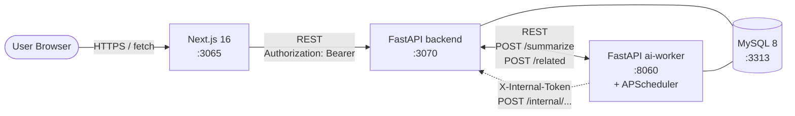
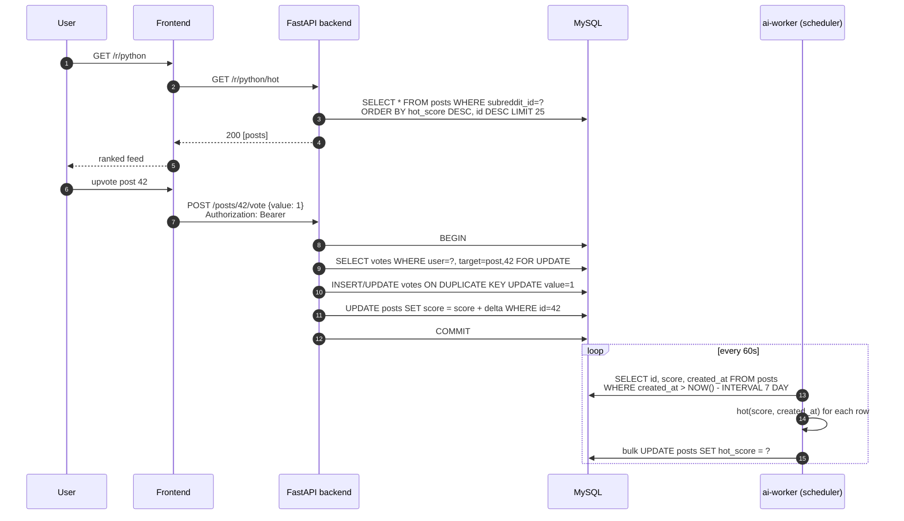
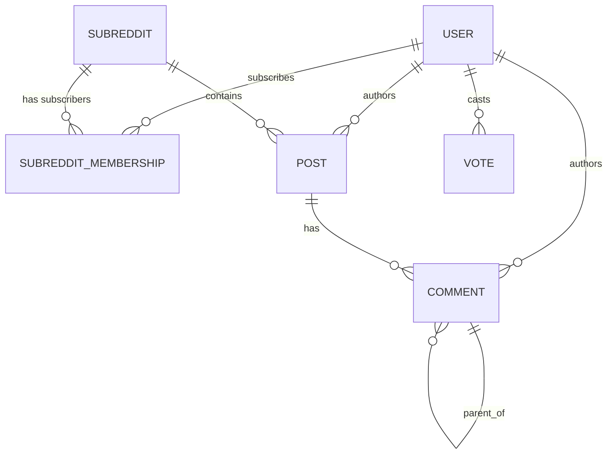

# Reddit 風 forum (FastAPI) アーキテクチャ

Reddit のアーキテクチャを参考に、**「サブレディット / 投稿 / コメントツリー / 投票 + Hot ランキング」** をローカル環境で再現する学習プロジェクト。

中核となる技術課題は以下の 4 つ:

1. **コメントツリーの DB 設計** — Adjacency List + Materialized Path のハイブリッド ([ADR 0001](adr/0001-comment-tree-storage.md))
2. **投票の整合性と score 整合** — `votes` truth + `posts.score` denormalize + 相対加算 ([ADR 0002](adr/0002-vote-integrity.md))
3. **Hot ランキングと再計算バッチ** — Reddit Hot 式 + ai-worker (FastAPI scheduler) で 60s 間隔再計算 ([ADR 0003](adr/0003-hot-ranking-batch.md))
4. **非同期 I/O スタック + JWT 認証** — FastAPI async + SQLAlchemy 2.0 async + aiomysql + HS256 JWT ([ADR 0004](adr/0004-async-stack-fastapi.md))

> 本プロジェクトは CLAUDE.md「言語別バックエンド方針」の **FastAPI プロジェクト 1 本目**。同じ Python の `instagram` (Django/DRF / 同期 ORM + Celery) と対比し、**「同期 ORM + 管理画面前提」 vs 「非同期 I/O + 型駆動」** という Python 二大潮流の差を 1 リポジトリで体感する。

---

## システム構成



- 永続化は **MySQL のみ** (Redis 不採用、ranking は DB の denormalize で完結)
- frontend ↔ backend は **REST + JSON** (固定形)
- backend ↔ ai-worker は REST 同期コール (`/summarize`, `/related`, `/spam-check` mock)
- ai-worker → backend は **`X-Internal-Token`** で内部 ingress (perplexity / discord と同方針)
- ai-worker は **APScheduler interval (60s)** で Hot 再計算バッチを内蔵 (ADR 0003)

### Hot ランキングのデータフロー



詳細:
- コメントツリーの path 採番フローは [ADR 0001](adr/0001-comment-tree-storage.md)
- 投票の相対加算とトランザクション境界は [ADR 0002](adr/0002-vote-integrity.md)
- Hot 式と scheduler 設計は [ADR 0003](adr/0003-hot-ranking-batch.md)

---

## ドメインモデル



| テーブル | 役割 |
| --- | --- |
| `users` | `username UNIQUE`, `password_hash` (bcrypt), `created_at` |
| `subreddits` | `name UNIQUE`, `description`, `created_by`, `created_at` |
| `subreddit_memberships` | `(subreddit_id, user_id)` UNIQUE, `created_at` (= subscribe relation) |
| `posts` | `subreddit_id`, `user_id`, `title`, `body TEXT`, `score INT`, `hot_score FLOAT`, `hot_recomputed_at`, `deleted_at`, `created_at` / index `(subreddit_id, hot_score DESC, id DESC)` `(subreddit_id, created_at DESC)` |
| `comments` | `post_id`, `parent_id NULL`, `path VARCHAR(255)`, `depth INT`, `user_id`, `body TEXT`, `score INT`, `deleted_at`, `created_at` / index `(post_id, path)` `(post_id, score DESC)` (ADR 0001) |
| `votes` | `user_id`, `target_type ENUM('post','comment')`, `target_id`, `value TINYINT`, `created_at`, `updated_at` / UNIQUE `(user_id, target_type, target_id)` (ADR 0002) |

> マイグレーションは Phase 2 で `users / subreddits / subreddit_memberships`、Phase 2 後半で `posts / comments / votes` を 6 ファイルに分割して作成する。

---

## REST API 概観 (FastAPI ↔ Frontend)

| メソッド | パス | 認証 | 用途 |
| --- | --- | --- | --- |
| `POST` | `/auth/register` | – | 登録、JWT 返却 |
| `POST` | `/auth/login` | – | ログイン、JWT 返却 |
| `GET`  | `/me` | bearer | JWT から user 情報 |
| `GET`  | `/r` | – | サブレディット一覧 |
| `POST` | `/r` | bearer | サブレディット作成 (作成者は auto-subscribe) |
| `GET`  | `/r/{name}` | – | サブレディット詳細 |
| `POST` | `/r/{name}/subscribe` | bearer | subscribe / unsubscribe (toggle) |
| `GET`  | `/r/{name}/hot` | – | Hot ランキング (ADR 0003) |
| `GET`  | `/r/{name}/new` | – | 新着順 |
| `POST` | `/r/{name}/posts` | bearer | post 作成 (初期 hot_score を同期計算) |
| `GET`  | `/posts/{id}` | – | post 単体 |
| `POST` | `/posts/{id}/vote` | bearer | post への投票 (ADR 0002) |
| `GET`  | `/posts/{id}/comments` | – | コメントツリー (path 順) |
| `POST` | `/posts/{id}/comments` | bearer | コメント / 返信投稿 |
| `POST` | `/comments/{id}/vote` | bearer | コメントへの投票 |
| `POST` | `/internal/recompute-hot` | internal token | (ai-worker → backend、現状は scheduler が直接 DB に書くので予備) |
| `GET`  | `/health` | – | DB / ai-worker 疎通 |

> **anonymous read**: 閲覧系 GET は bearer なしでアクセス可。投稿 / 投票 / コメント / subscribe は bearer 必須 (ADR 0004)。

---

## ai-worker の責務 (Python / FastAPI + APScheduler)

| エンドポイント / ジョブ | 用途 | 入出力 |
| --- | --- | --- |
| `POST /summarize` | 投稿の TL;DR 要約 (mock) | `{title, body}` → `{summary}` |
| `POST /related` | 関連サブレディット (mock) | `{subreddit}` → `{related: [name]}` |
| `POST /spam-check` | コメント / post のスパム判定 (mock) | `{body}` → `{flagged, score}` |
| `GET /health` | 疎通 | `{ok: true}` |
| **interval job** `recompute_hot_scores` (60s) | Hot 再計算バッチ (ADR 0003) | DB の posts を bulk UPDATE |
| **interval job** `reconcile_score` (nightly) | votes ↔ posts.score の drift 検出 (ADR 0002) | drift をログ出力 |

> mock 実装の規律: hash ベース determinist。LLM / 外部 API 不使用。instagram / discord / perplexity と同パターン。

---

## レスポンス境界

- 認可は **`Depends(get_current_user)`** で JWT 検証 (一部 router は `Depends(get_current_user_optional)` で anonymous 許可)
- subreddit subscribe は記録のみ (現状は閲覧 / 投稿のいずれにも必須にしない、Reddit と同じく公開コミュニティ前提)
- **失敗時の挙動**:
  - **bearer 不正**: 401
  - **bearer なしで要認証エンドポイント**: 401
  - **ai-worker 不通**: `/summarize` `/related` `/spam-check` は **空レスポンス + `degraded: true` で 200** (graceful degradation、operating-patterns §2)
  - **scheduler 障害**: hot_score が更新されなくなる → 並び順が古いままになるだけで API は動く

---

## 起動順序

```bash
# 1. インフラ
docker compose up -d mysql        # 3313

# 2. backend (FastAPI)
cd backend
python -m venv .venv && source .venv/bin/activate
pip install -r requirements.txt
python -m app.cli migrate         # マイグレーション
uvicorn app.main:app --port 3070 --reload

# 3. ai-worker (別タブ)
cd ../ai-worker && python -m venv .venv && source .venv/bin/activate
pip install -r requirements.txt
uvicorn app.main:app --port 8060 --reload    # Hot scheduler は app の startup で起動

# 4. frontend (別タブ)
cd ../frontend && npm install
npm run dev                        # http://localhost:3065

# 5. E2E (Phase 5 で追加)
cd ../playwright && npm test
```

## ポート割り当て

| サービス | ポート | 備考 |
| --- | --- | --- |
| frontend (Next.js)  | 3065 | discord の 3055 から +10 |
| backend (FastAPI)   | 3070 | discord の 3060 から +10 |
| ai-worker (FastAPI) | 8060 | discord の 8050 から +10 |
| MySQL               | 3313 | discord の 3312 から +1 |
| Redis               | (不使用) | ranking は DB の denormalize で完結 (ADR 0003) |

## Phase ロードマップ

| Phase | 範囲 | 状態 |
| --- | --- | --- |
| 1 | scaffolding + ADR 4 本 + architecture.md + docker-compose | 🟢 設計フェーズ完了 |
| 2 | FastAPI scaffold (async + SQLAlchemy 2.0 + bcrypt JWT) + auth / subreddits / posts CRUD + 投票 (ADR 0002) | 🔴 未着手 |
| 3 | comments ツリー (ADR 0001 path 採番) + コメント投票 + soft delete | 🔴 未着手 |
| 4 | ai-worker (FastAPI + APScheduler) で Hot 再計算 + `/summarize` `/related` `/spam-check` mock + frontend (Next.js / hot 一覧 / コメントツリー) | 🔴 未着手 |
| 5 | Playwright (anonymous read + 認証フロー + 投票 + コメント返信) + Terraform 設計図 + GitHub Actions CI workflows | 🔴 未着手 |
