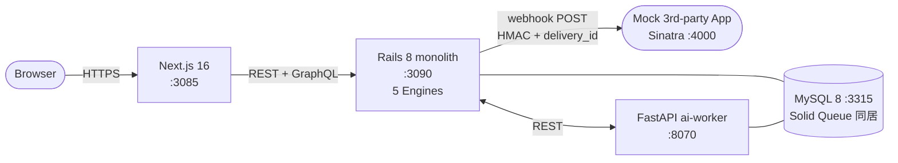

# Shopify 風 EC プラットフォーム (Rails 8 / モジュラーモノリス)

Shopify を参考に、**「モジュラーモノリス × マルチテナント × 在庫整合性 × App プラットフォーム」** をローカル環境で再現するプロジェクト。

slack (Rails / WebSocket fan-out) / youtube (Rails / Solid Queue 状態機械) / github (Rails / GraphQL 権限グラフ) / perplexity (Rails / SSE RAG) / instagram (Django / fan-out on write) / discord (Go / per-guild Hub) / reddit (FastAPI / async + コメントツリー) に続く **8 つ目のプロジェクト**。Rails スタックの中で唯一「**境界設計 (Engine 分割)**」を正面から扱う位置づけ。

外部 SaaS / LLM は使用せず、ai-worker 側で deterministic な mock を実装することでローカル完結を保つ（リポ全体方針: [`../CLAUDE.md`](../CLAUDE.md)）。

---

## 見どころハイライト (設計フェーズ)

> 🟢 **MVP 完成 (Phase 1-5 完了 + 高精度コードレビュー反映)**: Phase 4 + apps Engine + Webhook 配信 (HMAC + delivery_id idempotency + at-least-once retry) / **ActiveSupport::Notifications で `orders → apps` の dependency inversion** (orders は apps を直接参照しない / packwerk で fixate) / Terraform validate pass / GitHub Actions **5 ジョブ追加** / RSpec **89 件通過** + pytest 7 件 + packwerk 0 violation。
>
> Review fix: cart double-submit (lock!) / cart 重複作成防止 (UNIQUE 制約 + retry) / currency mismatch 検証 / `Inventory::NotConfigured` 区別 / DeductService source ledger 紐付け / Order#number 原子採番 (`core_shops.next_order_number` counter) / Solid Queue 実装 / Apps API endpoint (Bearer + scope) / ai-worker 統合 + graceful degradation。並行 spec で C1/C2/I3 の不変条件を fixate。

- **モジュラーモノリス: Rails Engine + packwerk** — `core / catalog / inventory / orders / apps` の 5 Engine、依存方向を packwerk で CI 失敗にする ([ADR 0001](docs/adr/0001-modular-monolith-rails-engine.md))
- **マルチテナント: `shop_id` row-level scoping** — サブドメイン解決 + 明示 scope (`current_shop.products.find`)、`default_scope` は意図的に却下 ([ADR 0002](docs/adr/0002-multi-tenancy-row-level-shop-scoping.md))
- **在庫の同時減算: 条件付き UPDATE + ledger** — `UPDATE inventory_levels SET on_hand = on_hand - :q WHERE on_hand >= :q`、悲観/楽観ロックを却下、`stock_movements` ledger で reconcile ([ADR 0003](docs/adr/0003-inventory-conditional-update-decrement.md))
- **App プラットフォーム: Solid Queue + HMAC + idempotency** — at-least-once 配信、`X-Hmac-Sha256` 署名、`X-Webhook-Delivery-Id` で受信側冪等性 ([ADR 0004](docs/adr/0004-app-platform-webhook-delivery.md))

---

## アーキテクチャ概要



詳細な ER / 在庫減算シーケンス / API 概観 / Phase ロードマップは **[docs/architecture.md](docs/architecture.md)** を参照。

---

## 採用したスコープ

| 含める | 除外 |
| --- | --- |
| Shop / Product / Variant / Inventory / Order / Checkout | 課金・サブスク (Shopify Payments / Billing) |
| 5 Engine 分割 + packwerk 依存方向強制 | 物理マイクロサービス |
| `shop_id` row-level scoping + サブドメイン解決 | schema/DB-per-tenant |
| 在庫の条件付き UPDATE + ledger + reconcile | partial decrement / 複数 location アロケーション戦略 (派生 ADR) |
| App / AppInstallation / Webhook 配信 + HMAC | OAuth フルフロー / Marketplace UI / 課金 |
| Solid Queue による at-least-once 配信 + retry | Webhook 順序保証 / HMAC rotation (派生 ADR) |
| storefront の最小 UI (商品一覧 → カート → checkout) | テーマ / Liquid 風カスタマイズ |
| 認証 1 経路 (rodauth-rails セッション + JWT) | OAuth / SSO / 2FA |

---

## 主要な設計判断 (ADR ハイライト)

| # | 判断 | 何を選んで何を捨てたか |
| --- | --- | --- |
| [0001](docs/adr/0001-modular-monolith-rails-engine.md) | **Rails Engine + packwerk によるモジュラーモノリス** | namespace のみ / マイクロサービス / sorbet 型境界 を却下。CI で依存方向 violation を 0 件に維持 |
| [0002](docs/adr/0002-multi-tenancy-row-level-shop-scoping.md) | **`shop_id` row-level scoping + 明示 scope** | schema/DB-per-tenant / `default_scope` 暗黙 scope を却下。漏洩試験を不変条件 spec で固定 |
| [0003](docs/adr/0003-inventory-conditional-update-decrement.md) | **条件付き UPDATE (compare-and-decrement) + append-only ledger** | 悲観ロック (`with_lock`) / 楽観ロック / Redis reservation を却下。drift は ai-worker の reconcile job で吸収 |
| [0004](docs/adr/0004-app-platform-webhook-delivery.md) | **Solid Queue + HMAC 署名 + delivery_id idempotency で at-least-once** | 同期配信 / 外部 broker / GraphQL Subscription を却下。受信側冪等性は契約として明示 |

---

## ポート割り当て

| サービス | ポート | 備考 |
| --- | --- | --- |
| frontend (Next.js)  | 3085 | reddit 3065 から +20 |
| backend (Rails 8)   | 3090 | reddit 3070 から +20 |
| ai-worker (FastAPI) | 8070 | reddit 8060 から +10 |
| MySQL               | 3315 | reddit 3313 から +2 |
| Mock receiver app   | 4000 | webhook 受信モック (Sinatra) |

Redis は **不使用**。Solid Queue / Solid Cache は backend の MySQL に同居（youtube と同じ）。

---

## ローカル起動 (Phase 2 以降で動作)

### 前提

- Docker / Docker Compose / Ruby 3.3+ / Node.js 20+ / Python 3.12+
- `acme-store.localhost` `globex.localhost` のサブドメイン解決 (macOS なら `/etc/hosts` で `127.0.0.1 acme-store.localhost globex.localhost` を追加)

### 起動

```bash
# 1. インフラ
docker compose up -d mysql                  # 3315

# 2. backend (Rails 8)
cd backend && bundle install
bin/rails db:prepare                         # 全 migration 適用
bin/packwerk check                           # 依存方向違反 0 を確認 (ADR 0001)
bin/rails s -p 3090

# 2b. Solid Queue worker (別タブ / ADR 0004 webhook 配信に必須)
cd backend && bin/jobs                       # WebhookDelivery を pickup して dispatch

# 3. ai-worker (別タブ)
cd ../ai-worker && python -m venv .venv && source .venv/bin/activate
pip install -r requirements.txt
uvicorn app.main:app --port 8070 --reload

# 4. frontend (別タブ)
cd ../frontend && npm install
npm run dev                                  # http://acme-store.localhost:3085

# 5. Mock receiver (別タブ、Phase 5 で追加)
cd ../apps/mock_receiver && bundle exec ruby app.rb -p 4000

# 6. E2E (Phase 5 で追加)
cd ../playwright && npm test
```

---

## ステータス

| コンポーネント | ステータス |
| --- | --- |
| ADR (0001-0004)             | 🟢 全 Accepted |
| architecture.md             | 🟢 ER / 在庫減算シーケンス / Engine 構成 / Phase ロードマップまで記述 |
| Backend (Rails 8 + 5 Engine) | 🟢 Phase 5 完了 (Phase 4 + Apps::{App,AppInstallation,WebhookSubscription,WebhookDelivery} + EventBus + Signer (HMAC-SHA256) + DeliveryJob (at-least-once retry / max 8 attempts) / ApplicationJob を core Engine に移動) |
| ai-worker (FastAPI)          | 🟢 Phase 4 完了 (FastAPI + /recommend /summarize-reviews /forecast-demand mock + X-Internal-Token / pytest 7 件通過) |
| Frontend (Next.js 16)        | 🟢 Phase 4 完了 (Next.js 16 + Tailwind v4 / storefront 商品一覧ページ / build + typecheck pass) |
| 認証 (rodauth-rails + JWT)   | 🟢 Phase 2 完了 (RodauthMain JSON+JWT mode / before_create_account で shop_id bind / 共有 PK で Account ↔ Core::User) |
| App プラットフォーム         | 🟢 Phase 5 完了 (orders → apps の dependency inversion を ActiveSupport::Notifications で実装 / `orders.order_created` を apps Engine の after_initialize subscriber が拾って配信予約) |
| インフラ設計図 (Terraform)   | 🟢 Phase 5 完了 (VPC / ALB / ECS Fargate / RDS MySQL / Secrets / CloudWatch、`terraform validate` pass) |
| CI (GitHub Actions)          | 🟢 Phase 5 完了 (5 ジョブ: backend / packwerk / ai-worker / frontend / terraform) |

---

## ドキュメント

- [アーキテクチャ図](docs/architecture.md) — システム構成 / ER / 在庫減算シーケンス / API 概観 / Phase ロードマップ
- [ADR 一覧](docs/adr/)
  - [0001 モジュラーモノリス (Rails Engine + packwerk)](docs/adr/0001-modular-monolith-rails-engine.md)
  - [0002 マルチテナント分離 (`shop_id` row-level scoping)](docs/adr/0002-multi-tenancy-row-level-shop-scoping.md)
  - [0003 在庫の同時減算 (条件付き UPDATE + ledger)](docs/adr/0003-inventory-conditional-update-decrement.md)
  - [0004 App プラットフォーム (Webhook at-least-once + HMAC + idempotency)](docs/adr/0004-app-platform-webhook-delivery.md)
- リポジトリ全体方針: [../CLAUDE.md](../CLAUDE.md)
- Rails コーディング規約: [../docs/coding-rules/rails.md](../docs/coding-rules/rails.md)
- 横断パターン: [../docs/operating-patterns.md](../docs/operating-patterns.md) (内部 ingress / fan-out / 相対加算 + reconcile)

---

## Phase ロードマップ

| Phase | 範囲 | 状態 |
| --- | --- | --- |
| 1 | scaffolding + ADR 4 本 + architecture.md + docker-compose | 🟢 設計フェーズ完了 |
| 2 | Rails 8 + 5 Engine + packwerk 0 violation + core (Shop / User / Auth) + tenant resolver middleware | 🟢 完了 (RSpec 20 件: shop / user / tenant_resolver / auth (rodauth) / cross_tenant_isolation / scope_lint / dependency) |
| 3 | catalog + inventory + 条件付き UPDATE + concurrent decrement spec + stock_movements ledger | 🟢 完了 (RSpec 40 件: + product / variant / stock_movement / deduct_service / **concurrent_deduct (100 thread × initial 60 で 60 成功 / 40 失敗 / on_hand=0 / SUM(delta)=-60**)) |
| 4 | orders + checkout + ai-worker proxy + frontend (merchant 画面 + storefront) | 🟢 完了 (RSpec 56 件: + Orders::CheckoutService 6 件 (在庫不足時の全件 rollback) / storefront API request 6 件 / pytest 7 件 / Next.js build pass) |
| 5 | apps Engine + WebhookSubscription/Delivery + Terraform + CI 5 ジョブ | 🟢 完了 (RSpec 71 件) |
| Review fix | C1-C4 + I1-I6 + M2/M4/M7/M8 を反映 | 🟢 完了 (RSpec 89 件: + 並行 checkout 2 / cart UNIQUE 4 / NotConfigured 1 / source ledger 1 / currency mismatch 1 / cart retry 1 / Apps API 5 / recommendations 3) |
