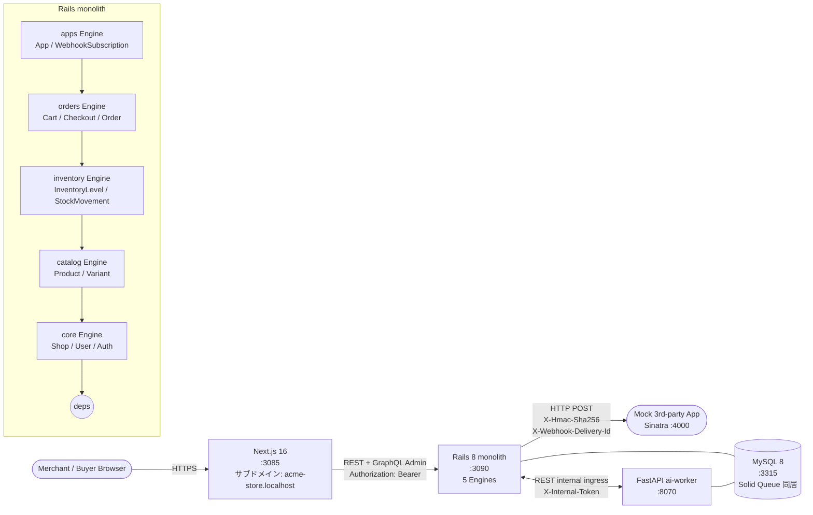
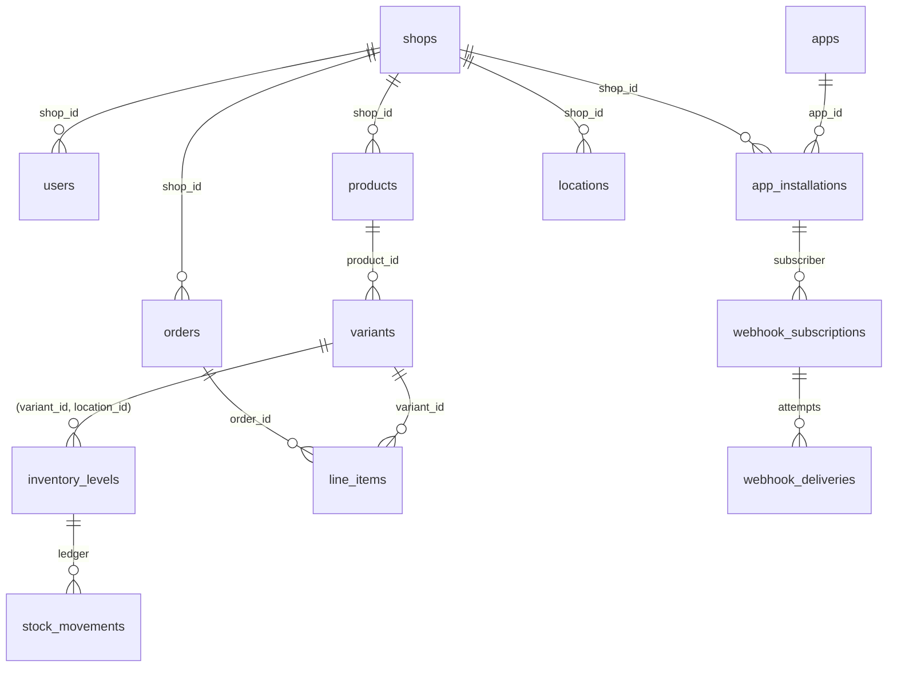
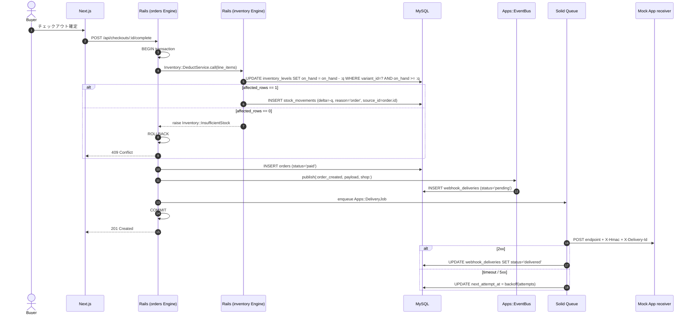

# Shopify 風 EC プラットフォーム — アーキテクチャ

> **設計フェーズ (Phase 1) 時点**のドキュメント。Phase 2 以降の実装で詳細はアップデートする。

本プロジェクトは Shopify を参考に、**モジュラーモノリス (Rails Engine + packwerk) / マルチテナント / 在庫整合性 / App プラットフォーム**の 4 論点を、ローカル完結のミニマム構成で再現する。

設計判断の **なぜ** は ADR (`docs/adr/`) を参照。本書は **何を / どう繋いで動かすか**にフォーカスする。

---

## 1. システム構成



- **依存方向**：`apps → orders → inventory → catalog → core` の単一方向。逆参照は packwerk が CI で落とす（ADR 0001）
- **テナント解決**：サブドメイン (`<shop-subdomain>.localhost:3085` → backend に `Host` ヘッダ伝播 → `TenantResolver` middleware が `current_shop` 確定）
- **認証経路**：
  - Merchant 管理画面 = rodauth-rails のセッション + JWT bearer（slack / perplexity と同じ）
  - 3rd-party App 経由 = `App#api_token` を Bearer。scope 文字列で per-endpoint 認可

---

## 2. ER (主要テーブル / Engine 別)



主要 column の責務：

| table | 主な column | 備考 |
| --- | --- | --- |
| `shops` | `subdomain UNIQUE`, `name` | tenant 解決の入口 |
| `products` | `shop_id`, `slug`, `title`, `status` | `(shop_id, slug)` UNIQUE |
| `variants` | `product_id`, `sku`, `price_cents`, `currency` | shop_id は products 経由で継承（denorm せず JOIN） |
| `inventory_levels` | `variant_id`, `location_id`, `on_hand` | **`UPDATE WHERE on_hand >= n`** で減算 (ADR 0003) |
| `stock_movements` | `delta`, `reason`, `source_type`, `source_id` | append-only ledger |
| `orders` | `shop_id`, `number`, `status`, `total_cents` | `with_lock` で連番 number 採番 |
| `app_installations` | `app_id`, `shop_id`, `scopes`, `api_token_digest` | M:N の結節 |
| `webhook_deliveries` | `subscription_id`, `payload`, `status`, `attempts`, `next_attempt_at` | Solid Queue が引く |

すべての tenant-scoped table に **`shop_id` を必ず持たせ、`(shop_id, ...)` 複合 index** を貼る（ADR 0002）。

---

## 3. 在庫減算シーケンス (ADR 0003)



ポイント：
- 在庫減算 / orders 行 / `webhook_deliveries` 作成 / Solid Queue enqueue が **すべて同一 MySQL トランザクション**
- `Inventory::InsufficientStock` だけが checkout を失敗させる経路（負在庫を作らない）
- webhook 配信は非同期、retry は exponential backoff（max 8 attempts）

---

## 4. ai-worker の役割

ローカル完結方針に従い、本物の LLM / 推薦モデルは置かず deterministic mock を返す。

| endpoint | 用途 |
| --- | --- |
| `POST /recommend` | 関連商品（同 collection 内の最近作成順 mock） |
| `POST /summarize-reviews` | 商品レビューの mock 要約（"3 件のレビューを要約しました" 等） |
| `POST /forecast-demand` | 需要予測 mock（過去 7 日販売数 × 1.2 + 定数） |
| 内部 batch | `reconcile_inventory` — `SUM(stock_movements.delta) + initial == on_hand` 不変条件チェック、drift があれば log warning（ADR 0003） |

backend → ai-worker は `X-Internal-Token` header を持つ REST 呼び出し（perplexity / instagram / reddit と同じ ingress パターン）。

---

## 5. API 概観

| 経路 | スタイル | 用途 |
| --- | --- | --- |
| `/admin/api/*` | REST (OpenAPI) + 一部 GraphQL | Merchant 管理画面 (Next.js) からの操作 |
| `/storefront/api/*` | REST | Buyer 向け公開 API（商品閲覧、カート、checkout） |
| `/apps/api/*` | REST | 3rd-party App 経由のアクセス (Bearer = `app_installation.api_token`) |
| `webhooks` (outbound) | HTTP POST | publisher → 受信側 App、HMAC 署名 + delivery_id |

Engine 別の routes は `components/<engine>/config/routes.rb` で完結し、main app の `routes.rb` は `mount` のみ。

---

## 6. 起動順序とポート

| サービス | ポート | 備考 |
| --- | --- | --- |
| frontend (Next.js) | 3085 | reddit 3065 から +20 (slack ↔ shopify が並ぶプロジェクト数の整理) |
| backend (Rails 8) | 3090 | reddit 3070 から +20 |
| ai-worker (FastAPI) | 8070 | reddit 8060 から +10 |
| MySQL | 3315 | reddit 3313 から +2 |

> Solid Queue / Solid Cache は backend の MySQL に同居（youtube と同じ）。Redis は **不使用**。

```bash
docker compose up -d mysql                 # 3315
cd backend && bin/rails db:prepare         # Phase 2 で実装
                bin/rails s -p 3090
cd ai-worker && uvicorn app.main:app --port 8070
cd frontend && npm run dev                 # http://acme-store.localhost:3085
```

---

## 7. Phase ロードマップ

| Phase | 範囲 | 主な ADR |
| --- | --- | --- |
| 1 | scaffolding + ADR 4 本 + architecture.md + docker-compose stub | 全 ADR 起票 |
| 2 | Rails 8 + 5 Engine 化 + packwerk 0 violation + core (Shop, User, Auth) + tenant resolver | 0001 / 0002 |
| 3 | catalog + inventory (ADR 0003 条件付き UPDATE) + concurrent decrement spec | 0003 |
| 4 | orders + checkout + ai-worker proxy + frontend (Next.js) で merchant 画面と storefront | — |
| 5 | apps Engine (App / Webhook) + Mock receiver + Playwright + Terraform + CI 5 ジョブ | 0004 |

---

## 8. このプロジェクトでは扱わないこと（明示的なスコープ外）

- 課金・サブスク（Shopify Payments / Billing API）
- Marketplace / アプリ審査フロー
- 配送計算（運送会社 API 連携）
- 多通貨 FX / 税計算の網羅
- Storefront のリッチ UI（テーマカスタマイズ / Liquid 風テンプレート）
- POS / モバイルアプリ
- 認証手段の網羅（OAuth / SSO / 2FA）— セッション + JWT 1 経路のみ

派生 ADR 候補（順序保証 / HMAC rotation / reservation / 複数 location アロケーション 等）は ADR 0003 / 0004 末尾に列挙済み。
