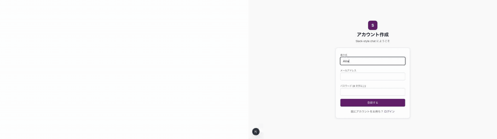
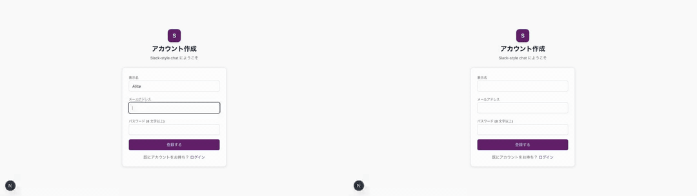
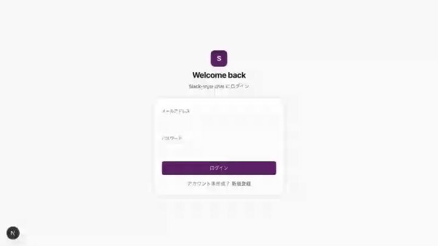
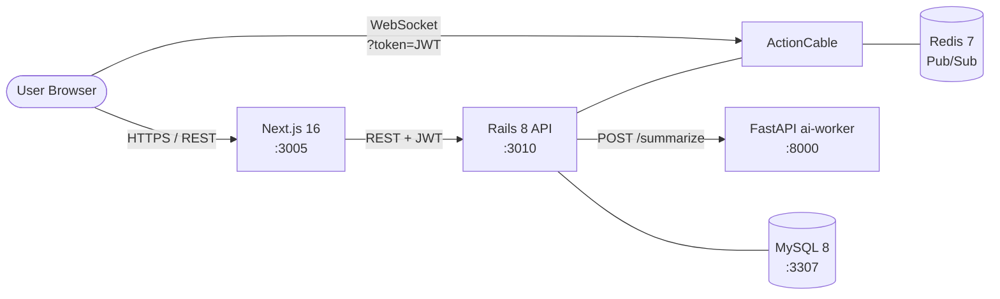

# Slack風 Realtime Chat

Slack のアーキテクチャを参考に、**「メッセージの fan-out」「既読 cursor の整合性」「Rails と Python (ai-worker) の責務境界」** という 3 つの技術課題をローカル環境で再現したプロジェクト。

機能網羅ではなく、Slack が解いている技術課題を **小さく動く形で再現する** ことを目的にしている。
学習対象から外れる絵文字ピッカー / ハドル / SSO 等は意図的に除外している（[リポジトリ方針のスコープ](../docs/service-architecture-lab-policy.md#scope)参照）。

---

## 見どころハイライト

- **[2 BrowserContext の双方向 fan-out を Playwright で E2E 検証](playwright/tests/realtime-fanout.spec.ts)** — ブラウザ A から送信したメッセージがブラウザ B に WebSocket 経由で到達することを実ブラウザ 2 つで保証。`broadcast` の id で dedup する規約も spec で固定 (ADR 0001)
- **既読 cursor の単調増加ガード + 多デバイス同期** — `last_read_message_id` は `MAX(current, incoming)` でしか進めない。古い id で再リクエストしても advance しないことを minitest で検証 (ADR 0002)
- **Rails ↔ ai-worker 境界** — Rails は認可と最新 30 件の取得まで、要約計算は FastAPI の ai-worker に切る。ai-worker 失敗時は **`502 Bad Gateway` で graceful degradation** ([../docs/operating-patterns.md](../docs/operating-patterns.md))
- **rodauth-rails + JWT のクロスオリジン認証** — REST も WebSocket もヘッダ / クエリパラメータの JWT で同じ `current_user` に解決 (ADR 0004)

---

## E2E デモ (Playwright で録画)

`cd slack/playwright && npm run capture` で再生成。仕組みは [docs/testing-strategy.md キャプチャ節](../docs/testing-strategy.md#キャプチャ-gif-を-readme-に埋め込む仕組み)。

| # | シナリオ | キャプチャ |
| --- | --- | --- |
| 01 | リアルタイム fan-out (Alice/Bob 2 ブラウザを hstack で並べた) |  |
| 02 | 既読 cursor (auto-mark-read で未読バッジが消える、2 BrowserContext hstack) |  |
| 04 | 認証フロー: signup |  |
| 04 | 認証フロー: signup → logout → login |  |
| 05 | 未認証で /channels → /login にリダイレクト |  |

> 03 (AI 要約) は ai-worker が必要なので capture 時 skip される。

---

## アーキテクチャ概要



詳細な構成図 / 配信シーケンス / 既読同期シーケンスは **[docs/architecture.md](docs/architecture.md)** を参照。

---

## 採用したスコープ

| 含める | 除外 |
| --- | --- |
| WebSocket によるリアルタイム配信 | ハドル（音声通話） / WebRTC |
| チャンネル / DM / メッセージ | 絵文字ピッカー / リッチテキスト |
| 既読管理（多デバイス同期） | スレッド機能の作り込み |
| 検索（最小） | エンタープライズ管理機能 |
| 通知（アプリ内のみ、1 経路） | メール / プッシュ / Webhook |
| メッセージ要約（モック AI） | Slackbot / アプリ統合 / SSO |

---

## 主要な設計判断 (ADR ハイライト)

| # | 判断 | 何を選んで何を捨てたか |
| --- | --- | --- |
| [0001](docs/adr/0001-realtime-delivery-method.md) | **WebSocket + Redis Pub/Sub (ActionCable)** | SSE / long-polling を退け fan-out のスケール特性を学ぶ。Redis 依存を引き受ける |
| [0002](docs/adr/0002-message-persistence-and-read-tracking.md) | **`memberships.last_read_message_id` の単調増加** | 既読カウンタではなく cursor で多デバイス同期。古い id で advance しないガードを model layer に置く |
| [0003](docs/adr/0003-database-choice.md) | **MySQL 8 (Slack 自身と整合)** | Postgres でなく MySQL。Vitess へのスケール経路を視野に入れた選択 |
| [0004](docs/adr/0004-authentication-strategy.md) | **rodauth-rails + JWT** | Devise + session でなく rodauth + token。WebSocket でも同じ JWT を使う |
| [0005](docs/adr/0005-browser-e2e-with-playwright.md) | **Playwright で 2 BrowserContext 並行 E2E** | minitest だけでは fan-out が保証できない。実ブラウザを 2 つ立てて検証する |
| [0006](docs/adr/0006-production-aws-architecture.md) | **本番想定は ECS + Aurora + ElastiCache** | ローカルは単純 docker-compose、本番設計は Terraform で別管理 |

---

## 動作確認 (Try it)

`docker compose up -d mysql redis` で起動した後、以下で API / WebSocket / 要約まで疎通できる。

```bash
# 1. ユーザを作って JWT を取得
TOKEN=$(curl -sS -X POST http://localhost:3010/create-account \
  -H "Content-Type: application/json" \
  -d '{"email":"alice@example.com","password":"password123","login":"alice"}' \
  | jq -r '.access_token')

# 2. 自分の情報を確認
curl -sS http://localhost:3010/me -H "Authorization: Bearer $TOKEN"

# 3. メッセージを投稿 (broadcast 経由で同チャンネル購読中の他 client にも届く)
curl -sS -X POST http://localhost:3010/channels/1/messages \
  -H "Authorization: Bearer $TOKEN" -H "Content-Type: application/json" \
  -d '{"body":"hello world"}'

# 4. 既読 cursor を進める (id=42 まで読んだ)
curl -sS -X POST http://localhost:3010/channels/1/read \
  -H "Authorization: Bearer $TOKEN" -H "Content-Type: application/json" \
  -d '{"message_id":42}'

# 5. ai-worker でチャンネル要約
curl -sS http://localhost:3010/channels/1/summary -H "Authorization: Bearer $TOKEN"
```

ブラウザで http://localhost:3005 を開けば 2 タブに分けて自分宛 fan-out も観察できる。

---

## テスト

| レイヤ | フレームワーク | 件数 / カバー範囲 |
| --- | --- | --- |
| 単体・統合 | Rails minitest | 9 件 (model / channel / connection / broadcast) |
| E2E | Playwright (chromium) | 6 件 (auth / fan-out / read-sync / summary) |
| ai-worker | — | import smoke / `/health` ping (CI で boot 検証) |

---

## ローカル起動

### 前提

- Docker / Docker Compose / Node.js 20+ / Ruby 3.3+ / Python 3.12+

### 起動

```bash
# 1. インフラ
docker compose up -d mysql redis            # 3307, 6379

# 2. backend
cd backend && bundle exec rails db:create db:migrate
bundle exec rails server -p 3010            # http://localhost:3010

# 3. ai-worker
cd ../ai-worker && source .venv/bin/activate
uvicorn main:app --port 8000

# 4. frontend
cd ../frontend && npm run dev               # http://localhost:3005

# 5. E2E (任意 / ai-worker 必須のテストを含む)
cd ../playwright && AI_WORKER_RUNNING=1 npm test
```

### ポート割り当て

| サービス | ポート | 備考 |
| --- | --- | --- |
| frontend (Next.js)  | 3005 | App Router / Tailwind v4 |
| backend (Rails)     | 3010 | API mode / rodauth-rails / ActionCable |
| ai-worker (FastAPI) | 8000 | mock summarize |
| MySQL               | 3307 | 他プロジェクトとの衝突回避で 3307 → 3306 |
| Redis               | 6379 | ActionCable Pub/Sub |

---

## ステータス

| コンポーネント | ステータス |
| --- | --- |
| インフラ (MySQL, Redis)    | 🟢 docker-compose で起動 |
| Backend (Rails 8)          | 🟢 認証 / REST / ActionCable / ai-worker 連携 / minitest 9 件 |
| Frontend (Next.js 16)      | 🟢 認証 / チャット / 既読 / 要約 UI / Tailwind v4 |
| ai-worker (FastAPI)        | 🟢 メッセージ要約 mock |
| E2E (Playwright)           | 🟢 chromium 6 件 (auth / fan-out / read-sync / summary) |
| インフラ設計図 (Terraform) | 🟢 `terraform validate` 通過 |
| CI (GitHub Actions)        | 🟢 slack-{backend, frontend, ai-worker, terraform} ジョブ |
| ADR                        | 🟢 0001-0006 全 Accepted |

---

## ドキュメント

- [アーキテクチャ図](docs/architecture.md) — Mermaid で全体構成 / 配信フロー / 既読同期 / ai-worker 境界
- [本番想定 Terraform](infra/terraform/) — AWS (ECS / Aurora / ElastiCache / CloudFront) 設計図（apply はしない）
- [ADR 一覧](docs/adr/) — 設計判断 6 件
- リポジトリ全体方針: [../CLAUDE.md](../CLAUDE.md)
- 共通ルール: [../docs/](../docs/) (api-style / coding-rules / operating-patterns / testing-strategy)
