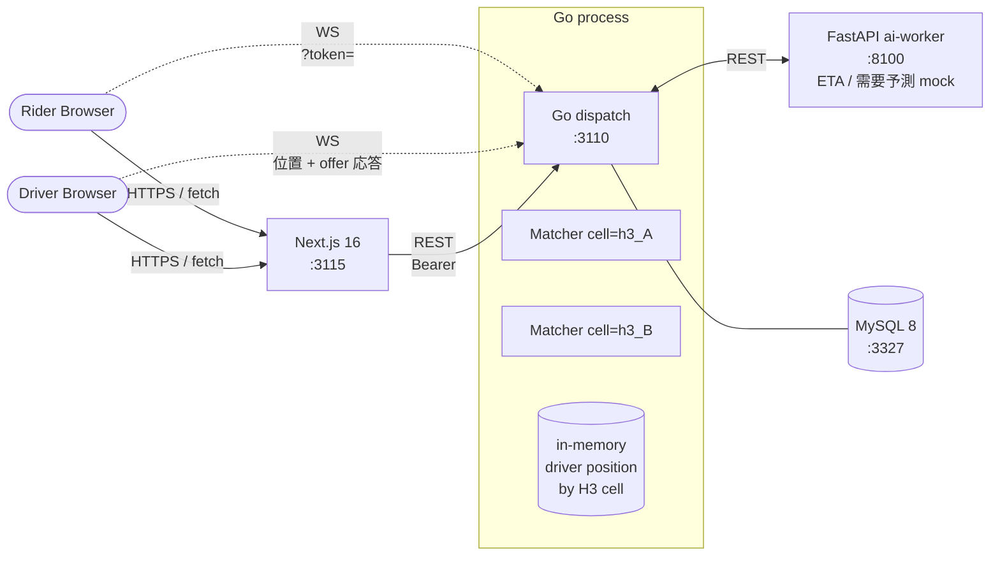

# Uber 風配車プラットフォーム (Go)

Uber のアーキテクチャを参考に、**「地理空間索引 + goroutine + channel での近傍ドライバ・マッチング + 二者間 trip state machine」** をローカル環境で再現するプロジェクト。

slack / youtube / github / perplexity / instagram / discord / reddit / shopify / zoom / calendly に続く 11 番目のプロジェクトとして、**バックエンドを Go で実装する 2 本目** ([リポジトリ方針「言語別バックエンド方針」](../README.md#言語別バックエンド方針))。discord (per-guild Hub による fan-out) と対比して **「Go の goroutine + channel で地理空間索引付き双方向マッチングをどう解くか」** を学習テーマに置く。

外部 SaaS / 地図 API / LLM は使用せず、座標 / マップタイルはダミー、ai-worker 側で deterministic な mock を実装することでローカル完結を保つ (リポ全体方針: [`../CLAUDE.md`](../CLAUDE.md))。

---

## 見どころハイライト

> 🟢 **Phase 4-2 完了 / backend + ai-worker MVP 動作**: trip REST (POST/GET/cancel) + driver WS gateway (go_online / position / accept / reject) + matcher 配線 + **ai-worker (ETA / 需要予測 mock) を同期境界で配線**。E2E 統合テスト (MySQL 実機) で **rider POST /trips → driver WS offer → accept → driver_accepted** の完全フローが通過、`POST /trips` は ai-worker から `eta_seconds` を取得 (落ちても degrade)。Phase 5 (frontend / Playwright / Terraform / CI 拡充) は残り。

- **H3 cell-index で近傍ドライバを O(1) 探索** — S2 / Geohash / MySQL Spatial Index を却下、H3 採用 ([ADR 0001](docs/adr/0001-geospatial-index-h3.md))
- **二者間 trip state machine** — `requested → matching → driver_accepted → arriving → arrived → in_trip → completed | canceled` の trip と `offline / idle / matched / en_route_pickup / on_trip` の driver を併走、`UPDATE ... WHERE status = ?` の compare-and-set でドライバ二重取得を防ぐ ([ADR 0002](docs/adr/0002-trip-dispatch-state-machine.md))
- **per-cell matcher goroutine + channel オファー** — H3 cell 単位の matcher goroutine が候補ドライバへ非同期 offer、driver は accept/reject を返す。discord の per-guild Hub と対比 ([ADR 0003](docs/adr/0003-matcher-goroutine-channel.md))
- **ai-worker 同期境界 + graceful degradation** — `POST /trips` で ai-worker `POST /eta` を同期 call し ETA を返す。ai-worker 不在/遅延/エラーは `eta=null` に degrade し配車は止めない。`X-Internal-Token` の trusted ingress、`internal/ai` に隔離 ([ADR 0004](docs/adr/0004-ai-worker-boundary-sync-eta.md))

---

## アーキテクチャ概要



詳細な ER / WS シーケンス / state machine / マッチング flow は **[docs/architecture.md](docs/architecture.md)** を参照。

---

## 採用したスコープ

| 含める | 除外 |
| --- | --- |
| Rider / Driver の登録・ログイン (HS256 JWT, 1 経路) | OAuth / SMS 認証 / 顔認証 |
| Trip の二者間 state machine (requested → ... → completed / canceled) | 相乗り (UberPool) / 事前予約 (Reserve) |
| H3 cell 単位の近傍ドライバ検索 + per-cell matcher goroutine | 複数都市 / shard 化 / 国跨ぎ → 派生 ADR |
| Driver 位置の WebSocket push (offline / idle / on_trip 状態だけ持つ) | 速度 / 進行方向 / heading angle / ナビ |
| 料金は距離 + 時間の固定式モック | 動的料金 (surge pricing) → 派生 ADR |
| ai-worker `/eta` `/demand-forecast` (mock) | 実 ML / 実マップタイル |
| マッチタイムアウト時の自動 cancel | リトライ・拡大検索 (拡大検索は派生 ADR で扱う) |
| **派生 ADR で扱う候補**: surge pricing / 拡大検索 / shard 化 / fraud detection / 評価ループ / 相乗り | (上記いずれも本 ADR 0001-0003 のスコープ外として明示) |

---

## 主要な設計判断 (ADR ハイライト)

| # | 判断 | 何を選んで何を捨てたか |
| --- | --- | --- |
| [0001](docs/adr/0001-geospatial-index-h3.md) | **H3 hexagonal cell index** (`uber/h3-go`) を in-memory `map[cell][]driverID` で持つ | Geohash (角度歪み + 8 隣接) / S2 (実装複雑) / MySQL Spatial (低頻度 read には合うが高頻度 update に弱い) を却下 |
| [0002](docs/adr/0002-trip-dispatch-state-machine.md) | **trip + driver の二者間 state machine** + `UPDATE drivers SET status='matched' WHERE id=? AND status='idle'` で compare-and-set | DB トランザクション + SELECT FOR UPDATE / 楽観ロック (version カラム) / Redis SETNX を却下 |
| [0003](docs/adr/0003-matcher-goroutine-channel.md) | **per-H3-cell matcher goroutine** が trip request を受け取り候補ドライバへ channel で offer | 単一 matcher goroutine / per-trip goroutine / DB polling / Redis stream を却下 |
| [0004](docs/adr/0004-ai-worker-boundary-sync-eta.md) | **ai-worker 境界** = `POST /trips` で `/eta` を同期 REST + `X-Internal-Token` + 失敗時 degrade | 後追い (WS/別 endpoint) / 完了時 fare のみ / キュー / gRPC を却下 |

---

## ポート割り当て

| サービス | ポート | 備考 |
| --- | --- | --- |
| frontend (Next.js)  | 3115 | calendly の 3105 から +10 |
| backend (Go)        | 3110 | calendly の 3100 から +10 |
| ai-worker (FastAPI) | 8100 | calendly の 8090 から +10 |
| MySQL               | 3327 | calendly の 3326 から +1 |

Redis は **不使用**。matcher は in-memory channel で十分 (ADR 0003)。

---

## 既存サービスとの関係

| 観点 | 比較対象 | uber が学ぶこと |
| --- | --- | --- |
| Go 並行性 | `discord` (per-guild Hub) | per-cell matcher / 地理空間で sharding する点が違う |
| 長寿命 state machine | `zoom` (1 actor / 会議) | 二者 (rider + driver) が同時に異なる遷移を起こす点が違う |
| 二者間 escrow 状 | `mercari` (候補) | "保留 → 確定" の構造は近いが、uber は **時間制約 + 競合取得** が主課題 |
| ローカル完結方針 | `perplexity` (RAG) | LLM API / 地図 API のような外部依存をモック化する手法を踏襲 |

---

## ローカル起動

> 🟢 Phase 4-2 完了 / backend + ai-worker MVP 動作: trip REST (POST/GET/cancel) + register/login/me + driver WS gateway + per-cell matcher 配線 + ai-worker (ETA / 需要予測 mock) 同期境界まで実装。
> frontend は未着手 (Phase 5)。

```sh
# 1. MySQL 起動 (host port 3327)
make uber-deps-up

# 2. migrations 適用 (schema_migrations 経由で冪等)
make uber-migrate

# 3. ai-worker 初期化 (初回のみ) + 起動 (:8100 / ETA・需要予測 mock)
cd uber/ai-worker && python3 -m venv .venv && .venv/bin/pip install -r requirements.txt && cd -
make uber-ai

# 4. backend 起動 (:3110 / REST + /ws + matcher)。ai-worker と繋ぐ場合は env を渡す:
#   AI_WORKER_URL=http://127.0.0.1:8100 AI_INTERNAL_TOKEN=dev-internal-token make uber-backend
make uber-backend

# 5. テスト (backend: go test -race / ai-worker: pytest)
make uber-test
```

backend は CGO ありの `uber/h3-go/v4` を利用する。docker 経由で `golang:1.24` image を使う場合は同 image に gcc が同梱されているのでそのまま `go build ./...` が通る。`AI_WORKER_URL` を渡さなければ ai-worker 非依存で動き、ETA は `null` に degrade する (ADR 0004)。`make uber-deps-up` は MySQL に加え ai-worker コンテナ (:8100) も起動する。

統合 / E2E テスト (`internal/api` / `internal/dispatch` / `internal/ws`) は MySQL 実機を要求し、環境変数 `UBER_TEST_DB` (例: `uber:uber@tcp(127.0.0.1:3327)/uber_test?parseTime=true`) が設定されているときだけ走る (未設定なら `t.Skip`)。CI (`uber-backend` ジョブ) では MySQL service を立てて `UBER_TEST_DB` を渡し、rider POST → WS offer → accept → driver_accepted の E2E + ETA 配線 (mock ai-worker 注入) まで毎回実行する。ai-worker 単体は `uber-ai-worker` ジョブで pytest。

## 構成 (Phase 4-2 時点)

```text
uber/
├── backend/                       # Go (chi / database/sql / gorilla/websocket / h3-go)
│   ├── go.mod / go.sum
│   ├── migrations/001_init.up.sql # users / drivers / trips / trip_events (ADR 0001/0002 に対応)
│   ├── cmd/
│   │   ├── dispatch/main.go        # サーバ起動 (chi + REST + /ws + matcher + ai-worker 配線 + graceful shutdown)
│   │   └── migrate/main.go         # schema_migrations を使った冪等な migrate runner
│   └── internal/
│       ├── config/                # env 読み込み (DATABASE_URL / JWT_SECRET / AI_WORKER_URL / AI_INTERNAL_TOKEN / H3_RESOLUTION)
│       ├── auth/                  # HS256 JWT 発行・検証 + bcrypt password (+ test)
│       ├── store/                 # Store{DB *sql.DB} + User/Driver/Trip/TripEvent CRUD
│       ├── geo/                   # H3 wrapper (Encode / KRing) + unit test
│       ├── dispatch/              # state machine + per-cell matcher goroutine + CellRegistry + StoreAcceptor + integration test
│       ├── ai/                    # ai-worker HTTP client (ETA / demand-forecast) + graceful degradation + unit test (ADR 0004)
│       ├── api/                   # REST handler (register/login/me / trips POST,GET,cancel / demand) + integration test
│       └── ws/                    # driver WS gateway (go_online / position / accept / reject) + Service + e2e integration test
└── ai-worker/                     # FastAPI (deterministic mock)
    ├── main.py                    # /health / POST /eta (haversine) / POST /demand-forecast (cell ハッシュ) + X-Internal-Token
    ├── requirements.txt / pytest.ini
    └── tests/                     # health / internal-token / eta / demand-forecast (pytest 12 件)
```

frontend / playwright / infra/terraform は引き続き `.gitkeep`。Phase 5 で実装する。

---

## 残タスク (Phase 4-2 完了時点)

- **Phase 5**: `frontend/` (Next.js rider + driver) / `playwright/` (E2E) / `infra/terraform/`
- CI は `uber-backend` (Go build + `go test -race` + MySQL service + `/healthz` smoke) と `uber-ai-worker` (pytest) を追加済み。frontend / playwright / terraform ジョブは Phase 5 で追加する。

### 初期化コマンド (Phase 5 着手時に実行)

<!-- 初期化が終わったら該当行を削除する -->

- `cd uber/frontend && npx create-next-app@latest . --typescript --tailwind --app --eslint --no-src-dir --import-alias '@/*'`
- `cd uber/playwright && npm init -y && npm install -D @playwright/test`

---

## ドキュメント

- [docs/architecture.md](docs/architecture.md) — システム図・ER・状態機械・主要フロー・ai-worker 境界
- [docs/adr/0001-geospatial-index-h3.md](docs/adr/0001-geospatial-index-h3.md)
- [docs/adr/0002-trip-dispatch-state-machine.md](docs/adr/0002-trip-dispatch-state-machine.md)
- [docs/adr/0003-matcher-goroutine-channel.md](docs/adr/0003-matcher-goroutine-channel.md)
- [docs/adr/0004-ai-worker-boundary-sync-eta.md](docs/adr/0004-ai-worker-boundary-sync-eta.md)
