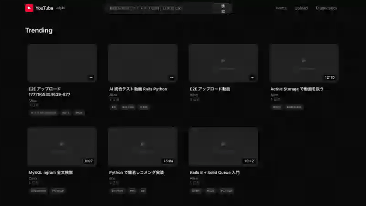
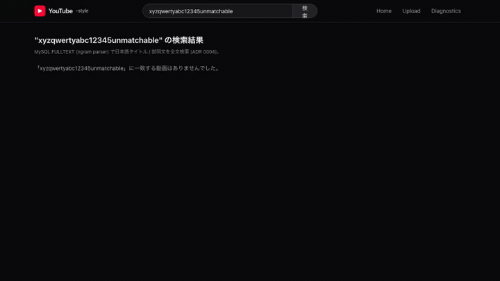
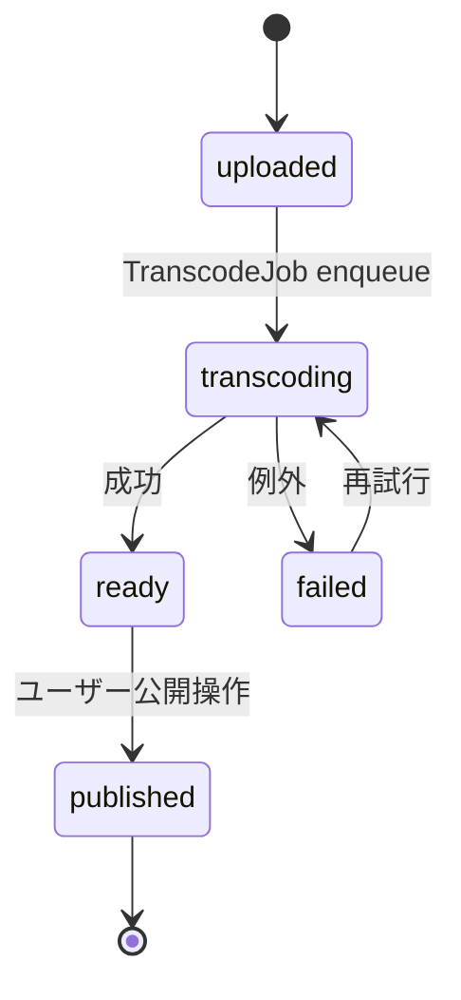

# YouTube風 Video Platform

YouTube のアーキテクチャを参考に、**「アップロード状態機械」「DB-driven 非同期ワーカー」「Rails と Python (ai-worker) の責務境界」「FULLTEXT 検索」** の 4 つを軸に置いたプロジェクト。

実コーデックや LLM は呼ばず、**状態遷移とパイプラインの設計** に集中して再現する。
slack で扱った WebSocket fan-out とは別軸の技術課題（**非同期 + 状態機械 + 検索**）にフォーカスし、本リポジトリ内で **Redis を使わない構成** (Solid Queue) を試す場でもある。

---

## 見どころハイライト

- **アップロード状態機械** `uploaded → transcoding → ready → published` を **モデルメソッド + Solid Queue** で原子的に駆動。`enqueue_after_transaction_commit` で「DB rollback 後にジョブだけ走る」事故を防ぐ ([ADR 0001](docs/adr/0001-upload-pipeline-state-machine.md))
- **Redis 不使用の構成** — Solid Queue / Solid Cache / Solid Cable で **MySQL に集約**。slack の Sidekiq+Redis と対比できるよう意図的に別スタック ([ADR 0001](docs/adr/0001-upload-pipeline-state-machine.md))
- **MySQL FULLTEXT (ngram parser) で日本語検索** — 別レイヤー (Elasticsearch) を導入せず、まずは MySQL で MVP。ngram の閾値 (`ft_min_word_len`) と LIKE フォールバックの境界を spec で確認 ([ADR 0004](docs/adr/0004-database-and-search-strategy.md))
- **ai-worker が 3 種類の責務を持つ** — `recommend` (関連動画スコアリング) / `tags` (タイトル + 説明からタグ抽出) / `thumbnail` (Pillow で grayscale 縮小) を Rails の Job からチェーンして呼ぶ ([ADR 0003](docs/adr/0003-recommendation-boundary.md))

---

## E2E デモ (Playwright で録画)

`cd youtube/playwright && npm run capture` で再生成。仕組みは [docs/testing-strategy.md キャプチャ節](../docs/testing-strategy.md#キャプチャ-gif-を-readme-に埋め込む仕組み)。

| # | シナリオ | キャプチャ |
| --- | --- | --- |
| 01 | home page lists videos and detail page renders |  |
| 03 | search page returns results from MySQL ngram FULLTEXT |  |
| 04 | search page is empty for non-matching keyword |  |

> 02 (upload state machine) は Solid Queue worker (`bundle exec bin/jobs`) と `JOBS_RUNNING=1` env 必要、capture 時は skip される。

---

## アーキテクチャ概要

```mermaid
flowchart LR
  user([User Browser])
  user -->|HTTPS / SSR| front[Next.js 16<br/>:3015]
  front -->|REST| api[Rails 8 API<br/>:3020]
  api -->|Solid Queue<br/>(MySQL queue DB)| jobs[Background Jobs]
  jobs -->|状態遷移| api
  api <-->|REST| ai[FastAPI ai-worker<br/>:8010]
  api --- mysql[(MySQL 8<br/>:3308<br/>development / queue / cache)]
  api -->|Active Storage local| storage[(./storage)]
```

### アップロード状態機械



詳細は **[docs/architecture.md](docs/architecture.md)** を参照。

---

## 採用したスコープ

| 含める | 除外 |
| --- | --- |
| 動画メタデータ管理 + 状態機械 | 実コーデックでの動画変換 |
| コメント (ネスト 1 段まで) | ライブ配信 / WebRTC |
| 検索 (FULLTEXT 最小) | 収益化 / 広告挿入 |
| 関連動画レコメンド (モック) | 視聴履歴ベースのパーソナライズ |
| サムネ生成 (Pillow モック) | エンコーダ設定の作り込み |

---

## 主要な設計判断 (ADR ハイライト)

| # | 判断 | 何を選んで何を捨てたか |
| --- | --- | --- |
| [0001](docs/adr/0001-upload-pipeline-state-machine.md) | **Solid Queue で `videos.status` ENUM を駆動** | Sidekiq+Redis を退け、状態遷移とジョブ enqueue を **同一 MySQL トランザクション**に乗せる |
| [0002](docs/adr/0002-storage-design-and-mock-strategy.md) | **Active Storage local + 本番想定 S3** | コーデックは扱わず、ファイル配置の I/F だけ実装。本番は Terraform 上で S3 + CloudFront |
| [0003](docs/adr/0003-recommendation-boundary.md) | **レコメンド計算は ai-worker、永続化は Rails** | slack の要約と同じパターンを別ドメインで再現。Rails は候補集合の取得まで、スコアリングは ai-worker |
| [0004](docs/adr/0004-database-and-search-strategy.md) | **MySQL FULLTEXT (ngram parser)** | Elasticsearch を退け、日本語検索を MySQL で MVP。スケール時の差し替え経路を ADR で言及 |
| [0005](docs/adr/0005-no-api-versioning.md) | **API バージョニングはやらない** | 学習スコープを拡げない判断。本番化時に再検討 |
| [0006](docs/adr/0006-production-aws-architecture.md) | **本番想定は ECS + Aurora + S3 + SQS** | Solid Queue (ローカル) → SQS (本番設計) の差し替えを Terraform で示す |

---

## 動作確認 (Try it)

`docker compose up -d mysql` の後、bin/jobs と Rails / ai-worker / frontend を立ち上げる。

```bash
# 動画一覧 (SSR / 一覧 API は public)
curl -sS http://localhost:3020/videos | jq '.items | .[] | {id, title, status}'

# 動画詳細
curl -sS http://localhost:3020/videos/1 | jq '{title, status, tags, thumbnail_url}'

# 検索 (ngram FULLTEXT — 日本語も拾う)
curl -sS 'http://localhost:3020/videos?q=Rails' | jq '.items | length'

# アップロード状態機械の遷移を観察
#   1. POST /uploads でファイルを送ると status=uploaded で record 作成
#   2. Solid Queue worker (bin/jobs) が TranscodeJob を実行 → transcoding
#   3. 成功で ready、ai-worker でタグ抽出 + サムネ生成チェイン
#   4. ユーザが publish 操作 → published
curl -sS http://localhost:3020/videos/1/processing | jq '{status, progress}'

# ai-worker レコメンド (Rails が候補を渡し、ai-worker がスコア順に返す)
curl -sS http://localhost:3020/videos/1/recommendations | jq '.items[]'
```

ブラウザで http://localhost:3015 を開くと、SSR でレンダリングされた一覧 + アップロード UI + ステータス polling が確認できる。

---

## テスト

| レイヤ | フレームワーク | 件数 / カバー範囲 |
| --- | --- | --- |
| 単体・統合 | RSpec + FactoryBot + WebMock | 55 件 (model 状態機械 / Solid Queue / ai-worker mock / FULLTEXT 検索) |
| E2E | Playwright (chromium) | 4 件 (browse / search × 2 / upload state machine) |
| ai-worker | — | import smoke + `/health` boot smoke (CI) |

---

## ローカル起動

### 前提

- Docker / Docker Compose / Node.js 20+ / Ruby 3.3+ / Python 3.12+

### 起動

```bash
# 1. インフラ
docker compose up -d mysql                  # 3308

# 2. backend
cd backend && bundle install
bundle exec rails db:prepare
bundle exec rails server -p 3020

# 2b. Solid Queue worker (アップロード遷移を進めるために必須)
bundle exec bin/jobs

# 3. ai-worker
cd ../ai-worker
python3 -m venv .venv && source .venv/bin/activate
pip install -r requirements.txt
uvicorn main:app --port 8010

# 4. frontend
cd ../frontend && npm install
npm run dev                                 # http://localhost:3015

# 5. E2E (任意)
cd ../playwright && npm test
```

### ポート割り当て

| サービス | ポート | 備考 |
| --- | --- | --- |
| frontend (Next.js)  | 3015 | App Router (SSR) |
| backend (Rails)     | 3020 | API mode + Solid Queue + Active Storage |
| ai-worker (FastAPI) | 8010 | recommend / tags / thumbnail (mock) |
| MySQL               | 3308 | development / `_queue` / `_cache` の 3 DB を切る |

---

## ステータス

| コンポーネント | ステータス |
| --- | --- |
| インフラ (MySQL)           | 🟢 db:prepare 通過 |
| Backend (Rails 8)          | 🟢 状態機械 + Solid Queue + Active Storage + ai-worker 統合 + コメント + 検索 (RSpec 55 件) |
| Frontend (Next.js 16)      | 🟢 一覧 / 詳細 / アップロード / 状態 polling / 検索 / コメント UI |
| Solid Queue worker         | 🟢 `bin/jobs` が Transcode → ExtractTags → GenerateThumbnail を駆動 |
| ai-worker (FastAPI)        | 🟢 recommend / tags / thumbnail mock |
| 検索                       | 🟢 MySQL FULLTEXT (ngram) で日本語可 |
| E2E (Playwright)           | 🟢 chromium 4 件 (browse / search × 2 / upload) |
| インフラ設計図 (Terraform) | 🟢 ECS / Aurora / S3 / CloudFront / SQS で `terraform validate` 通過 |
| CI (GitHub Actions)        | 🟢 youtube-{backend, frontend, ai-worker, terraform} ジョブ |
| ADR                        | 🟢 0001-0006 全 Accepted |

---

## ドキュメント

- [アーキテクチャ図](docs/architecture.md) — システム構成 / 状態機械 / レコメンド境界の Mermaid 図
- [本番想定 Terraform](infra/terraform/) — ECS / Aurora / S3 / CloudFront / SQS（apply はしない）
- [ADR 一覧](docs/adr/) — 設計判断 6 件
- リポジトリ全体方針: [../CLAUDE.md](../CLAUDE.md)
- 共通ルール: [../docs/](../docs/) (api-style / coding-rules / operating-patterns / testing-strategy)

---

## Phase ロードマップ

| Phase | 範囲 | 成果物 |
| --- | --- | --- |
| 1 | 雛形 + 各サービス疎通 | ✅ 完了 |
| 2 | 動画メタデータ CRUD + 一覧/詳細 UI | ✅ 完了 |
| 3 | アップロード + 状態機械 + Solid Queue | ✅ 完了 |
| 4 | ai-worker 統合 (recommend / tags / thumbnail) | ✅ 完了 |
| 5 | コメント + 検索 + Playwright E2E + Terraform + CI | ✅ MVP 完成 |
