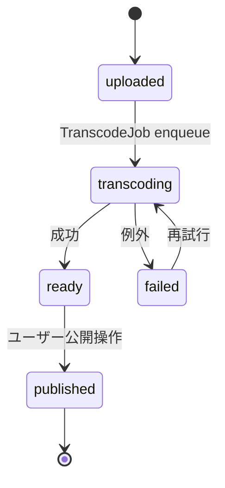
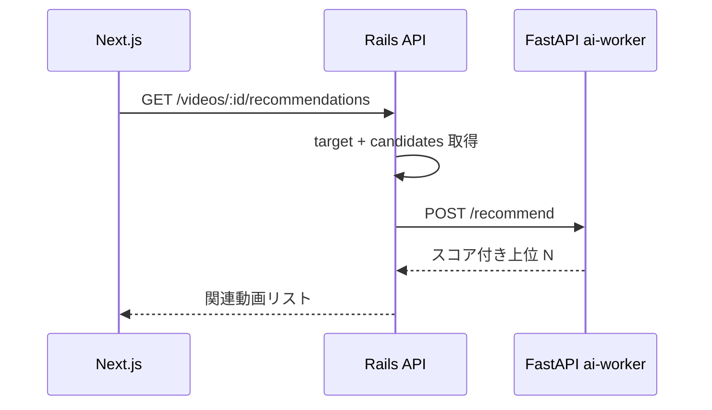

# YouTube 風 Video Platform アーキテクチャ

YouTube のアーキテクチャを参考に、**動画変換パイプラインの状態機械** と **レコメンドの責務分離** をローカル環境で再現する学習プロジェクト。

---

## システム構成

```mermaid
flowchart LR
  user([User Browser])
  user -->|HTTP| front[Next.js<br/>:3015]
  front -->|REST<br/>/videos, /health, ...| backend[Rails 8 API<br/>:3020]
  backend -->|Solid Queue<br/>(MySQL queue DB)| jobs[Background Jobs]
  jobs -->|状態遷移| backend
  backend <-->|HTTP| ai[FastAPI ai-worker<br/>:8010]
  backend --- mysql[(MySQL 8<br/>:3308)]
  backend -->|Active Storage<br/>local disk| storage[(./storage)]
```

- 外部依存は **MySQL のみ**。Redis は使わない (ADR 0001 / 0002)
- バックグラウンドジョブは **Solid Queue** が同じ MySQL 上の専用 DB (`youtube_development_queue`) を使う
- 動画ファイル本体は Active Storage の `:local` サービスでローカルディスクに置く（本番想定は S3）

## アップロード状態機械（Phase 3 で実装予定）



- 状態は `videos.status` カラムで永続化
- 状態遷移は **必ずトランザクション + Solid Queue enqueue を同一 commit に乗せる** (ADR 0001 が掲げる "DB-only" の旨味)
- 進捗通知は **SSE** で frontend に push (ADR 別建て予定)

## レコメンド境界（Phase 4 で実装予定）



- レコメンド計算は ai-worker、永続化と境界制御は Rails (ADR 0003 予定)

---

## 起動順序

```bash
# 1. インフラ
docker compose up -d mysql        # 3308

# 2. backend
cd backend && bundle exec rails db:prepare
bundle exec rails server -p 3020

# 3. ai-worker
cd ../ai-worker && source .venv/bin/activate
uvicorn main:app --port 8010

# 4. frontend
cd ../frontend && npm run dev      # http://localhost:3015
```

## ポート割り当て

| サービス | ポート | 備考 |
| --- | --- | --- |
| frontend (Next.js) | 3015 | Slack の 3005 から +10 |
| backend (Rails API) | 3020 | Slack の 3010 から +10 |
| ai-worker (FastAPI) | 8010 | Slack の 8000 から +10 |
| MySQL | 3308 | Slack の 3307 から +1 |
