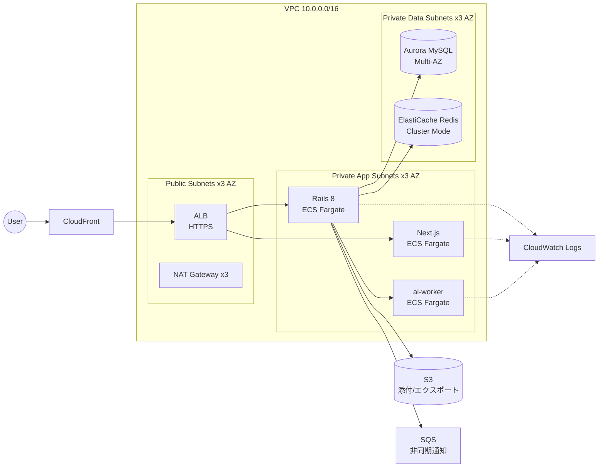

# youtube / infra / terraform

> **設計図用途**：このコードは `terraform apply` する想定ではない（CLAUDE.md 参照）。  
> 「本番化するなら AWS 上でどう組むか」を Terraform として読み取れる形で残すことが目的。

## 全体像



## ファイル構成

| ファイル | 内容 |
| --- | --- |
| `versions.tf` | Terraform / provider バージョン固定、backend 設定（コメントアウト） |
| `variables.tf` | 入力変数（リージョン・AZ・コンテナイメージ・ドメイン等） |
| `outputs.tf` | ALB DNS / RDS endpoint 等の出力 |
| `network.tf` | VPC + 3-AZ public/private subnets + NAT |
| `security_groups.tf` | ALB / ECS / RDS 用 SG (Redis なし / ADR 0001) |
| `alb.tf` | ALB + Listener + Target Groups（path 振り分け） |
| `ecs.tf` | ECS Cluster + 3 Service (frontend / backend / ai-worker) |
| `rds.tf` | Aurora MySQL クラスタ（ADR 0004）|
| `s3.tf` | 動画原本 / サムネイル用バケット |
| `sqs.tf` | 本番想定の変換キュー (ADR 0001 で Solid Queue → SQS の差し替えポイント) |
| `cloudfront.tf` | CDN（静的アセット + ALB オリジン） |
| `iam.tf` | ECS task / execution roles |
| `cloudwatch.tf` | Log groups + 主要アラーム |
| `secrets.tf` | DB password, JWT secret 等の Secrets Manager |

## 設計判断

- ADR 0001: 開発は Solid Queue (Redis 不要) / 本番想定では SQS に差し替え可能 (`sqs.tf`)
- ADR 0002: ストレージは S3 + CloudFront (本番想定。開発は Active Storage local)
- ADR 0004: Aurora MySQL 採用、検索は FULLTEXT ngram

## 想定コスト感（東京リージョン）

| 区分 | 月額目安 |
| --- | --- |
| ALB | ~25 USD |
| NAT Gateway × 3 | ~150 USD（HA、削れる） |
| ECS Fargate (3 サービス × 2 task × 0.5 vCPU/1 GB) | ~120 USD |
| Aurora MySQL (db.t3.medium × 2 + Storage) | ~150 USD |
| ElastiCache Redis (cache.t3.micro × 2) | ~30 USD |
| S3 / CloudFront / SQS / CloudWatch | ~20 USD |
| **合計** | **~500 USD/月** |

「本番化するならこの規模感」を読者に伝えるための数字。実際は適用しない。

## 実行しないが確認したい場合

```bash
cd youtube/infra/terraform
terraform init -backend=false
terraform validate
terraform fmt -check
```
