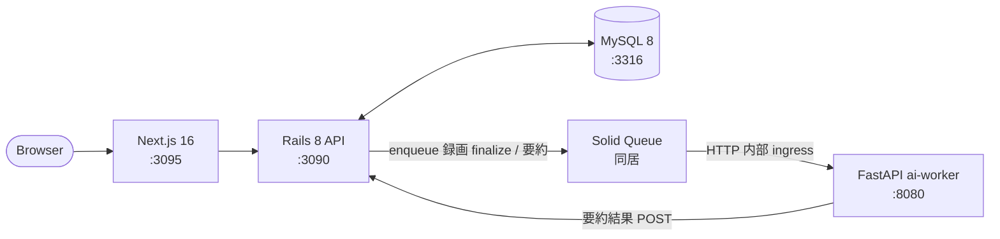

# Zoom 風オンライン会議プラットフォーム (Rails 8 + Next.js 16 + FastAPI)

[Zoom](https://zoom.us/) を参考に、**「会議ライフサイクル状態機械 + ホスト/参加権限 + 録画→要約パイプライン」** をローカル環境で再現するプロジェクト。

WebRTC SFU は本リポのスコープ外（policy で「WebRTC は別領域」として除外）のため、メディア配信そのものはモック扱いとし、**会議の状態管理 / 権限 / 非同期パイプライン** に学習を集中させる。外部 SaaS / LLM は使用せず、ai-worker 側で deterministic な mock を実装することでローカル完結を保つ（リポ全体方針: [`../CLAUDE.md`](../CLAUDE.md)）。

---

## 見どころハイライト

> 🔴 **設計フェーズ**: ADR 起こし中

<!-- 実装が進んだら箇条書きで主要設計を列挙（例: 会議 state machine の遷移制約、ホスト譲渡の DB ロック戦略、録画→要約の at-least-once 配信 等） -->

---

## アーキテクチャ概要



> 凡例: 実線 = HTTP、二重線 = DB 接続。WebRTC のメディアパスは存在しない（SFU はモック）。

---

## 計画している ADR (最低 3 本)

policy の「ADR 最低3本」要件に対し、以下 3 本を予定。詳細は `docs/adr/` 配下に追加予定。

- **ADR 0001: 会議ライフサイクルを state machine + 状態列で表現する**
  - `scheduled / waiting_room / live / ended / recorded / summarized` の状態遷移を Rails 側で `aasm` あるいは生 case 文 + `with_lock` で管理する選択。youtube ADR との対比（あちらはアップロードジョブ単位、こちらは会議という長寿命リソース単位）。
- **ADR 0002: ホスト / 共同ホスト / 参加者の権限モデル**
  - リソース所有者 (host) + 動的に付与可能な共同ホスト (co-host) + ウェイティングルーム入室許可。github の `PermissionResolver` 2 層構造との比較で、**動的権限付与（譲渡 / 委任）が中心** という違いを ADR に残す。
- **ADR 0003: 会議終了 → 録画 finalize → ai-worker 要約 の at-least-once パイプライン**
  - shopify の webhook ADR と同形（Solid Queue + idempotency key）だが、**外向きではなく内部 ingress 越しに ai-worker を呼ぶ** 点と **会議 1 件あたり 1 サマリ** の冪等保証が論点。

---

## ローカル起動

```sh
# TODO: 実装フェーズで以下を整備する
# docker compose up -d mysql        # mysql:3316 起動
# make zoom-backend                 # Rails API :3090
# make zoom-frontend                # Next.js :3095 (別タブ)
# make zoom-ai                      # FastAPI :8080 (別タブ)
```

ポート割り当て:

| 役割 | host port | container port |
| --- | --- | --- |
| MySQL 8 | 3316 | 3306 |
| Rails backend | 3090 | 3000 |
| Next.js frontend | 3095 | 3000 |
| FastAPI ai-worker | 8080 | 8000 |

---

## 初期化コマンド（プロジェクト初期化時に実行）

<!-- 各コンポーネント初期化が完了したらこの節を削除する -->

- backend (Rails 8 API): `cd backend && rails new . --api --database=mysql --skip-test --skip-bundle`（テストは RSpec 採用予定なら別途）
- frontend (Next.js 16): `cd frontend && npx create-next-app@latest . --typescript --tailwind --app --src-dir --no-eslint=false`
- ai-worker (FastAPI): `cd ai-worker && python -m venv .venv && .venv/bin/pip install fastapi uvicorn[standard] httpx pytest`

> いずれも policy 上「外部 SaaS は使わない」。LLM 要約は ai-worker 内部で **固定文字列 + 入力ハッシュベースの deterministic mock** を返す実装にする。

---

## 既存サービスとの関係

| 観点 | 比較対象 | zoom が学ぶこと |
| --- | --- | --- |
| 状態機械 | youtube (動画変換 state machine) | 「ジョブ寿命」ではなく「会議という長寿命エンティティ」の状態遷移 |
| 権限グラフ | github (Org/Team/Collaborator 継承) | **動的権限付与（共同ホスト譲渡）** が加わる |
| 非同期パイプライン | shopify (Solid Queue webhook 配信) | 内部 ingress (ai-worker) 向けの at-least-once + 1サマリ冪等 |
| WebSocket fan-out | slack / discord | **本プロジェクトでは扱わない**（参加者通知は polling か Server-Sent Events のいずれか、ADR で確定） |
