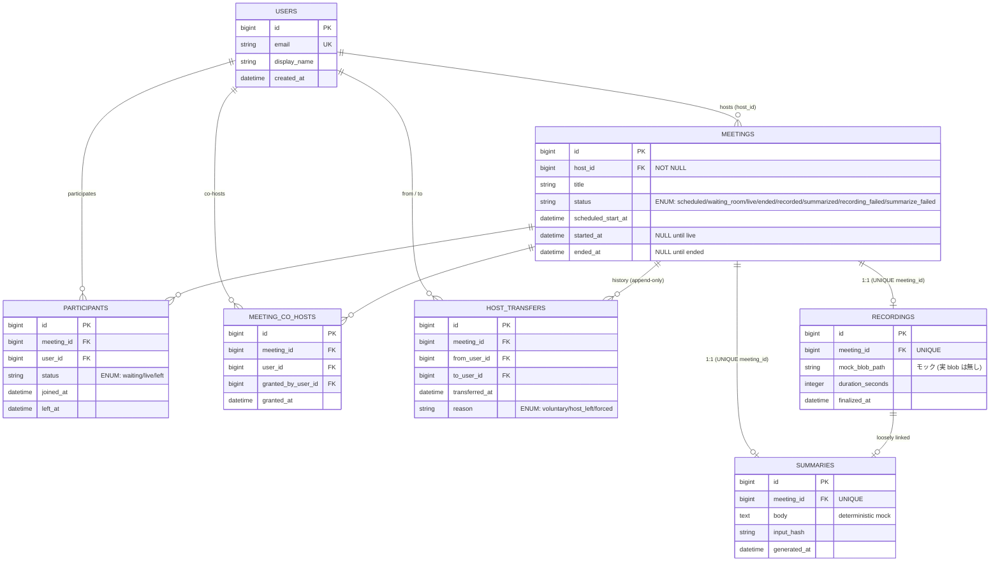

# zoom アーキテクチャ

> 🟡 **Phase 1 設計フェーズ**: ADR 3 本確定済（[`adr/`](adr/)）。本書は ADR の内容をデータモデル / 主要フロー視点で具現化したもの。実装に着手したら「ローカル運用」節を埋める。

---

## ドメイン境界

```
┌─────────────────────────────┐
│ Browser (Next.js 16)        │  ホスト UI / 参加者 UI
└──────────┬──────────────────┘
           │ REST + JSON
┌──────────▼──────────────────┐
│ Rails 8 API (:3090)         │
│  ├ Meetings (state machine) │  ← ADR 0001
│  ├ Permissions (Resolver)   │  ← ADR 0002
│  └ Pipeline (Solid Queue)   │  ← ADR 0003
└──────────┬───────┬──────────┘
           │       │ 内部 ingress (Bearer)
           │       │ httpx
   MySQL 8 │       └──→ FastAPI ai-worker (:8080)
   :3316   │              └ /summarize  (deterministic mock)
           │
   meetings / participants / co_hosts /
   host_transfers / recordings / summaries /
   solid_queue_*
```

**責務分離:**

- **Rails (backend)**: 状態遷移 / 権限判定 / 履歴記録 / ジョブ駆動（state machine + DB トランザクション + Solid Queue）
- **ai-worker**: 要約モック（stateless、結果は入力ハッシュベースで deterministic）
- **frontend**: ホスト操作 UI / 参加者リスト / waiting room 入室許可 UI / 要約結果表示

**スコープ外（policy 準拠）:**

- WebRTC SFU / メディア配信 — 「会議に入っている」状態は DB 上の `participants.status = 'live'` だけで表現、音声・映像は流さない
- 認証の網羅 — rodauth-rails で email + password 1 経路のみ
- 通知（メール / プッシュ） — 会議終了通知は要約の DB 更新のみで完結、外部チャネルは持たない

---

## データモデル

### ER 図



### 主要テーブル設計の肝

| テーブル | 制約の肝 | 由来 |
| --- | --- | --- |
| `meetings.host_id` | `NOT NULL` で「最大 1 ホスト」を物理保証 | ADR 0002 |
| `meetings.status` | ENUM、遷移はモデルメソッドのみ、`with_lock` 必須 | ADR 0001 |
| `meeting_co_hosts` | `UNIQUE(meeting_id, user_id)` | ADR 0002 |
| `host_transfers` | append-only（UPDATE / DELETE しない、spec で fixate） | ADR 0002 |
| `recordings.meeting_id` | `UNIQUE` で「会議 1 件 = 録画 1 件」 | ADR 0003 |
| `summaries.meeting_id` | `UNIQUE` で「会議 1 件 = 要約 1 件」（at-least-once 冪等の核） | ADR 0003 |
| Solid Queue 一式 | 同一 MySQL に同居（`enqueue_after_transaction_commit = true`） | ADR 0001 / 0003 |

### 状態 ENUM の取りうる値

```
scheduled
  └─→ waiting_room  (host が会議室を open)
        └─→ live    (host が「開始」または最初の参加者入室を許可)
              └─→ ended (host が「終了」または最後の参加者退出)
                    ├─→ recorded         (FinalizeRecordingJob 成功)
                    │     └─→ summarized (SummarizeMeetingJob 成功)
                    │     └─→ summarize_failed (リトライ上限超過 → 再開可能)
                    └─→ recording_failed (FinalizeRecordingJob 失敗 → 再開可能)
```

戻り遷移: `recording_failed → recorded` / `summarize_failed → summarized` はジョブ再実行で吸収（履歴上は status カラムが進むだけ）。

---

## 主要フロー

### フロー 1: 会議開始 → 参加 → 終了（ハッピーパス）

```
host                                    rails                              participant
 │  POST /meetings (title, sched_at)    │
 │ ───────────────────────────────────→ │ INSERT meetings (status=scheduled)
 │ ←─ 201 (meeting_id)                  │
 │                                      │
 │  POST /meetings/:id/open             │
 │ ───────────────────────────────────→ │ meeting.with_lock { open_waiting_room! }
 │                                      │ status: scheduled → waiting_room
 │                                      │
 │                                      │   POST /meetings/:id/join
 │                                      │ ←─────────────────────────────────────│
 │                                      │ INSERT participants (status=waiting)
 │                                      │ ─→ 202 (待機中)
 │  GET /meetings/:id/waiting_room      │
 │ ───────────────────────────────────→ │
 │ ←─ [{user_id, name}, ...]            │
 │                                      │
 │  POST /meetings/:id/admit            │
 │  { user_id }                         │
 │ ───────────────────────────────────→ │ permission_resolver.can_admit? (host or co_host)
 │                                      │ participant.update(status: 'live')
 │                                      │ meeting.with_lock { go_live! if first }
 │                                      │
 │  POST /meetings/:id/end              │
 │ ───────────────────────────────────→ │ meeting.with_lock { end! }
 │                                      │ status: live → ended
 │                                      │ enqueue FinalizeRecordingJob (after_commit)
 │                                      │
 │                                      │ [Solid Queue worker]
 │                                      │ ┌──────────────────────────────────────┐
 │                                      │ │ FinalizeRecordingJob                 │
 │                                      │ │  recordings.upsert(meeting_id)       │
 │                                      │ │  meeting.mark_recorded! (lock)       │
 │                                      │ │  enqueue SummarizeMeetingJob         │
 │                                      │ └──────────────────────────────────────┘
 │                                      │ ┌──────────────────────────────────────┐
 │                                      │ │ SummarizeMeetingJob                  │
 │                                      │ │  POST ai-worker:8080/summarize       │
 │                                      │ │  summaries.upsert(meeting_id)        │
 │                                      │ │  meeting.mark_summarized! (lock)     │
 │                                      │ └──────────────────────────────────────┘
 │  GET /meetings/:id/summary           │
 │ ───────────────────────────────────→ │
 │ ←─ {body: "..."}                     │
```

### フロー 2: ホスト譲渡（live 中、ADR 0002 の主役）

```
host A                                  rails                              user B (co_host)
 │  POST /meetings/:id/transfer_host    │
 │  { to_user_id: B }                   │
 │ ───────────────────────────────────→ │ meeting.with_lock {
 │                                      │   raise unless B is current participant
 │                                      │   prev_host_id = meeting.host_id  # = A
 │                                      │   meeting.update!(host_id: B)
 │                                      │   host_transfers.insert!(
 │                                      │     from: A, to: B, reason: 'voluntary'
 │                                      │   )
 │                                      │ }
 │ ←─ 200 (new_host_id: B)              │
 │                                      │
 │  以後、A は普通の participant、       │
 │  B が host                           │
```

### フロー 3: 並行 end!（ホストが「終了」と同時に最後の参加者が退出 → 自動 ended）

```
thread 1 (host clicks "終了")    thread 2 (last participant leaves)
        │                                │
        │ meeting.with_lock {            │
        │   end!                         │ meeting.with_lock { ... }   ← BLOCKED
        │ }                              │
        │ status: live → ended ✓         │
        │                                │
                                          │ unblocked: status は既に 'ended'
                                          │ → end! は no-op (transition guard)
                                          │ → 例外を出さず冪等に終了
```

`with_lock` が直列化、内部で「現在 status が遷移可能か」チェック → 既に ended なら no-op で抜ける。`InvalidTransition` を **投げない** のが肝（投げると thread 2 がエラーログを出して紛らわしい）。

### フロー 4: 要約失敗 → ホスト操作で再開

```
host                                    rails                              ai-worker
 │                                      │ SummarizeMeetingJob (5 retry 失敗)
 │                                      │ meeting.mark_summarize_failed!
 │  GET /meetings/:id                   │
 │ ←─ {status: 'summarize_failed'}      │
 │                                      │
 │  POST /meetings/:id/retry_summary    │
 │ ───────────────────────────────────→ │ permission_resolver.can_retry? (host)
 │                                      │ enqueue SummarizeMeetingJob
 │                                      │ (status はまだ summarize_failed)
 │                                      │ ─────────→ POST /summarize
 │                                      │ ←─────────  200
 │                                      │ summaries.upsert (UNIQUE で冪等)
 │                                      │ meeting.mark_summarized!
```

---

## 失敗時の挙動

| 失敗ケース | 起きること | 復旧経路 |
| --- | --- | --- |
| live 中に DB 障害（一時的） | リトライ可能なエラー、status は据え置き | 自動回復（次回操作で続行） |
| `FinalizeRecordingJob` 失敗（モック blob 書き込み失敗） | Solid Queue retry → 上限超過で `recording_failed` | ホストが「録画再生成」操作で再 enqueue |
| `SummarizeMeetingJob` 失敗（ai-worker タイムアウト） | Solid Queue retry → 上限超過で `summarize_failed` | ホストが「要約再生成」操作で再 enqueue |
| ホスト譲渡レース（B が同時に退出） | `with_lock` 内で B が participant でないため `InvalidTransfer` 例外 | A に「対象が退出済み」エラーを返し、別人選択を促す |
| 並行 `end!` | `with_lock` で直列化、後勝ちは no-op | 冪等、エラー無し |
| 並行 `SummarizeMeetingJob`（at-least-once 重複） | 後続も `summaries.upsert` で no-op、`mark_summarized!` も冪等 | 何もしない（ADR 0003） |

---

## ローカル運用

> 🔴 実装フェーズで埋める。現状はディレクトリスケルトンのみ。

```sh
# TODO: 実装後に有効化
# docker compose up -d mysql            # mysql:3316
# make zoom-backend                     # Rails API :3090
# make zoom-frontend                    # Next.js :3095
# make zoom-ai                          # FastAPI :8080
# make zoom-e2e                         # Playwright (会議ライフサイクル + 譲渡 + 要約)
```

ポート:

| 役割 | host port |
| --- | --- |
| MySQL 8 | 3316 |
| Rails backend | 3090 |
| Next.js frontend | 3095 |
| FastAPI ai-worker | 8080 |

---

## 学びログ

> 🔴 実装中・完成後に [`docs/learning-log-template.md`](../../docs/learning-log-template.md) に従って追記する。
